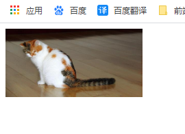

# 四、元素节点

[[_TOC_]]

## 1. 创建元素节点

Element对象表示`元素节点`，继承了Node对象

```javascript
 const elem = document.createElement(tagName);
```

## 2. Element对象属性

```javascript
元素指针：
elem.parentElement          //返回当前元素父元素节点
elem.previousElementSibling //返回当前元素前一个同辈元素节点
elem.nextElementSibling     //返回当前元素后一个同辈元素节点
elem.firstElementChild      //返回当前元素第一个子元素节点
elem.lastElementChild       //返回当前元素最后一个子元素节点
elem.childElementCount      //返回当前元素子元素节点数量
elem.childNodes             //返回NodeList实例,包含当前元素所有类型子节点
elem.children               //返回HTMLCollection实例,包含当前元素所有子元素节点
元素信息：
elem.tagName                //返回当前元素的标签名(大写)
elem.dir                    //返回/设置当前元素的文字方向
elem.lang                   //返回/设置当前元素的语言
elem.hidden                 //返回/设置当前元素是否可见
元素内容：
elem.innerHTML              //返回/设置当前元素包含的HTML代码
elem.outerHTML              //返回/设置当前元素及其包含的HTML代码
元素客户区大小：
elem.clientHeight           //height + padding
elem.clientWidth            //width + padding
元素可见大小：
elem.offsetParent           //返回最靠近当前元素且具有大小的祖先元素
elem.offsetTop              //返回当前元素上外边框距包含元素上内边框的垂直位移
elem.offsetLeft             //返回当前元素左外边框距包含元素左内边框的水平位移
elem.offsetHeight           //height + padding + border + scroll
elem.offsetWidth            //width + padding + border + scroll
元素滚动大小：
elem.scrollTop              //返回/设置元素垂直滚动时上方不可见内容的垂直高度
elem.scrollLeft             //返回/设置元素水平滚动时左侧不可见内容的水平宽度
elem.scrollWidth            //元素内容总高度
elem.scrollHeight           //元素内容总宽度
```

### (1) 元素内容

写模式下根据指定值创建一个`新的DOM树`，再用 DOM 树来替换，其中所有标签都会按照浏览器处理 HTML 的标准方式转换为元素，因此原本的字符串与解析后的值大不相同

```javascript
//<div id="block"><span id="inline"></span></div>
const div = document.getElementById('block');
console.log(div.innerHTML); //"<span id="inline"></span>"
console.log(div.outerHTML); //"<div id="block"><span id="inline"></span></div>"

div.innerHTML = "hello & welcome, <b>\"reader\"!</b>";
解析后:hello &amp; welcome, <b>&quot;reader&quot;!</b>

//禁止在循环中使用innerHTML
const str = '';
for(let i=0; i<values.length; i++){
  str += '<li>' + values[i] + '</li>';
}
ul.innerHTML = str;
```

## 3. Element对象方法

```javascript
获取元素：
elem.getElementsByTagName(tag)     //返回HTMLCollection实例,包含elem所有指定标签名的子元素节点
elem.getElementsByClassName(class) //返回HTMLCollection实例,包含elem所有指定class属性值的子元素节点
elem.querySelector(css)            //返回elem第一个匹配CSS选择器的后代元素节点
elem.querySelectorAll(css)         //返回NodeList实例,包含elem所有匹配CSS选择器的后代元素节点
elem.closest(css)                  //返回匹配CSS选择器且最接近elem的祖先节点,包括elem本身,无则返回null
elem.matches(css)                  //返回布尔值,表示elem是否匹配CSS选择器
添加节点：
elem.insertAdjacentElement(pos,n)  //返回节点n,将n插入到elem指定位置,已存在则移动到新位置
                                   //(beforebegin:元素之前,afterend:元素之后,
                                   //afterbegin:元素第一个子节点之前,eforeend:元素最后一个子节点之后)
elem.insertAdjacentHTML(pos,html)  //无返回值,将待解析的html字符串插入到elem指定位置
elem.insertAdjacentText(pos,text)  //无返回值,将文本节点text插入到elem指定位置
元素盒模型：
elem.getClientRects()              //返回RectList实例,包含多个Rect对象
elem.getBoundingClientRect()       //返回Rect实例,包含elem CSS盒模型所有信息
```

### (1) 获取元素

```javascript
//<ul id="ul">
//  <li class="red first">haha</li>
//  <li class="red second">
//    <li class="red third">hehe</li>
//  </li>
//</ul>
const ul = document.querySelector('#ul');
const li = ul.querySelector('.third');
console.log(ul.querySelector('.red'));    //<li class="red first">
console.log(ul.querySelectorAll('.red')); //NodeList {0: li.red.first, 1: li.red.second, 2: li.red.third, length: 3}
console.log(li.closest('.red'));          //<li class="red third">
console.log(ul.matches('.red'));          //false
```

### (2) 添加节点

```javascript
//<div id="block">haha</div>
const div = document.getElementById('block');
const b = document.createElement('b');
div.insertAdjacentElement('afterbegin', b);
div.insertAdjacentHTML('afterbegin', '<span>hehe</span>');
div.insertAdjacentText('afterbegin', 'hello');
console.log(div.childNodes); //NodeList {0: #text "hello", 1: span, 2: b, 3: #text "haha", length: 4}

//<div id="block">
//  "hello"
//  <span>hehe</span>
//  <b></b>
//  "haha"
//</div>
```

### (3) 元素盒模型

elem.getBoundingClientRect() 返回当前元素 CSS 盒模型的所有信息

```javascript
//

const cat = document.getElementById('cat')
console.log(cat.getBoundingClientRect()); 
//DOMRect {x: 8, y: 8, top: 8, bottom: 108, left: 8, right: 208, width: 200, height: 100}
```


