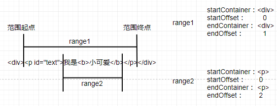
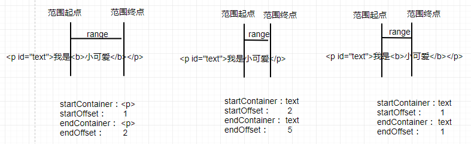

# 九、节点范围

[[_TOC_]]

## 1. Selection对象

Selection 对象表示`鼠标在文档中选取的区域`，

一个文档同一时间只能有一个选区，但一个选区可以同时包含多个范围（用户按下 Ctrl 键可以同时框选多个范围，`Chrome中禁止该操作`），

**锚点 anchor**：范围选取时的开始点，鼠标按下瞬间的点，不随鼠标拖动改变 

**焦点 focus**：范围选取时的结束点，鼠标松开瞬间的点，随鼠标拖动改变

```javascript
定义：const sel = window.getSelection() || document.getSelection();
属性：位置属性：
     sel.isCollapsed             //返回布尔值,表示当前选区起点和终点是否位于同一位置
     sel.anchorNode              //返回当前选区起点所在的节点
     sel.anchorOffset            //返回当前选区起点距离focusNode的位置偏移量,
                                 //anchorNode为文本节点,偏移量为当前选区起点距离focusNode第一个字的字数
                                 //anchorNode为元素节点,偏移量为当前选区起点之前的同级节点数量,
     sel.focusNode               //返回当前选区终点所在的节点
     sel.focusOffset             //返回当前选区终点距离focusNode的位置偏移量
                                 //anchorNode为文本节点,偏移量为当前选区终点距离focusNode第一个字的字数
                                 //anchorNode为元素节点,偏移量为当前选区终点之前的同级节点数量,
     范围属性：
     sel.rangeCount              //返回当前选区包含的范围的数量
方法：操作选区：
     sel.toString()              //返回当前选区的纯文本内容
     sel.containsNode(node,bool) //返回布尔值,当前选区是否包含node,false表示必须包含整个节点,true表示可以包含节点的一部分
     折叠选区：
     sel.collapseToStart()       //无返回值,将当前选区折叠到起点
     sel.collapseToEnd()         //无返回值,将当前选区折叠到终点
     sel.collapse(node,offset)   //无返回值,将当前选区起点和终点折叠到node指定偏移置,
                                 //node=anchorNode=focusNode,offset=anchorOffset=focusOffset
     sel.extend(node,offset)     //无返回值,将当前选区终点移动到node指定偏移位置,node=focusNode,offset=focusOffset
     替换选区：
     sel.selectAllChildren(node) //无返回值,取消当前选区并将node所有子节点设为选区
     移除选区： 
     sel.deleteFromDocument()    //无返回值,从文档移除当前选区
     选区范围：
     sel.getRangeAt(index)       //返回当前选区索引处的范围
     sel.addRange(range)         //无返回值,向当前选区添加指定范围
     sel.removeRange(range)      //无返回值,移除当前选区指定范围
     sel.removeAllRanges()       //无返回值,移除当前选区所有范围
```

### (1) 位置属性

```javascript
//<div><p>我是小可爱</p></div>
//<button id="btn">打印选区</button>
const btn = document.querySelector('#btn');
btn.addEventListener('click', function(){
  const sel = document.getSelection();
})
```

.png)

```javascript
//<div><p>我是小可爱</p><p>我是小可爱</p><p id="p3">我是小可爱</p><p>我是小可爱</p></div>
//<button id="btn">打印选区</button>
const btn = document.querySelector('#btn');
btn.addEventListener('click', function(){
  const sel = document.getSelection();    
  const range = document.createRange();
  const p3 = document.querySelector('#p3');
  range.selectNode(p3);
  sel.addRange(range)
});
```

.png)

### (2) 折叠选区

折叠选区的起点或终点，从而实现移动选区

```javascript
//<p id="text">我是小可爱</p>
const text = document.querySelector('#text');
p.addEventListener('mouseup', function(){
  const sel = document.getSelection();
  sel.extend(sel.focusNode, 5); //用户松开鼠标时,选区折叠
});
```

### (3) 替换选区

取消选中当前选区，转而将另一个节点的所有子节点设为选区

```javascript
//<p id="text1">你是小可爱</p>
//<p id="text2">我是小可爱</p>
//<button id="btn">选中第二行文本</button>
const p1 = document.querySelector('#text1');
const p2 = document.querySelector('#text2');

const sel = document.getSelection();
const range = document.createRange();
range.selectNode(p1);
sel.addRange(range);

const btn = document.querySelector('#btn');
btn.addEventListener('click', function(){
  sel.selectAllChildren(p2);
})
```

### (4) 移除选区

将当前选区的文档片段从文档中移除

```javascript
//<p id="text">我是小可爱</p>
const p = document.querySelector('#text');
p.addEventListener('mouseup', function(){
  const sel = document.getSelection();
  sel.deleteFromDocument(); //用户松开鼠标时,选区从文档移除
});
```

### (5) 选区范围

向当前选区添加、删除、范围

```javascript
//<p id="text">我是小可爱</p>
//<button id="btn">选中文本中间三个字</button>
const btn = document.querySelector('#btn');
btn.addEventListener('click', function(){
  const sel = document.getSelection();
  sel.removeAllRanges();

  const range = document.createRange();
  const p = document.querySelector('#text');
  range.setStart(p.firstChild, 1);
  range.setEnd(p.firstChild, 4);

  sel.addRange(range);
})
```

### 2. Range对象

Range对象表示`鼠标在文档选区内的一段连续范围`，范围必须是连续的，可以包括整个节点，也可以包括节点的一部分

```javascript
定义：const range = sel.getRangeAt(index);
     const range = document.createRange();
属性：位置属性：
     range.collapsed                //返回布尔值,表示当前范围起点和终点是否位于同一位置
     range.commonAncestorContainer  //返回距离当前范围起点和终点最近的共同祖先节点
     range.startContainer           //返回当前范围起点所在的节点
     range.startOffset              //返回当前范围起点距离startContainer的位置偏移量,
                                    //父节点为文本节点,偏移量为当前范围起点距离startContainer第一个字的字数
                                    //父节点为元素节点,偏移量为当前范围起点之前的同级节点数量,
     range.endContainer             //返回当前范围终点所在的节点
     range.endOffset                //返回当前范围终点距离endContainer的位置偏移量
                                    //父节点为文本节点,偏移量为当前范围终点距离endContainer第一个字的字数
                                    //父节点为元素节点,偏移量为当前范围终点之前的同级节点数量,

方法：填充简单范围：
     range.selectNode(node)         //无返回值,用node及其所有子节点填充当前范围
     range.selectNodeContents(node) //无返回值,用node的所有子节点填充当前范围
     填充复杂范围：
     range.setStartBefore(node)     //无返回值,将当前范围起点设置到node之前,node作为当前范围第一个节点
     range.setStartAfter(node)      //无返回值,将当前范围起点设置到node之后,node下一个同辈节点作为当前范围第一个子节点
     range.setStart(node,offset)    //无返回值,将当前范围起点设置到node指定偏移位置,node=startContainer,offset=startOffset
     range.setEndBefore(node)       //无返回值,将当前范围终点设置到node之前,node上一个同辈节点作为当前范围最后一个子节点
     range.setEndAfter(node)        //无返回值,将当前范围终点设置到node之后,node作为当前范围最后一个子节点
     range.setEnd(node,offset)      //无返回值,将当前范围终点设置到node指定偏移位置,node=endContainer,offset=endOffset
     操作范围：
     range.insertNode(node)         //无返回值,在当前范围起点处插入node,已存在则移动到起点处
     折叠范围：
     range.collapse(bool)           //无返回值,true则将当前范围折叠到起点,false则将当前范围折叠到终点
     替换范围：
     range.surroundContents(node)   //无返回值,环绕当前范围插入node,即当前范围作为node的DOM子树
     移除范围：
     range.deleteContents()         //无返回值,将当前范围从文档中移除
     复制范围：
     range.cloneContents()          //返回DocumentFragment实例,当前范围表示的文档片段的副本
     range.extractContents()        //返回DocumentFragment实例,当前范围表示的文档片段,并从文档移除该片段
     range.cloneRange()             //返回range实例,当前范围的副本
     释放范围：
     range.detach()                 //无返回值,释放当前范围,不能再访问
```

### (1) 位置属性

```javascript
//<div><p>我是小可爱</p></div>
//<button id="btn">打印范围</button>
const btn = document.querySelector('#btn');
btn.addEventListener('click', function(){
  const sel = document.getSelection();    
  const range = sel.getRangeAt(0);
});
```

.png)

```javascript
//<div><p>我是小可爱</p><p>我是小可爱</p><p id="p3">我是小可爱</p><p>我是小可爱</p></div>
//<button id="btn">打印范围</button>
const btn = document.querySelector('#btn');
btn.addEventListener('click', function(){
  const range = document.createRange();
  const p3 = document.querySelector('#p3');
  range.selectNode(p3);
});
```

.png)

### (2) 填充简单范围

```javascript
//<div><p id="text">我是<b>小可爱</b></p></div>
const p = document.querySelector('#text'); 
const range1 = document.createRange();
const range2 = document.createRange();
range1.selectNode(p);
range2.selectNodeContents(p);
```



### (3) 填充复杂范围

```javascript
//<p id="text">我是<b>小可爱</b></p>
//<button id='btn'>删除"小可爱"</button>
const btn = document.querySelector('#btn');
btn.addEventListener('click', function(){
  const p = document.querySelector('#text');
  const range = document.createRange();
  range.setStart(p, 1);
  range.setEnd(p, 2);
  range.deleteContents();  
})

//<p id="text">我是小可爱</p>
//<button id='btn'>删除"小可爱"</button>
const btn = document.querySelector('#btn');
btn.addEventListener('click', function(){
  const p = document.querySelector('#text');
  const range = document.createRange();
  range.setStart(p.firstChild, 2);
  range.setEnd(p.firstChild, 5);
  range.deleteContents();
})

//<p id="text">我是<b>小可爱</b></p>
//<button id='btn'>删除"是小"</button>
const btn = document.querySelector('#btn');
btn.addEventListener('click', function(){
  const p = document.querySelector('#text');
  const p1 = p.firstChild;
  const p2 = p.lastChild.firstChild;
  const range = document.createRange();
  range.setStart(p1, 1);
  range.setEnd(p2, 1);
  range.deleteContents();
})
```



### (4) 操作范围

```javascript
//<p id="text">我是<b>小可爱</b></p>
//<button id="btn">插入"最可爱的"</button>

const btn = document.querySelector('#btn');
btn.addEventListener('click', function(){
  const p = document.querySelector('#text');
  const range = document.createRange();
  range.setStart(p, 1);
  range.setEnd(p, 2);

  const span = document.createElement('span');
  span.append('最可爱的');
  span.style.color = 'red';
  range.insertNode(span); //插入到范围起点
})
```

### (5) 替换范围

```javascript
//<p id="text">我是<b>小可爱</b></p>
//<button id="btn">突出显示"小可爱"</button>

const btn = document.querySelector('#btn');
btn.addEventListener('click', function(){
  const p = document.querySelector('#text');
  const range = document.createRange();
  range.setStart(p, 1);
  range.setEnd(p, 2);

  const span = document.createElement('span');
  span.style.color = 'red';
  range.surroundContents(span);
})
```

### (6) 复制范围

```javascript
//<p id="text">我是<b>小可爱</b></p>
//<button id="btn">复制"小可爱"</button>

//情况1
const btn = document.querySelector('#btn');
btn.addEventListener('click', function(){
  const p = document.querySelector('#text');
  const range = document.createRange();
  range.setStart(p, 1);
  range.setEnd(p, 2);
  const docFrag = range.cloneContents(); //复制当前范围的文档片段
  p.parentNode.append(docFrag);
})


//情况2
const btn = document.querySelector('#btn');
btn.addEventListener('click', function(){
  const p = document.querySelector('#text');
  const range = document.createRange();
  range.setStart(p, 1);
  range.setEnd(p, 2);
  const docFrag = range.extractContents(); //复制并移除当前范围的文档片段
  p.parentNode.append(docFrag);
})


//情况3
const btn = document.querySelector('#btn');
btn.addEventListener('click', function(){
  const p = document.querySelector('#text');
  const range1 = document.createRange();
  range1.setStart(p, 1);
  range1.setEnd(p, 2);
  const range2 = range1.cloneRange(); //复制当前范围
  console.log(range2.toString());
})
```

### (7) 释放范围

使用完范围后，最好调用 detach \( \) 方法释放该 range 实例，然后解除对范围的引用，从而让垃圾回收机制回收其内存

```javascript
const range = document.createRange();
range.detach(); //释放range实例
range = null;   //解除引用
```
