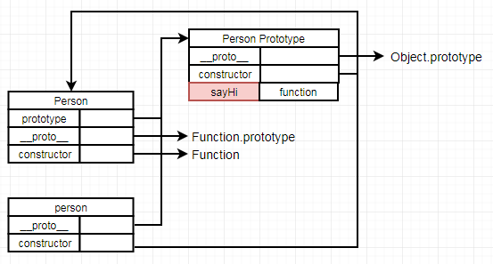
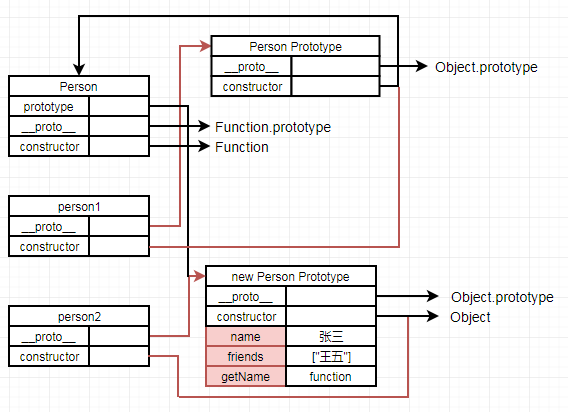
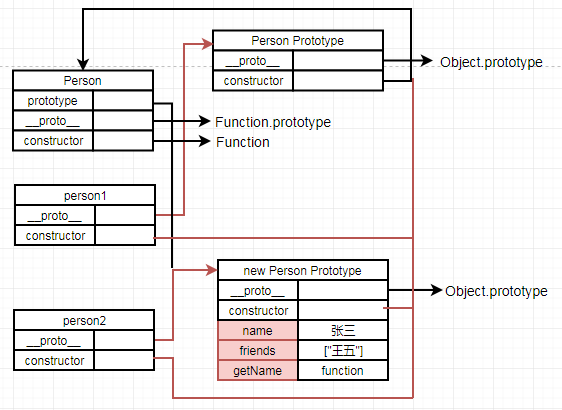
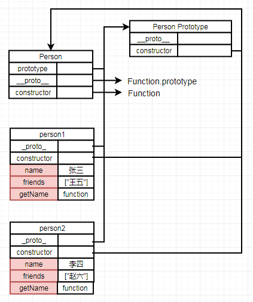
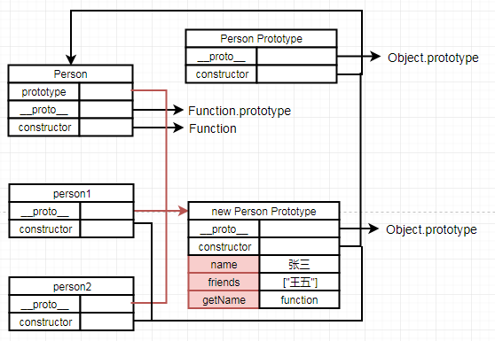
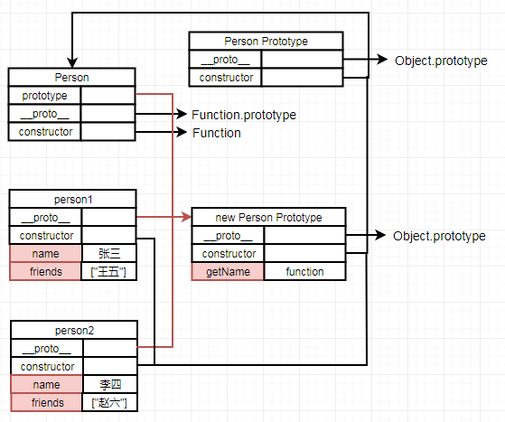
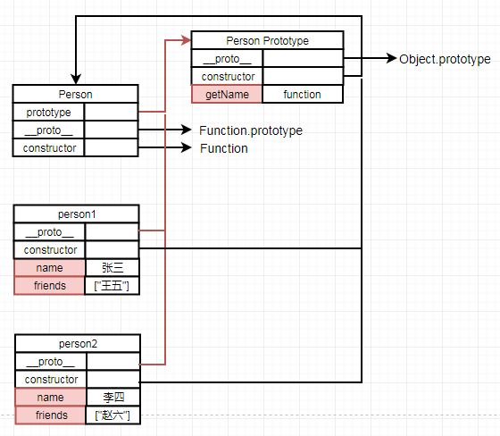
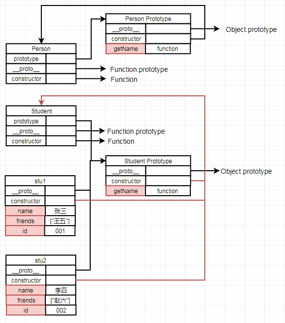
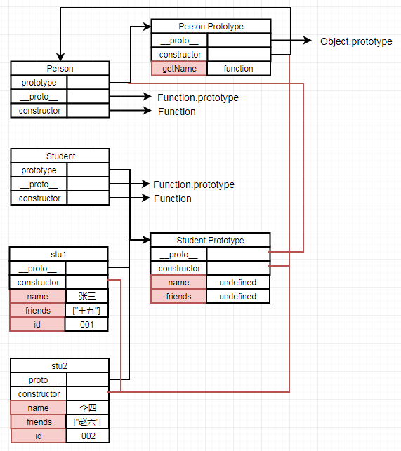

# 九、原型

[[_TOC_]]

ES5 中没有类的概念，而是通过`原型`实现面向对象编程

## 1. 原型

### (1) 原型

#### ① prototype

无论何时，只要创建一个新函数，就会根据一组特定的规则为该`函数`创建一个 prototype 属性，指向函数的原型

#### ② constructor

默认情况下，原型都会自动获得一个 constructor 属性，指向原型的构造函数

`所有对象都有 constructor 属性`，但是实例对象和构造函数的 constructor 属性并非自身拥有的，而是`通过原型链继承`过来的，

* 实例对象：实例的 constructor 属性继承自`自身的 __proto__ 属性指向的原型的 constructor 属性`，

* 构造函数：构造函数也是对象，其 constructor 属性同样继承自自身的__proto__属性指向的原型的 constructor 属性

#### ③__proto__

当调用构造函数创建一个新实例后，实例将会自动获得一个__proto__属性，指向`创建实例时构造函数的原型`，__proto__属性为`内部属性`，对脚本完全不可见，ES5 明确规定，只有浏览器必须部署这个属性，其他运行环境不一定部署这个属性，故而最好不要使用这个属性，而是使用 Obejct.getPrototypeOf( )、Object.setPrototypeOf()、Object.create() 等方法来操作这个属性

### (2) 原型链

原型指的就是对象的 `_proto_` 属性，而原型链就是由__proto__属性关联的原型的链状结构，所有对象都有自己的原型，从对象到原型，再到原型的原型，一层层地上溯，最终上溯到顶层，而 Object.prototype 的原型是null，因此原型链的尽头就是 `null`

① 属性屏蔽：在实例上添加一个新属性，则会`屏蔽`原型上的同名属性

② 属性查找：先在实例上查找属性，没有则在实例的原型上查找，再没有则沿着原型链不断上溯查找，直到找到属性或上溯到原型链顶层


### (3) 修改原型

由于在原型中查找值的过程是一次搜索过程，所以对原型所做的任何修改都会`立即`反映到所有实例上，即使先创建实例后修改原型

```javascript
function Person(){};
var person = new Person();

//修改原型
Person.prototype.sayHi = function(){
  console.log('hi');
};
```



### (4) 重写原型

重写整个原型会切断构造函数与最初原型间的联系，使构造函数的 prototype 属性指向新原型，而实例的__proto__属性指向`创建实例时`构造函数的旧原型

#### ① 限制

新原型的 constructor 属性不指向构造函数

```javascript
function Person(){};
var person1 = new Person();

//重写整个原型
Person.prototype = { 
  name: "张三",
  friends: ["王五"],
  getName: function(){
    return this.name;
  }
};
var person2 = new Person();
```



#### ② 优化

使用 Object.defineProperty() 设置新原型的 constructor 属性指向构造函数，且该属性不可枚举

```javascript
function Person(){};
var person1 = new Person();

//重写整个原型
Person.prototype = { 
  name: "张三",
  friends: ["王五"],
  getName: function(){
    return this.name;
  }
};

//设置新原型的constructor属性指向构造函数,且不可枚举
Object.defineProperty(Person.prototype, 'constructor', {
  value: Person,
  enumerable: false
});
var person2 = new Person();
```



## 2. 创建对象

### (1) 构造函数模式

构造函数始终`以大写字母开头`，非构造函数应该以小写字母开头，构造函数中的属性和方法都定义在`实例`上，是每个实例`特有`的

#### 构造函数的执行过程

① 创建一个实例

② 构造函数的 this 绑定到该实例

③ 为实例添加属性和方法

④ 实例的__proto__属性连接到构造函数的 prototype 属性

⑤ 返回实例

```javascript
function Person(name, friends){
  this.name = name;
  this.friends = friends;

  this.getName = function(){ 
    return this.name;
  };
}
var person1 = new Person("张三", ["王五"]);
var person2 = new Person("李四", ["赵六"]);
```



### (2) 原型模式

定义在原型上的属性和方法被特定类型的所有实例共享

```javascript
function Person(){};
Person.prototype = { 
  name: "张三",
  friends: ["王五"],
  getName: function(){
    return this.name;
  }
};
Object.defineProperty(Person.prototype, 'constructor', {
  value: Person,
  enumerable: false
});
var person1 = new Person();
var person2 = new Person();
person2.name = '李四';
person2.friends.push('赵六');
```



### (3) 组合模式

组合使用构造函数模式和原型模式，构造函数模式定义实例属性，原型模式定义方法和共享属性，那么每个实例都会有自己的一份实例属性，同时又共享着对方法的引用，最大限度地节省内存，成为最常用的创建自定义对象的方式

```javascript
function Person(name, friends){ 
  this.name = name;
  this.friends = friends;
}
Person.prototype = {  
  getName: function(){
    return this.name;
  }
}
Object.defineProperty(Person.prototype, 'constructor', {
  value: Person,
  enumerable: false
});
var person1 = new Person("张三", ["王五"]);
var person2 = new Person("李四", ["赵六"]);
```



### (4) 动态原型模式

将所有信息都封装在构造函数中，仅在必要的情况下（某个应该存在的方法无效），在构造函数中初始化原型，保持了同时使用构造函数和原型的优点，比起组合模式又提升了少许性能，这种模式几近完美，推荐使用

```javascript
function Person(name, friends){ 
  this.name = name;
  this.friends = friends;

  //getName()方法不存在的情况下,才将其添加到原型中,仅在初次调用构造函数时执行
  if(typeof this.getName !== 'function'){
    Person.prototype.getName = function(){
      return this.name;
    };
  }
}

//情况1
Object.keys(Person.prototype);                //Array []
Object.getOwnPropertyNames(Person.prototype); //Array ['constructor']

//情况2：初次调用Person构造函数后才会在原型上添加getName方法
var person1 = new Person("张三", ["王五"]);
var person2 = new Person("李四", ["赵六"]);
Object.keys(Person.prototype);                //Array ['getName']
Object.getOwnPropertyNames(Person.prototype); //Array ['constructor', 'getName']
```



## 3. 继承

ES5 的继承，实质是先创造子类的实例对象 ，然后再将父类的方法添加到 上

### (1) 借用构造函数继承

在子类构造函数内部调用超类构造函数，实际上是在将要创建的子类实例中执行超类构造函数中的所有对象初始化代码，故而子类就可以`继承超类的全部实例属性`，也可向其`传递参数`

**限制**：父类原型中定义的方法，对子类不可见，子类必须在原型中再次定义方法

```javascript
function Person(name, friends){ 
  this.name = name;
  this.friends = friends;

  if(typeof this.getName !== 'function'){
    Person.prototype.getName = function(){
      return this.name;
    };
  }
}
function Student(name, friends, id){
  Person.call(this, name, friends); //借用构造函数继承,继承父类的全部实例属性
  this.id = id;

  if(typeof this.getName !== 'function'){
    Student.prototype.getName = function(){
      return this.name;
    }
  }
}
var stu1 = new Student("张三", ["王五"], "001");
var stu2 = new Student("李四", ["赵六"], "002");
```



### (2) 原型链继承

由__proto__ 属性关联的原型的链状结构，所有对象都有自己的原型，从对象到原型，再到原型的原型，一层层地上溯，最终上溯到顶层，而`Object.prototype 的原型是 null`，因此原型链的尽头就是 null，也就是说，所有对象都继承了 Object.prototype 的属性和方法，这就是所有对象都有valueOf()、toString() 方法的原因 

#### 原型搜索机制

访问某个实例的属性时，先搜索实例本身，没有再搜索实例的原型，仍没有则沿着原型链不断向上搜索直至找到该属性或搜索到原型链末端Object.prototype 为止 

#### 限制

① 父类的实例属性会变成子类的原型属性，被子类的所有实例共享 

② 创建子类实例时，无法向父类的构造函数传递参数

```javascript
function Person(){
  this.name = "吴大";
  this.friends = ["王五"];

  if(typeof this.getName !== 'function'){
    Person.prototype.getName = function(){
      return this.name;
    };
  }
}
function Student(name, id){
  this.name = name;
  this.id = id;
}
Student.prototype = new Person(); //原型链继承,父类的实例作为子类的原型

var stu1 = new Student("张三", "001");
var stu2 = new Student("李四", "002");
stu2.friends.push("赵六");
stu1.friends;   //Array ["王五", "赵六"]
stu2.friends;   //Array ["王五", "赵六"]
stu1.getName(); //"张三"
stu2.getName(); //"李四"
delete stu2.name;
stu2.getName(); //"吴大"
```


### (3) 组合继承

通过原型链实现对原型属性和方法的继承，通过借用构造函数实现对实例属性的继承，既保证了子类每个实例都有自己的属性，又实现了函数复用，还可以向父类的构造函数传递参数 

**限制**：无论什么情况下，都会`调用2次超类构造函数`，一次是在子类构造函数内部，另一次是在创建子类原型时，如下例所示，调用2次 Person 构造函数，就会继承 2 组 name、friends 属性，一组在 Student 原型上，一组在 Student 实例上

```javascript
function Person(name, friends){ 
  this.name = name;
  this.friends = friends;

  if(typeof this.getName !== 'function'){
    Person.prototype.getName = function(){
      return this.name;
    };
  }
}
function Student(name, friends, id){
  Person.call(this, name, friends); //借用构造函数继承,继承父类的全部实例属性
  this.id = id;
}
Student.prototype = new Person(); //原型链继承,父类的实例作为子类的原型
var stu1 = new Student("张三", ["王五"], "001");
var stu2 = new Student("李四", ["赵六"], "002");
```



### (4) 寄生组合式继承

通过`原型链的混成形式`实现对原型属性和方法的继承，通过借用构造函数实现对实例属性的继承，基本思路是不必为了指定子类的原型而调用超类的构造函数，本质上就是使用寄生式继承来继承超类的原型，然后再将结果指定给子类的原型，因为只需`调用1次超类的构造函数`，这种继承方式几近完美，成为了最佳的继承方式

```javascript
const obj1 = {name: '张三'};
const obj2 = Object.create(obj1);     //将参数对象作为原型来实现拷贝
console.log(obj2.__proto__ === obj1); //true
```

```javascript
//寄生组合式继承的基本模式
function inheritPrototype(child, parent){
  var prototype = Object.create(parent.prototype); //创建父类原型的实例
  prototype.constructor = child;                   //弥补因重写子类原型而失去的constructor属性
  child.prototype = prototype;                     //将父类原型的实例指定为子类原型
}
```

```javascript
function Person(name, friends){ 
  this.name = name;
  this.friends = friends;

  if(typeof this.getName !== 'function'){
    Person.prototype.getName = function(){
      return this.name;
    };
  }
}
function Student(name, friends, id){
  Person.call(this, name, friends); //借用构造函数继承,继承父类的全部实例属性
  this.id = id;
}
inheritPrototype(Student, Person);  //寄生组合式继承,将父类原型的实例设置为子类原型
var stu1 = new Student("张三", ["王五"], "001");
var stu2 = new Student("李四", ["赵六"], "002");
```


### (5) 原型式继承

借助已有的对象创建新对象，不必因此创建自定义类型，在没有必要兴师动众的创建构造函数，而只想让一个对象和另一个对象保持类似的情况下，原型式继承是最佳方式，通过 `Object.create()`实现原型式继承，第一个参数对象为新对象的原型，第二个参数对象为新对象添加额外属性（可选）

```javascript
var person1 = {
  name: "张三",
  friends: ["王五"],
};
var person2 = Object.create(person1);
person2.name = "李四";
person2.friends.push("赵六");
var person3 = Object.create(person1, {
  friends: {
    value: ["陈七"]
  }
});

person2.name;    //"李四"
person2.firends; //Array ["王五", "赵六"]
person3.name;    //"张三"
person3.friends; //Array ["陈七"]
```
