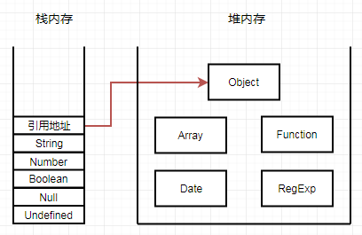

# 四、内存

[[_TOC_]]

## 1. 内存模型

程序运行时，操作系统给每个进程分配一个堆，每个线程分配一个栈，堆的大小不确定，需要的话可以不断增加，栈的大小固定，超出限制则会发生栈溢出，JS是单线程语言，每个进程只有一个线程

### (1) 栈内存

存储`基本数据类型`的简单数据段

① 基本数据类型值`大小固定`，在栈内存中存储

② 由 JS 引擎自动分配，直接分配栈内存存储值

③ 访问变量：`按值访问`，栈内存中直接读取值，读写较快

### (2) 堆内存

存储`引用数据类型`的对象

① 引用数据类型值`大小不固定`，在堆内存中存储，由于结构复杂，数据量大，在堆内存中表现为`一段连续的内存地址`

② 由程序员动态申请，代码指定分配，先分配堆内存存储对象，再分配栈内存存储对象的引用地址

③ 访问变量：`按引用地址访问`，先到栈内存中读取引用地址，再到引用地址指向的堆内存中读取对象，故而读写较慢



```javascript
const person = {
  name: name,
  age: age,
  friends: ['王五', '赵六'],
  getName(){
    return this.name
  }
}
```


### (3) 变量传递/函数参数传递

> 按值传递：传递栈内存中的数据，2个变量相互独立，分别指向栈内存中两个值
>
> 按引用传递：传递栈内存中数据的地址编号，2个变量相互影响，指向栈内存中同一个值

#### ① 变量传递

存储在栈内存中的基本类型值：按值传递

存储在堆内存中的引用类型值：按引用传递

```javascript
//基本类型值
const a = 1;
let b = a;
b = 2;
console.log(b); //2
console.log(a); //1

//引用类型值
const a = {value: 1};
const b = a;
b.value = 2;
console.log(b.value); //2
console.log(a.value); //2
```


#### ② 函数参数传递

存储在栈内存中的基本类型值：按值传递

存储在堆内存中的引用类型值：按值传递

```javascript
//基本类型值
const f = x => {
  x = 2;
  return x;
}
const a = 1;
console.log(f(a)); //2
console.log(a);    //1

//引用类型值
const f = x => {
  x = {value: 2};
  return x;
}
const a = {value: 1};
console.log(f(a).value); //2
console.log(a.value);    //1
```


## 2. 内存泄漏

内存泄漏指的是程序中无法回收，造成操作系统内存的浪费，导致运行速度减慢甚至系统崩溃等后果

### (1) 意外的全局变量

① ES5 规定，函数中未使用 var 声明的变量，默认全局变量

② 使用严格模式避免 意外的全局变量

```javascript
function f(){
  a = 1;
  或者
  this.a = 1;
}
f();
console.log(a); //1


'use strict'
function f(){
  a = 1;
}
f();
console.log(a); //ReferenceError
```

### (2) 循环引用

① 两个对象互相包含指向对方的指针

② 两个对象同时解除对对方的引用

```javascript
function f(){  
  const obj1 = {};  
  const obj2 = {};  
  obj1.a = obj2; //obj1引用obj2  
  obj2.a = obj1; //obj2引用obj1  

  //解除引用
  obj1 = null;
  obj2 = null;
}
```

### (3) 闭包

① 闭包可以维持函数内的局部变量，使其得不到释放 

② 在定义事件处理函数的外部函数中，解除对DOM元素的引用

```javascript
//闭包引用了elem元素,无法回收elem占用内存
function f(){
  const elem = document.getElementById("block");
  elem.onclick = function(){
    console.log(elem.id);
  };

  //解除引用
  elem = null; 
}
```

### (4) 被遗忘的定时器

① 定时器中引用了变量或 DOM 元素，若不清除定时器，则变量或 DOM 元素无法被释放

② 手动清除定时器和DOM

```javascript
//定时器中引用了全局变量now,定时器不清除,now无法被释放
const now = Date.now();
const t = setInterval(function(){ 
  const node = document.getElementById('block'); 
  if(node){ 
    node.innerHTML = now;
  } 
}, 1000);

//清除定时器
clearInterval(t);
```

### (5) 未清除的DOM引用

① 变量引用了 DOM 元素，若不清除变量对 DOM 元素的引用，即使清除 DOM 元素，仍无法回收 DOM 元素

② 手动解除对 DOM 元素的引用

```javascript
const node = document.getElementById('block');
document.body.removeChild(node);

//解除引用
node = null;
```

## 3. 内存回收

### (1) 原理

找出不再继续使用的，释放其占用的内存，垃圾收集器按照固定的时间间隔的执行这一操作 

#### ① 全局变量的生命周期

全局变量的生命周期持续到应用程序退出，如关闭网页或浏览器 

#### ② 局部变量的生命周期

局部变量的生命周期是函数的执行过程，函数执行时，JS引擎为其局部变量分配内存空间以存储值，函数执行结束，销毁函数的局部变量并释放内存，随着函数的调用和返回，其执行上下文、活动对象不断销毁和重建

```javascript
function f(){
  let x = 1;
  console.log(++x);
}
f(); //2
f(); //2,函数再次调用时局部变量被重建

function f(){
  let x = 1;
  return function(){
    console.log(++x);
  };
}
const f1 = f(); 
f1(); //2
f1(); //3,闭包f1会通过作用域链访问外部函数f的局部变量x,故而函数f的活动对象仍存在于内存中未被销毁
```

### (2) 标记清除

#### 工作原理

变量进入执行上下文时，标记为"进入执行上下文"，变量离开执行上下文时，标记为"离开执行上下文" 

#### 工作流程

① 垃圾收集器在运行时给存储在内存中的所有变量都加上标记 

② 去掉执行上下文中的变量以及被执行上下文中的变量引用的变量的标记 

③ 在此之后再被加上标记的变量将被视为准备删除的变量，因为执行上下文中的变量无法访问到这些变量 

④ 垃圾收集器完成内存清除工作，销毁带标记的值并回收其内存

### (3) 引用计数

#### 工作原理

跟踪记录每个被引用的次数 

#### 工作流程 

① 声明一个变量并将一个引用类型值赋给该变量，这个值的引用次数为1 

② 同一个值又被赋给另一个变量，这个值的引用次数加1 

③ 引用这个值的变量取了另外一个值，这个值的引用次数减1 

④ 当这个值的引用次数为0时，说明无法再访问这个值 

⑤ 垃圾收集器下次运行时，释放其占用的内存 
