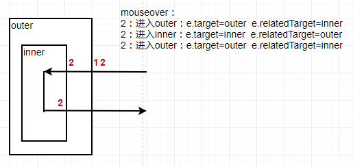
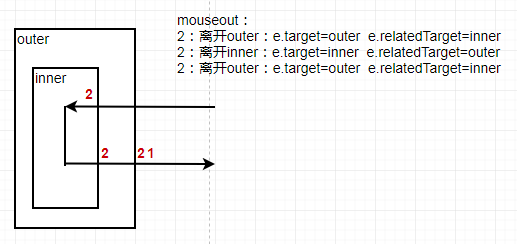
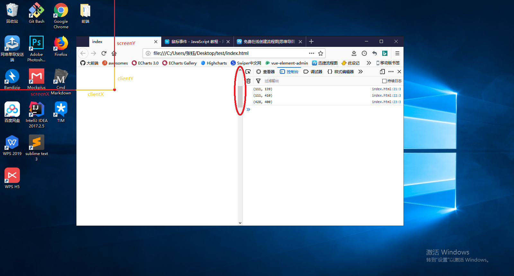

# 六、鼠标事件

[[_TOC_]]

MouseEvent 对象表示`鼠标事件`

```javascript
属性：e.detail                //返回当前事件发生时鼠标在给定位置的单击次数,不超过3次
     节点属性:
     e.relatedTarget         //当前事件的相关节点,仅针对mouseover、mouseout事件
     按键属性：
     e.altKey                //返回布尔值,当前事件发生时是否按下Alt键
     e.ctrlKey               //返回布尔值,当前事件发生时是否按下Ctrl键
     e.metaKey               //返回布尔值,当前事件发生时是否按下Meta键
     e.shiftKey              //返回布尔值,当前事件发生时是否按下Shift键
     e.button                //返回当前事件发生时按下鼠标哪个键(0:左键,1:滚轮,2:右键)
     e.buttons               //返回数当前事件发生时同时按下鼠标哪些键(001:左键,010:滚轮键,100:右键)
     位置属性：
     e.pageX                 //返回当前事件发生时鼠标相对文档左上角的水平坐标,包含滚动
     e.pageY                 //返回当前事件发生时鼠标相对文档左上角的垂直坐标,包含滚动
     e.clientX               //返回当前事件发生时鼠标相对浏览器视口左上角的水平坐标
     e.clientY               //返回当前事件发生时鼠标相对浏览器视口左上角的垂直坐标
     e.screenX               //返回当前事件发生时鼠标相对屏幕左上角的水平坐标
     e.screenY               //返回当前事件发生时鼠标相对屏幕左上角的垂直坐标
     距离属性：
     e.offsetX               //返回当前事件发生时鼠标相对目标节点左上角border内边缘的水平距离
     e.offsetY               //返回当前事件发生时鼠标相对目标节点左上角border内边缘的垂直距离
方法：e.getModifierState(str) //返回布尔值,用户是否按下特定功能键
```

## 1. 光标事件

```javascript
光标事件：
mouseenter  //鼠标进入节点时触发,进入子节点时不再触发,不冒泡
mouseover   //鼠标进入节点时触发,进入子节点时再次触发
mouseleave  //鼠标离开节点时触发,离开子节点时不再触发,不冒泡
mouseout    //鼠标离开节点时触发,离开子节点时再次触发
mousemove   //鼠标在节点内部移动时重复触发
```

```javascript
事件         e.target          e.relatedTarget
mouseover   光标将要进入的节点   光标将要离开的节点
mouseout    光标将要离开的节点   光标将要进入的节点
```

### (1) 进入节点

```javascript
//<div id="outer" style="width:200px;height:200px;border:1px solid red;">
//  <div id="inner" style="width:100px;height:100px;border:1px solid red;"></div>
//</div>

const outer = document.querySelector('#outer');
outer.addEventListener('mouseenter', function(e){
  console.log(1);
});
outer.addEventListener('mouseover', function(e){
  console.log(2);
});
//输出：2 1 2 2
```



### (2) 离开节点

```javascript
//<div id="outer" style="width:200px;height:200px;border:1px solid red;">
//  <div id="inner" style="width:100px;height:100px;border:1px solid red;"></div>
//</div>

const outer = document.querySelector('#outer');
outer.addEventListener('mouseleave', function(e){
  console.log(1);
});
outer.addEventListener('mouseout', function(e){
  console.log(2);
});
//输出：2 2 2 1
```



## 2. 按键事件

```javascript
任意键事件：
mousedown //按下鼠标任意键时触发,左键/右键/滚轮
mouseup   //释放鼠标任意键时触发,左键/右键/滚轮

左键事件：
click     //单击鼠标左键时触发(mousedown->mouseup->click)
dblclick  //双击鼠标左键时触发
```

### (1) 鼠标位置

#### ① 鼠标位于客户区位置

通过鼠标事件对象的 clientX 和 clientY 属性可以获得事件发生时鼠标在`浏览器视口`中的坐标 

#### ② 鼠标位于文档位置

通过鼠标事件对象的 pageX 和 pageY 属性可以获得事件发生时鼠标在`文档`中的坐标，页面未滚动的情况下，pageX 和 pageY 等于 clientX 和 clientY 

#### ③ 鼠标位于屏幕位置

通过鼠标事件对象的 screenX 和 screenY 属性可以获得事件发生时鼠标在`屏幕`中的坐标

```javascript
document.addEventListener('mouseup', function(e){
  console.log('(' + e.pageX   + ', ' + e.pageY + ')');   //"(111, 410)"
  console.log('(' + e.clientX + ', ' + e.clientY + ')'); //"(111, 139)"
  console.log('(' + e.screenX + ', ' + e.screenY + ')'); //"(428, 400)"
});
```



### (2) 鼠标距离

offsetX 属性和 offsetY 属性返回当前事件发生时鼠标相对`目标节点左上角border内边缘`的坐标

```javascript
//<div id="block" style="width:100px;height:100px;border:1px solid red;"></div>
const div = document.querySelector('#block');
div.addEventListener('mouseup', function(e){
  console.log('(' + e.offsetX + ', ' + e.offsetY + ')');
});
```

### (3) 修改键

按下鼠标键时键盘上修改键的状态也可以影响到要采取的操作，常用来修改鼠标事件的行为

```javascript
//<button id="btn">点击</button>

const btn = document.querySelector('#btn');
btn.addEventListener('mouseup', function(e){
  const keys = [];
  if(e.shiftKey){
      keys.push('shift');
  }
  if(e.ctrlKey){
      keys.push('ctrl');
  }
  if(e.altKey){
      keys.push('alt');
  }
  if(e.metaKey){
      keys.push('meta');
  }
  console.log(keys);
  console.log(e.button);
});
```

### (4) 特定功能键

```javascript
//判断用户是否按下大写键
document.addEventListener('mouseup', function(e){
  console.log(e.getModifierState('CapsLock')); 
});
```

## 3. 滚轮事件

```javascript
滚轮事件：
wheel //滚动鼠标滚轮时触发
```

WheelEvent 对象表示`滚轮事件`，继承了 Event 对象、MouseEvent 对象

```javascript
WheelEvent对象：
e.wheelDelta //用户向前滚动滚轮返回120的倍数,用户向后滚动滚轮返回-120的倍数
e.deltaMode  //返回数值,表示滚动量的单位(0:像素,1:行,2:页)
e.deltaX     //返回数值,表示滚轮的X轴滚动量
e.deltaY     //返回数值,表示滚轮的Y轴滚动量
e.deltaZ     //返回数值,表示滚轮的Z轴滚动量
```

### (1) 判断滚动方向

```javascript
//鼠标向后滚动一下
document.addEventListener('wheel', function(e){
  console.log(e.wheelDelta); //chrome:-120  firefox:undefined        
});
```

### (2) 判断滚动距离

```javascript
//鼠标向后滚动一下
document.addEventListener('wheel', function(e){
  console.log(e.deltaX);     //chrome:-0    firefox:0
  console.log(e.deltaY);     //       100           3
  console.log(e.deltaZ);     //       0             0
  console.log(e.deltaMode);  //       0             1
});
```

## 4. 剪贴板事件

```javascript
剪贴板事件：
contextmenu //按下鼠标右键时触发
copy        //复制时触发
cut         //剪切时触发
paste       //粘贴时触发
```

ClipboardEvent 对象表示`剪贴板事件`，继承了 Event 对象 

ClipboardData 对象表示`剪贴板数据`，继承了 DataTransfer 对象

```javascript
定义：const clip = e.clipboardData || window.clipboardData;
方法：clip.getDate("text/plain")     //返回剪贴板中指定格式的数据
     clip.setData("text/plain",str) //返回布尔值,是否成功设置剪贴板中指定格式数据
     clip.clearData()               //无返回值,清除剪贴板中的数据
```

### (1) 显示自定义菜单

需要显示自定义菜单，需要先阻止浏览器默认行为，不显示浏览器默认菜单

```javascript
//<div id="block">右键单击显示自定义菜单</div>
//<ul id="menu" style="position:absolute;background-color:#666;visibility:hidden;">
//  <li><a href="http://www.baidu.com"></a>百度</li>
//  <li><a href="http://www.sina.com"></a>新浪</li>
//  <li><a href="http://www.qq.com"></a>腾讯</li>
//</ul>

const div = document.querySelector('#block');
div.addEventListener('contextmenu', function(e){
  //取消浏览器默认行为,不显示浏览器默认菜单
  e.preventDefault();

  const menu = document.querySelector('#menu');
  menu.style.top = e.clientY + 'px';
  menu.style.left = e.clientX + 'px';
  menu.style.visibility = 'visible';
});

document.addEventListener('click', function(e){
  const menu = document.querySelector('#menu');
  menu.style.left = '0px';
  menu.style.top = '0px';
  menu.style.visibility = 'hidden';
});
```

### (2) 复制时添加版权信息

监听剪贴板的 copy 事件，用户复制时向剪贴板添加版权信息，避免随意转载

```javascript
//<input type="text" value="我是小可爱">

document.addEventListener('copy', addLink);
function addLink(e){
  const text = document.getSelection().toString();
  const info = "原文出自【张钰的个人博客】";
  const clip = e.clipboardData;
  clip.setData("text/plain", text + info);

  //阻止浏览器默认行为,使setData()添加信息成功
  e.preventDefault();
}
```

### (3) 粘贴时过滤字符

确保粘贴到文本框中的文本中必须包含某些字符，或者符合某种形式

```javascript
//<input id="text" type="text" value="我是小可爱111"/>

const text = document.querySelector('#text');
text.addEventListener('paste', function(e){
  const clip = e.clipboardData || window.clipboardData;
  const text = clip.getData("text");

  //剪贴板中的数据如果不是数字则不粘贴
  if(!/^\d+$/.test(text)){
      e.preventDefault();
  }
});
```

### (4) 屏蔽剪贴板

对于受保护的文档，可以通过阻止默认行为来屏蔽剪贴板

```javascript
document.addEventListener('copy', forbidClip);
document.addEventListener('cut', forbidClip);
document.addEventListener('paste', forbidClip);
function forbidClip(e){
  e.preventDefault();
}
```

## 5. 鼠标指针锁定事件

① 鼠标指针锁定 API 是一个关于鼠标指针（不是鼠标光标）的移动信息的 API，鼠标指针的移动不受屏幕或浏览器边界的限制，

② 鼠标指针锁定 API 允许开发者将鼠标事件`锁定到单个元素上`，获取鼠标指针的移动信息，

```javascript
事件：
pointerlickchange //elem.requestPointerLock()、elem.exitPointerLck()方法成功时在document对象上触发
pointerlockerror  //elem.requestPointerLock()、elem.exitPointerLck()方法失败时在document对象上触发


鼠标事件对象：
e.movementX //鼠标指针在水平方向上的移动距离(向右为正)
e.movementY //鼠标指针在垂直方向上的移动距离(向下为正)

节点方法：
document.pointerLockElement //返回当前页面被锁定的目标元素
elem.requestPointerLock()   //无返回值,将鼠标指针锁定到elem(异步方法)
elem.exitPointerLck()       //无返回值,取消鼠标指针在elem上的锁定(异步方法)
```

实例

```javascript
//
const img = document.getElementById('img')

//点击图片,触发锁定
img.addEventListener('click', function(e){  
  img.requestPointerLock()
})

//点击页面,取消锁定
document.addEventListener('click', function(e){  
  if(document.pointerLockElement === img){    
    document.exitPointerLock()  
  }
})

//锁定成功/失败
document.addEventListener('pointerlockchange', function(e){
  if(document.pointerLockElement === img){
    document.addEventListener('mousemove', rotate)
  } else{
    document.removeEventListener('mousemove', rotate)
  }
})

//鼠标指针移动,图片变换
let moveX = 0
let moveY = 0
const rotate = (e) => {
  moveX = moveX + e.movementX
  moveY = moveY + e.movementY
  img.style.transform = 'rotateX(' + moveY + 'deg) rotateY(' + moveX + 'deg)'
}
```
