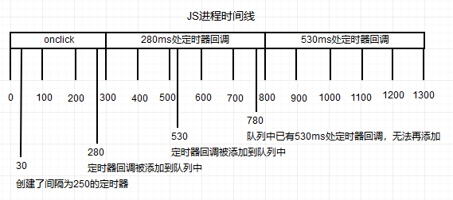
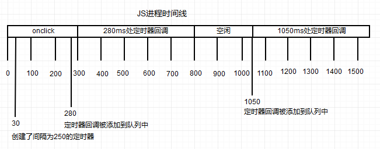

# 一、定时器

[[_TOC_]]

## 1. 方法

定时器指定的时间间隔指的是`何时将定时器的回调函数添加到 JS 引擎线程的宏任务队列`，而不是何时实际执行代码

```javascript
window对象方法：
setTimeout(f,t,...)  //返回定时器编号,t毫秒后将回调函数f添加到等待队列
setInterval(f,t,...) //返回定时器编号,每隔t毫秒将回调函数f添加到等待队列
clearTimeout(tId)    //无返回值,清除编号tId表示的setTimeout定时器
clearInterval(tId)   //无返回值,清除编号tId表示的setInterval定时器
```

## 2. 重复定时器

### (1) setInterval

使用 setInterval 实现重复定时器，仅当 JS 引擎线程的宏任务队列中没有定时器回调时，才会添加新的定时器回调，这样会导致如下 2 个问题，故而不推荐使用

* 某些间隔会被跳过
* 多个定时器的回调执行间隔可能会比预期小，可能会导致连续执行

```javascript
const btn = document.getElementById("btn");
btn.onclick = function(e){
  setInterval(function(){
    console.log("111");
  }, 250)
};
```



### (2) setTimeout

使用 setTimeout 实现重复定时器时，在`前一个定时器回调执行结束之前`，不会再向 JS 引擎线程的宏任务队列添加新的定时器回调

* 确保不会有任何缺失的间隔
* 确保确保下一次定时器回调之前，至少会等待指定的间隔，不会连续执行

```javascript
const btn = document.getElementById("btn");
btn.onclick = function(e){
  setTimeout(function(){
    console.log("111");

    setTimeout(arguments.callee, 250);
  }, 250);
};
```



## 3. 数组分块

运行在浏览器中的 JS 脚本被分配了确定数量的资源（ 内存大小和 CPU 时间 ），有着长时间运行脚本的制约，若代码运行超过特定时间或特定语句数量就不让它继续执行，代码达到限制就会弹出一个浏览器错误的对话框，JS 开发人员的目标就是确保用户永远不会在浏览器中看到这个对话框

**数组分块**：对于长时间运行的循环，若无需同步完成，无需按序完成，则可以使用定时器分割这个循环

```javascript
function chunk(arr, method){
  setTimeout(function(){
    //取出待办队列中下一个条目进行处理
    const item = arr.shift();
    method(item);

    //若代办队列中还有条目,则设置另一个定时器
    if(arr.length > 0){
      setTimeout(arguments.callee, interval);
    }
  }, interval);
}
```

## 5. 函数节流

浏览器中 DOM 操作比非 DOM 操作需要更多和内存和 CPU，连续进行过多的 DOM 操作可能会导致浏览器挂起甚至崩溃

**函数节流**：避免某个函数在没有间断的情况下重复连续执行，第一次调用函数创建一个定时器，第二次调用该函数时清除上一次的定时器并设置另一个

```javascript
function throttle(method){
  clearTimeout(method.tId);

  method.tId = setTimeout(function(){
    method();
  }, interval);
}
```
