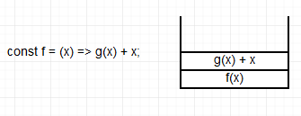
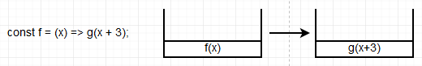
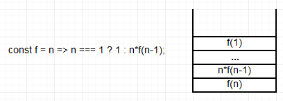
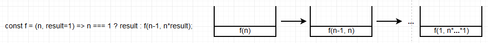

# 三、递归

[[_TOC_]]

## 1. 调用

函数调用会在内存形成一个`调用帧`，保存调用位置和内部变量等信息，多个函数的连续调用会形成一个`调用栈`，占用大量内存

## 2. 尾调用

函数的`最后一步操作`是调用另一个函数，不再用到外层函数的内部变量，则无需保留外层函数的调用帧，可以直接用内层函数的调用帧取代外层函数

## 3. 递归

函数调用自身，递归非常耗费内存，需要同时保存成百上千个调用帧，容易发生`栈溢出`，

## 4. 尾递归

函数尾调用自身，尾递归永远只存在一个调用帧，永远不会发生栈溢出

**尾递归的实现**：将`用到的所有内部变量改写成函数参数`，

