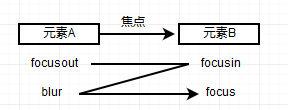

# 五、窗口事件

[[_TOC_]]

## 1. 大小事件

IE、Safari、Chrome、Opera在`浏览器窗口大小变化1像素时`触发，Firefox在`用户停止调整浏览器窗口大小时`触发，

因此需要尽量保证事件处理程序代码简单，避免浏览器反应明显变慢

```javascript
resize //浏览器窗口大小变化时在window对象上触发
```

窗口大小相关属性和方法

```javascript
属性：window.outerWidth     //返回当前窗口的宽度(包括浏览器菜单和边框)
     window.outerHeight    //返回当前窗口的高度
方法：window.resizeTo(x,y)  //缩放当前窗口至指定宽高
     window.resizeBy(x,y)  //缩放当前窗口指定水平位移量x,垂直位移量y
```

### (1) 缩放浏览器窗口

浏览器允许缩放的窗口，必须是通过 window.open() 打开的窗口，并且该窗口只有一个标签页

```javascript
//<button id="btn">打开一个新窗口</button>
//<button id="resizeBtn">缩放新窗口</button>

let w;
const btn = document.getElementById('btn')
const resizeBtn = document.getElementById('resizeBtn')
btn.addEventListener('click', function(e){
  w = window.open("", "", "width=100,height=100");      
  w.focus();
})
resizeBtn.addEventListener('click', function(e){
  w.resizeTo(500, 500);        
  w.focus(); 
})
```

### (2) 监控窗口大小

浏览器窗口全屏时，其大小等于`屏幕减去windows任务栏大小`

```javascript
//和第一个实例联合使用,需在新打开的窗口的控制台输入下列代码
window.addEventListener('resize', function(e){
  console.log(window.outerHeight);
});
```

## 2. 滚动事件

① 用户滚动带滚动条的元素内容时，在`对应元素`上触发，表示的是对应元素的变化，但是事件处理程序必须添加到`window对象`

② scroll 事件会在`滚动期间重复触发`，所以应该尽量保持事件处理程序代码简单，避免浏览器反应明显变慢

```javascript
scroll //用户滚动带滚动条的元素内容时在对应元素上触发
```

滚动相关属性和方法

```javascript
属性：滚动目标：
     document.scrollingElement //返回当前文档的滚动元素
     元素滚动位移：
     elem.scrollTop            //返回/设置elem垂直滚动时上方不可见内容的垂直位移
     elem.scrollLeft           //返回/设置elem水平滚动时左侧不可见内容的水平位移
     文档滚动位移：
     window.pageXOffset        //返回当前窗口加载的文档的水平滚动距离
     window.pageYOffset        //返回当前窗口加载的文档的垂直滚动距离
方法：元素滚动方法：
     elem.scrollIntoView(bool) //无返回值,滚动当前元素让其出现在视口中,true:当前元素顶部与视口顶部平齐,false:当前元素底部与视口底部平齐
     文档滚动方法：
     window.scrollTo(x,y)      //无返回值,滚动当前文档到指定坐标(x,y)
     window.scrollBy(x,y)      //无返回值,滚动当前文档指定水平位移x,垂直位移y
     窗口移动方法：
     window.moveTo(x,y)        //无返回值,移动当前窗口至指定坐标(x,y),屏幕左上角为圆心
     window.moveBy(x,y)        //无返回值,移动当前窗口指定水平位移量x,垂直位移量y
```

### (1) 滚动元素

QQ 聊天有新消息时，新消息滚动并居于页面底部，以吸引用户注意力，

```javascript
//<div id="block"></div>
//<button id="btn">点击</button>

const container = document.getElementById('block');
const btn = document.querySelector("#btn");
btn.addEventListener('click', function(e){
  const div = document.createElement('div');
  div.textContent = 'hahhahahahha';
  container.append(div)
  div.scrollIntoView(true);
})
```

### (2) 滚动当前文档

```javascript
document.addEventListener('scroll', function(e){
  console.log(window.pageYoffset);
});

window.scrollTo(0, 100); //100

window.scrollby(0, 200); //300
```

### (3) 移动当前窗口

浏览器允许移动的窗口，必须是通过 window.open() 打开的窗口，并且该窗口只有一个标签页

```javascript
//<button id="btn">打开一个新窗口</button>
//<button id="moveBtn">移动新窗口</button>

let w;
const btn = document.getElementById('btn')
const moveBtn = document.getElementById('moveBtn')
btn.addEventListener('click', function(e){
  w = window.open("", "", "width=100,height=100");      
  w.focus();
})
moveBtn.addEventListener('click', function(e){
  w.moveTo(100, 100);        
  w.focus();
})
```

## 3. 全屏事件

```javascript
fullscreenchange //全屏模式切换成功时触发
fullscreenerror  //全屏模式切换失败时触发
```

全屏相关属性和方法

```javascript
属性：document.fullscreenEnabled //返回布尔值,当前文档是否可以请求进入全屏模式
     document.fullscreenElement //返回当前文档全屏状态展示的元素节点
方法：elem.requestFullscreen()   //无返回值,当前元素请求进入全屏模式
     elem.exitFullscreen()      //无返回值,当前元素请求退出全屏模式
```

### (1) 全屏显示元素

点击按钮时，全屏显示按钮

```javascript
//<button id="btn">全屏显示按钮</button>

const btn = document.querySelector("#btn");
btn.addEventListener('click', function(e){
  btn.requestFullscreen();
})
document.addEventListener('fullscreenchange', function(e){
  console.log(document.fullscreenElement);
})
```

### (2) 全屏播放视频

点击按钮，全屏播放视频

```javascript
//<video width="300" height="200" controls>
//  <source src="movie.mp4" type="video/mp4">
//</video>
//<button id="btn">全屏播放视频</button>

const btn = document.getElementById('btn')
btn.addEventListener('click', function(e){
  const video = document.getElementsByTagName('video')[0]
  video.requestFullscreen()
})
```

## 4. 焦点事件

通过检测文档是否获得焦点，可以得知用户是否正在与页面交互，而某个元素获取焦点的方式通常有：文档加载完成（body元素获得焦点）、用户输入、调用elem.focus()等

```javascript
焦点事件:
focus    //元素获得焦点时触发,不会冒泡
blur     //元素失去焦点时触发,不会冒泡
focusin  //元素将要获得焦点时触发
focusout //元素将要失去焦点时触发
```



FoucsEvent对象表示`焦点事件`，继承了Event对象

```javascript
e.target        //返回当前事件的目标节点
e.relatedTarget //返回当前事件的相关节点
```

焦点相关属性和方法

```javascript
属性：document.activeElement //返回当前文档获得焦点的元素
方法：元素焦点方法：
     document.hasFocus()    //返回布尔值,当前文档是否有元素获得焦点
     elem.focus()           //无返回值,当前元素获得焦点
     elem.blur()            //无返回值,当前元素失去焦点
     窗口焦点方法：
     window.focus()         //无返回值,当前窗口获得焦点，位于其他所有窗口之前
     window.blur()          //无返回值,当前窗口失去焦点
```

### (1) 表单焦点

登陆界面加载完成后表单第一个控件自动获得焦点，上一个控件填写完毕后下一个控件自动获得焦点

```javascript
//<form>
//  <div>
//    <label>姓名：</label>
//    <input id="name" type="text" placeholder="请输入姓名" />
//  </div>
//  <div>
//    <label>备注：</label>
//    <input id="remark" type="text" placeholder="请输入备注" />
//  </div>
//</form>

const name = document.getElementById('name')
name.addEventListener('keyup', function(e){
  //用户输入姓名且按下Enter键,备注输入框自动获得焦点
  if(e.target.value !== '' && e.key === 'Enter'){
    const remark = document.getElementById('remark')
    remark.focus()
  }
})
```

### (2) 浏览器窗口焦点

```javascript
//<button id="btn">打开一个新窗口</button>

const btn = document.getElementById('btn')
btn.addEventListener('click', function(e){
  const w = window.open("", "", "width=100,height=100");      
  w.focus(); //新窗口获得焦点，位于所有旧窗口之前
})
```
