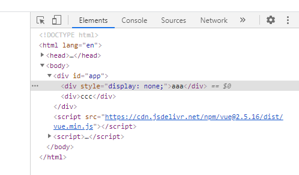
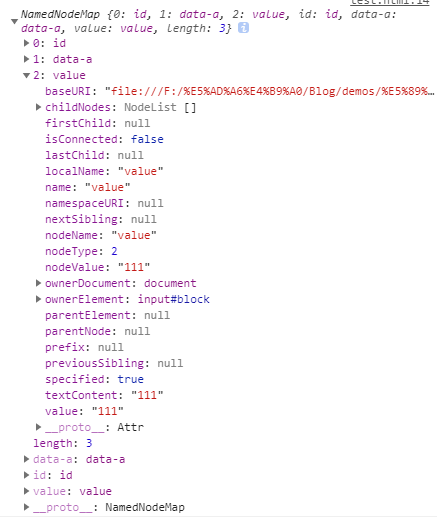
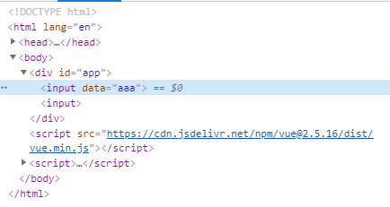

# 一、Vue 模板

[[_TOC_]]

## 1. 真实 DOM

浏览器的渲染引擎线程解析 HTML 代码生成 DOM 树

浏览器的渲染引擎线程解析 CSS 代码生成 CSSOM 树

浏览器的渲染引擎线程将 DOM 树和 CSSOM 树关联起来，构建 Render 树，每个 DOM 节点都有一个 attach 方法接受样式信息，返回 render 对象，这些 render 对象构成一个 Render 树

浏览器的渲染引擎线程遍历 Render 树开始布局，为每个节点确定一个显示屏上的精确坐标

浏览器的渲染引擎线程调用每个节点的 print 方法，将其绘制出来

```html
<div>
  <h1>My title</h1>
  Some text content
  <!-- TODO: Add tagline -->
</div>
```


## 2. 虚拟 DOM

Vue 通过建立一个虚拟 DOM 来追踪如何改变真实 DOM

### (1) 模板

Vue 使用了基于 HTML 的模板语法，偏向于 HTML 但不是 HTML，因此无法被浏览器直接识别

```html
<template>
  <input v-model="value" />
</template>

<script>
export default {
  name: "Home",
  data() {
    return {
      value: "我是小可爱"
    };
  }
};
</script>
```

### (2) 渲染函数

绝大多数情况下，使用模板更加简单，但是在一些场景中需要 JS 的完全编程的能力，这是可以用到渲染函数 render

```html
<script>
import Home from "@/views/Home";

export default {
  components: {
    Home
  },
  render(createElement) {
    return createElement("H1", this.title);
  },
  data() {
    return {
      title: "我是小可爱"
    };
  }
};
</script>
```

### (3) 虚拟 DOM

#### ① VNode

Vue 其实最终也是把模板编译成渲染函数 render，这是 Vue 的底层实现细节，通常不需要关心，不过开发者可以使用 `Vue.compile(template)` 实时编译模板

渲染函数 render 的参数函数 createElement 返回的并不是一个实际的 DOM 节点，而是一个`虚拟节点 VNode`，VNode 更准确的描述其实是 `DOM 节点描述信息`，用来描述需要在页面上渲染一个什么样的 DOM 节点

组件树中的所有 VNode 必须是`唯一`的

#### ② diff 算法

* 旧虚拟 DOM：实际 DOM
* 新虚拟 DOM：初始为实际 DOM，随着用户交互，改变 VNode 之后，和实际 DOM 不同
* 每次用户交互，就会改变新虚拟 DOM 的 VNode
* 每次修改新虚拟 DOM，都会将新虚拟 DOM 和旧虚拟 DOM 通过 diff 算法进行对比，得出 `diff 结果数据表`
* 将`同一事件循环`中的所有数据变更，通过`文档片段`更新到浏览器 DOM
* 浏览器实际 DOM 成为旧虚拟 DOM

#### ③ 文档片段

DocumentFrament 对象表示`一个文档片段`，DOM 规定文档片段是一种轻量级的文档，可以包含和控制节点，但不会像完整的文档那样占用额外的资源

文档片段`不属于当前文档`，故操作文档片段节点比直接操作 DOM 树快得多，常用于先构建一个 DOM 树结构，然后再插入当前文档，可以`避免浏览器反复渲染新信息`的问题

#### ④ 异步更新

Vue 更新 DOM 是异步执行的，Vue 侦听到数据变化，将开启一个队列 ( diff 结果数据表 )，缓存`同一事件循环`中的所有数据变更

下一次事件循环中，Vue 实际更新 DOM，并且清空缓存队列

#### ⑤ 虚拟 DOM 的作用

* **跨平台**：虚拟 DOM 以 JS 对象为基础，可以根据不同的运行环境进行代码转换 ( 浏览器、服务器、原生应用 )，这使得虚拟 DOM 具有了跨平台的能力

* **优化性能**：真实 DOM 操作涉及到渲染引擎线程和 JS 引擎线程的切换，因此是比较耗时的，而虚拟 DOM 通过 diff 算法可以减少不必要的 DOM 操作，从而提升渲染性能
  
  并非所有的 DOM 操作都能够通过虚拟 DOM 提升性能，比如单次删除某个节点，直接操作 DOM 肯定要比虚拟 DOM 计算对比之后再删除要快，所以会看到一些对渲染性能要求比较高的场景，比如在线文档、表格编辑，还是会使用真实 DOM

  > 虚拟 DOM 提升了 DOM 操作的性能下限，降低了 DOM 操作的性能上限

## 3. 指令

Vue 的 14 个指令如下

```javascript
v-text  //内容被 Vue 渲染为文本节点
v-html  //内容被 Vue 渲染为元素节点
v-pre   //所在元素及其子元素不会被 Vue 编译

v-show
v-if
v-else-if
v-else
v-for

v-model //用于表单控件上创建双向数据绑定
v-bind  //用于属性绑定
v-on    //用于事件绑定

v-cloak //保持在 DOM 元素上直到关联实例编译结束
v-once  //只渲染元素或组件一次,随后的重新渲染将被跳过
v-slot  //用于具名插槽和作用域插槽
```

### (1) v-text、v-html、v-pre

* v-text 内容被 Vue 渲染为`文本节点`
* v-html 内容被 Vue 渲染为`元素节点`，v-html 容易导致 XSS 攻击，因此永远不要用在用户提交的内容上
* v-pre 所在元素及其子元素`不会被 Vue 编译`

```html
<div id="app">
  <!-- 以下两者等价 -->
  <div v-text="text"></div>
  <div>{{ text }}</div>

  <div v-html="html"></div>

  <div v-pre>{{ html }}</div>
  <pre>{{ html }}</pre>
</div>

<script src="https://cdn.jsdelivr.net/npm/vue@2.5.16/dist/vue.min.js"></script>
<script>
const vm = new Vue({
  el: '#app',
  data(){
    return {
      text: '我是小可爱',
      html: '<h1>我是小可爱</h1>'
    }
  },
  methods: {}
})
</script>
```

### (2) v-show、v-if

* v-show 根据后跟表达式的真假值，`切换元素样式的 display`
* v-if 根据后跟表达式的真假值，决定是否渲染元素，切换时元素及其数据绑定/组件被`销毁并重建`

```html
<div id="app">
  <div v-show="isA">aaa</div>

  <div v-if="is === 'b'">bbb</div>
  <div v-else>ccc</div>
</div>

<script src="https://cdn.jsdelivr.net/npm/vue@2.5.16/dist/vue.min.js"></script>
<script>
const vm = new Vue({
  el: '#app',
  data(){
    return {
      isA: false,
      is: 'v'
    }
  },
  methods: {}
})
</script>
```



### (3) v-for

v-for 用于实现数组的列表渲染，配合使用 item in/of items 语法，并且最好为每个迭代元素提供一个不重复的 key 属性

* 不使用 key 属性，数组成员改变时，Vue 会为数组成员就近复用已存在的 DOM 节点
* 使用 key 属性，数组成员改变时，Vue 会根据 key 属性的变化重新排列节点顺序

```html
<div id="app">
  <ul>
    <li v-for="item of lis">{{ item }}</li>
  </ul>

  <!-- 配合 ES6 的解构赋值 -->
  <ul>
    <li v-for="{name, age} of users">{{ age }}</li>
  </ul>
</div>

<script src="https://cdn.jsdelivr.net/npm/vue@2.5.16/dist/vue.min.js"></script>
<script>
const vm = new Vue({
  el: '#app',
  data(){
    return {
      lis: ['aaa', 'bbb', 'ccc'],
      users: [
        {name: 'aaa', age: 20},
        {name: 'bbb', age: 21},
        {name: 'ccc', age: 22}
      ]
    }
  },
  methods: {
  }
})
</script>
```

### (4) v-model、v-on、v-bind

* v-model 用于表单控件上创建`双向数据绑定`
* v-bind 用于属性绑定
* v-on 用于事件绑定

#### ① v-model

v-model 用于表单控件上创建`双向数据绑定`，表单数据修饰符如下

```javascript
.trim   //自动过滤用户输入的首尾空格
.number //自动将用户输入转换为数值类型 (不推荐使用)
.lazy   //默认情况下v-model在input事件后同步值,.lazy将改为在change事件后同步
```

```html
<div id="app">
  <input v-model.trim="person.name" @keyup="handleChange"/>
</div>

<script src="https://cdn.jsdelivr.net/npm/vue@2.5.16/dist/vue.min.js"></script>
<script>
const vm = new Vue({
  el: '#app',
  data(){
    return {
      person: {
        name: 'hihj',
      }
    }
  },
  methods: {
    handleChange(){
      console.log(this.person)
    }
  }
})
</script>
```

#### ② v-bind

v-bind 用于属性绑定，属性修饰符如下

```javascript
.prop  //作为一个 property 而非 attribute 绑定
.sync  //扩展成一个更新父组件绑定值的 v-on 侦听器
.camel //将连词符属性名转换为驼峰大小写属性名(开发者规范代码,不推荐使用)
```

class 和 style 属性绑定

```html
<div id="app">
  <div :class="['red', {'big': isBig}]" :style="{backgroundColor: 'blue'}">
    aaa
  </div>
</div>

<script src="https://cdn.jsdelivr.net/npm/vue@2.5.16/dist/vue.min.js"></script>
<script>
const vm = new Vue({
  el: '#app',
  data(){
    return {
      isBig: true,
    }
  },
  methods: {}
})
</script>
```

.prop 修饰符属性绑定

* **attribute**：attribute 是指 `HTML 标签属性`，也就是`属性节点`，是和元素节点同一类型同一层次的存在，都是节点
  
  attribute 不随用户输入改变，只能通过属性节点的操作方法访问和修改

* **property**：property 是指 `DOM 元素节点的属性`，只是一个字段
  
  property 随用户输入改变，可以通过`点访问法`或`方括号访问法`直接访问和修改 DOM 元素节点的属性
  
  ```html
  <input id="block" data-a="a" value="111" />

  <script>
  const div = document.querySelector('#block')

  div.addEventListener('keyup', function(e){
    console.log(e.target.attributes[2])  //attribute,始终输出value="111"
    console.log(e.target.value)          //property, 不断输出最新值
  })

  //元素节点div的属性节点集合
  console.log(div.attributes) //NamedNodeMap {0: id, 1: data-a, 2: value, length: 3}
  ```

  

* .prop 修饰符属性绑定，作为一个 `property` 属性绑定
  
  ```html
  <div id="app">
    <input :data="data1" @keyup="handlePrint1($event)" />
    <input :data.prop="data2" @keyup="handlePrint2($event)" />
  </div>

  <script src="https://cdn.jsdelivr.net/npm/vue@2.5.16/dist/vue.min.js"></script>
  <script>
  const vm = new Vue({
    el: '#app',
    data(){
      return {
        data1: 'aaa',
        data2: 'bbb'
      }
    },
    methods: {
      handlePrint1(e){
        console.log(e.target.data) //undefined
        console.log(e.target.attributes[0]) //data="aaa"
      },
      handlePrint2(e){
        console.log(e.target.data) //'bbb'
      }
    }
  })
  </script>
  ```

  

.sync 修饰符属性绑定

* Vue 仅`表单控件`使用 v-model 双向数据绑定
* Vue 其他地方都是使用 v-bind、v-on 实现`父子组件之间的单向数据绑定`，数据自上而下流 prop，事件自下而上走 this.$emit
* v-bind 加上 .sync 修饰符会扩展成一个更新父组件绑定值的 v-on 侦听器，子组件自动具有 update 方法更新父组件值
  
  父组件代码如下

  ```html
  <template>
    <div id="app">
      <input v-model="data" />
      <About :value.sync="data"></About>
    </div>
  </template>

  <script>
  import About from "@/views/About";
  export default {
    name: "app",
    components: {
      About
    },
    data() {
      return {
        data: "aaa"
      };
    },
  };
  </script>
  ```

  子组件代码如下

  ```html
  <template>
    <div class="about">
      <h1>This is an about page</h1>
      <input v-model="txt" />
    </div>
  </template>

  <script>
  export default {
    name: "app",
    props: {
      value: {
        type: String,
        required: true
      }
    },
    data() {
      return {
        txt: ""
      };
    },
    watch: {
      txt: function(newVal) {
        //更新父组件的 prop - value属性
        this.$emit("update:value", newVal);
      }
    },
  };
  </script>
  ```

#### ③ v-on

v-on 用于事件绑定，事件修饰符如下

* v-on 用在普通元素上只能监听`原生 DOM 事件`
* v-on 用在自定义组件上可以监听`自定义事件`

```javascript
.left     //点击鼠标左键时触发
.right    //点击鼠标右键时触发
.middle   //点击鼠标中键时触发
.keyCode  //按下键盘特定键码的键时触发
.keyAlias //按下键盘特定键名的键时触发

.self     //从绑定元素本身触发
.stop     //禁止事件继续传播,调用e.stopPropagation()
.prevent  //禁止事件默认行为,调用e.preventDefault()
.passive  //允许事件默认行为,不调用e.preventDefault()

.native   //监听原生事件
.once     //仅触发一次
.capture  //捕获触发事件流
```

按键修饰符事件绑定

```html
<div id="app">
  <button @mousedown.middle.once="handleMiddle">鼠标中键</button><br/>
  键名：<input v-model.trim="txt1" @keyup.Enter="handleKey($event)" /><br/>
  键码：<input v-model.trim="txt2" @keyup.13="handleKeyCode($event)" /><br/>
</div>

<script src="https://cdn.jsdelivr.net/npm/vue@2.5.16/dist/vue.min.js"></script>
<script>
const vm = new Vue({
  el: '#app',
  data(){
    return {
      txt1: '',
      txt2: '',
    }
  },
  methods: {
    handleMiddle(){
      console.log('middle')
    },
    handleKey(e){
      console.log(e.key)
    },
    handleKeyCode(e){
      console.log(e.keyCode)
    },
  }
})
</script>
```

.self、.stop、.prevent、.passive 修饰符事件绑定

```html
<div id="app">
  <ul @click.self="handleSelf">
    <li v-for="item in lis">{{ item }}</li>
  </ul>
  <ul @click="handleStop">
    <li v-for="item in lis" @click.stop="">{{ item }}</li>
  </ul>

  <a href="https://fanyi.baidu.com/?aldtype=16047#en/zh" @click.prevent="">百度翻译</a>
  <a href="https://fanyi.baidu.com/?aldtype=16047#en/zh" @click.passive="">百度翻译</a>
</div>

<script src="https://cdn.jsdelivr.net/npm/vue@2.5.16/dist/vue.min.js"></script>
<script>
const vm = new Vue({
  el: '#app',
  data(){
    return {
      lis: ['aaa', 'bbb', 'ccc']
    }
  },
  methods: {
    handleSelf(){
      console.log('self')
    },
    handleStop(){
      console.log('stop')
    }
  }
})
</script>
```

.capture 修饰符事件绑定

```html
<div id="app">
  <!-- 情况1 -->
  <div @click.capture="handle1">
    <div @click="handle2">
      <div @click="handle3">aaa</div>
    </div>
  </div>

  <!-- 情况2 -->
  <div @click="handle1">
    <div @click.capture="handle2">
      <div @click="handle3">aaa</div>
    </div>
  </div>

  <!-- 情况3 -->
  <div @click.capture="handle1">
    <div @click.capture="handle2">
      <div @click="handle3">aaa</div>
    </div>
  </div>
</div>

<script src="https://cdn.jsdelivr.net/npm/vue@2.5.16/dist/vue.min.js"></script>
<script>
const vm = new Vue({
  el: '#app',
  data(){
    return {}
  },
  methods: {
    handle1(){
      console.log('1')
    },
    handle2(){
      console.log('2')
    },
    handle3(){
      console.log('3')
    }
  }
})
</script>

//输出：情况1：1 3 2
//     情况2：2 3 1
//     情况3：1 2 3
```

### (5) v-cloak

v-cloak 用于保持在 DOM 元素上直到关联实例编译结束

v-cloak 常用于消除实例编译结束前的页面闪烁

```css
[v-cloak] {
  display: none;
}
```

```html
<div id="app" v-cloak>
  <div>{{ msg }}</div>
</div>

<script src="https://cdn.jsdelivr.net/npm/vue@2.5.16/dist/vue.min.js"></script>
<script>
const vm = new Vue({
  el: '#app',
  data(){
    return {
      msg: 'aaa'
    }
  },
  methods: {
  }
})
</script>
```

### (6) v-once

v-once 用于只渲染元素或组件一次，随后的重新渲染将被跳过，可用于优化更新性能

```html
<div id="app">
  <div v-once>{{ msg }}</div>
  <input v-model="txt" @keyup="handleChange" />
</div>

<script src="https://cdn.jsdelivr.net/npm/vue@2.5.16/dist/vue.min.js"></script>
<script>
const vm = new Vue({
  el: '#app',
  data(){
    return {
      msg: 'aaa',
      txt: ''
    }
  },
  methods: {
    handleChange(){
      this.msg = this.txt
    }
  }
})
</script>
```

### (7) v-slot

v-slot 仅限用于`模板 <template>` 和`组件`

Vue 实现了一套内容分发的 API，设计灵感来自于 Web Components 规范草案，使用 `<slot>` 元素承载分发内容

#### ① 具名插槽

有时一个组件内需要多个插槽承载不同的内容，为了识别多个插槽而诞生了具名插槽，通过模板或组件的 `v-slot` 指令唯一标识某个插槽，再通过 `<slot name="">` 元素的 name 属性唯一标识某个插槽的承载内容

父组件

```html
<template>
  <div id="app">
    App
    <About>
      <template v-slot:top>我是小可爱</template>
      <template v-slot:bottom>我是大可爱</template>
    </About>
  </div>
</template>

<script>
import About from "@/views/About";

export default {
  name: "App",
  components: {
    About
  },
  data() {
    return {};
  }
};
</script>
```

子组件

```html
<template>
  <div class="about">
    About
    <slot name="top"></slot>
    <slot name="bottom"></slot>
  </div>
</template>

<script>
export default {
  data() {
    return {};
  }
};
</script>
```

#### ② 作用域插槽

父组件中所有内容都是在父级作用域中编译的，子组件中所有内容都是在子级作用域中编译的，插槽中使用数据只能访问当前组件中数据，而不能访问子组件中数据

**插槽 prop**：绑定到 `<slot>` 元素上的 attribute，通过插槽 prop 可以实现父组件插槽访问子组件数据，作用域插槽由此诞生

父组件

```html
<template>
  <div id="app">
    App
    <About>
      <template v-slot:top>
        我是{{ appTitle }}
      </template>
      <template v-slot:bottom="slotProps">
        我是{{ slotProps.aboutTitle }
      </template>

      <!-- 解构赋值 -->
      <template v-slot:bottom="{ aboutTitle }">
        我是{{ aboutTitle }}
      </template>
    </About>
  </div>
</template>

<script>
import About from "@/views/About";

export default {
  name: "App",
  components: {
    About
  },
  data() {
    return {
      appTitle: "大可爱"
    };
  }
};
</script>
```

子组件

```html
<template>
  <div class="about">
    About
    <slot name="top"></slot>
    <slot name="bottom" :aboutTitle="aboutTitle"></slot>
  </div>
</template>

<script>
export default {
  data() {
    return {
      aboutTitle: "小可爱"
    };
  }
};
</script>
```
