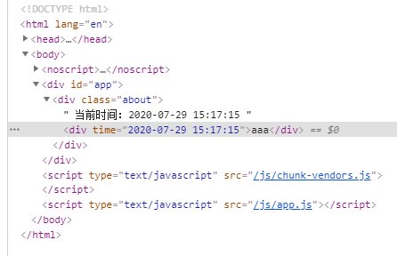

# 三、Vue 实例

[[_TOC_]]

## 1. Vue 实例创建

## 2. Vue 实例生命周期

### (1) 生命周期方法

Vue 实例的 4 个有关生命周期的方法

```javascript
vm.$mount(elem)   //将当前未挂载的实例手动挂载到指定elem元素
vm.$forceUpdate() //强迫当前实例重新渲染,仅影响实例本身和插入插槽内容的子组件,并非所有子组件
vm.$destroy()     //销毁当前实例,清理与其他实例的连接并且解绑全部指令及事件监听,绝大多数情况下不应该调用该方法,而是使用v-if指令以数据驱动的方式控制子组件的生命周期
vm.$nextTick(cb)  //将回调函数延迟到下次 DOM 更新后调用
```

### (2) 生命周期钩子

Vue 实例的 11 个生命周期钩子

```javascript
beforeCreate(){}             //实例初始化之后,数据观测和事件绑定之前被调用
created(){}                  //实例初始化完成之后被调用
beforeMount(){}              //实例被挂载到 DOM 元素之前被调用
mounted(){}                  //实例被挂载到 DOM 元素之后被调用,无法保证所有子组件一起被挂载,如果希望等到整个视图都渲染完毕,可以在内部使用this.$nextTick()
beforeUpdate(){}             //数据更新时,虚拟 DOM 重新渲染之前被调用
updated(){}                  //数据更新时,虚拟 DOM 重新渲染之后被调用
beforeDestroy(){}            //实例销毁之前被调用,此时实例仍然可用
destroyed(){}                //实例销毁之后被调用,此时实例不可用
errorCaptured(err,vm,info){} //捕获一个来自子孙组件的错误时被调用

activated(){}                //被 keep-alive 缓存的组件激活时调用
deactivated(){}              //被 keep-alive 缓存的组件停用时调用
```


### (3) 实例

```html
<div id="app">
  <div id="tit">{{title}}</div>
  <button @click="handleChange">修改</button>
  <button @click="handleDestroy">销毁实例</button>
</div>

<script src="https://cdn.jsdelivr.net/npm/vue@2.5.16/dist/vue.min.js"></script>
<script>
const vm = new Vue({
  el: '#app',
  data(){
    return {
      title: 'hello'
    }
  },
  beforeCreate(){
    console.log('beforeCreate')
  },
  created(){
    console.log('created')
  },
  beforeMount(){
    console.log('beforeMount')
  },
  mounted(){
    console.log('mounted')
  },
  beforeUpdate(){
    console.log('beforeUpdate')
  },
  updated(){
    console.log('updated')
  },
  activated(){
    console.log('activated')
  },
  deactivated(){
    console.log('deactivated')
  },
  beforeDestroy(){
    console.log('beforeDestroy', this.$data.title)
  },
  destroyed(){
    console.log('destroyed', this.$data.title)
  },
  errorCaptured(err,vm,info){
    console.log('errorCaptured')
  },
  methods: {
    handleChange(){
      console.log('hanldeChange1')
      this.title = 'hello world'
      console.log('hanldeChange2')

      //输出：hanldeChange1 hanldeChange2 beforeUpdate updated
    },
    handleDestroy(){
      console.log('handleDestroy1')
      this.$destroy()
      console.log('handleDestroy2')

      //输出：handleDestroy1 beforeDestroy destroyed handleDestroy2
    }
  }
})
</script>
```

## 3. Vue 全局配置

### (1) 全局配置

```javascript

```

### (2) 全局 API

```javascript

```

## 4. Vue 实例选项

### (1) DOM 选项

```javascript
DOM：
el          //将当前 Vue实例挂载到一个页面上已存在的 DOM元素上
template    //字符串模板,用来替换挂载的 DOM元素
render      //渲染函数,用来代替字符串模板
renderError //render函数遭遇错误时错误作为第二个参数传递到renderError(只在开发者环境下工作)
```

详见 二、模板语法

### (2) 生命周期钩子选项

### (3) 资源选项

```javascript
components //返回一个对象,包含当前组件引用的所有子组件
directives //返回一个对象,包含当前组件引用的所有自定义指令,也可以直接注册局部自定义指令
filters    //返回一个对象,包含当前组件引用的所有自定义过滤器,也可以直接注册局部自定义过滤器
```

#### ① directives

directives 选项可以在当前组件注册局部`自定义指令`

```html
<template>
  <div class="about">
    <input v-focus v-model="txt" />
  </div>
</template>

<script>
export default {
  props: {},
  data() {
    return {
      txt: ""
    };
  },
  directives: {
    focus: {
      //挂载元素插入到DOM后
      inserted: function(el) {
        el.focus();
      }
    }
  }
};
</script>
```

#### ② filters

filters 选项可以在当前组件注册局部`自定义过滤器`

**过滤器**：过滤器可以用在`双花括号 {{}} 插值`和 `v-bind 表达式`，过滤器的作用一般是文本格式化

```html
<template>
  <div class="about">
    当前时间：{{ time | formateDate }}
    <div :time="time | formateDate">aaa</div>
  </div>
</template>

<script>
export default {
  props: {},
  data() {
    return {
      time: new Date()
    };
  },
  filters: {
    formateDate: function(date) {
      const year = date.getFullYear();
      let month = date.getMonth() + 1;
      let day = date.getDate();
      let hour = date.getHours();
      let minute = date.getMinutes();
      let second = date.getSeconds();

      month = month < 10 ? "0" + month : month;
      day = day < 10 ? "0" + day : day;
      hour = hour < 10 ? "0" + hour : hour;
      minute = minute < 10 ? "0" + minute : minute;
      second = second < 10 ? "0" + second : second;

      return (year + "-" + month + "-" + day + " " + hour + ":" + minute + ":" + second);
    }
  }
};
</script>
```



### (4) 数据选项

Vue 会递归地将 data 选项中的数据加入响应式系统，但这些数据应该是声明时即存在的

```javascript
props          //当前组件接收到的父组件数据
provide/inject //祖先组件向所有子孙组件注入一个依赖,无论层次有多深,类似于prop
data           //当前组件的数据对象
computed       //当前组件的计算属性
watch          //当前组件的观察器
methods        //当前组件的方法
```

#### ① provide / inject

祖先组件使用 provide 选项暴露自身的数据，子孙组件使用 inject 注入祖先组件暴露的数据，无论组件层次有多深

父组件

```html
<template>
  <div id="app">
    <About></About>
  </div>
</template>

<script>
import About from "@/views/About";
export default {
  name: "App",
  components: {
    About
  },
  provide() {
    return {
      title: this.title
    };
  },
  data() {
    return {
      title: "this is app"
    };
  }
};
</script>
```

子组件

```html
<template>
  <div class="about">
    <Home></Home>
  </div>
</template>

<script>
import Home from "./Home";
export default {
  name: "About",
  components: {
    Home
  }
};
</script>

```

孙组件

```html
<template>
  <div>{{ title }}</div>
</template>

<script>
export default {
  name: "Home",
  inject: ["title"]
};
</script>
```

#### ② computed

computed 选项的计算属性结果会被`缓存`，只有计算属性依赖的响应式 property 发生变化时计算属性才会重新计算

* 组件触发重新渲染时，如果计算属性依赖的响应式 property 没有发生变化，那么计算属性会使用缓存值而不是重新计算
* 相比之下，methods 选项的方法始终会重新调用

如下示例，当改变计算属性的值之后，点击重新渲染按钮，重新渲染当前组件，计算属性的值不变，使用缓存的值，不会重新计算

```html
<template>
  <div class="about">
    a: <input v-model="a" />
    b: <input v-model="b" />
    c: {{ c }}

    personName: <input v-model="personName" />
    name:{{ name }}

    <button @click="$forceUpdate()">重新渲染</button>
  </div>
</template>

<script>
export default {
  props: {},
  data() {
    return {
      a: 3,
      b: 3,
      name: "张三"
    };
  },
  computed: {
    c() {
      return this.a * 2 + this.b;
    },
    personName: {
      get() {
        return this.name;
      },
      set(val) {
        this.name = val;
      }
    }
  }
};
</script>
```

#### ③ watch

watch 选项是一个`观察器`，可以观察当前组件的 data 选项的变量的值变化

组件的 `this.$watch(target,cb,options)` 方法作用同 watch 选项一样

* **deep**：深度监听,可监听到对象属性和数组项的变化
* **immediate**：立即触发一次回调

```html
<template>
  <div class="about">
    <h1>{{ title }}</h1>
    <input v-model="title" />

    <h2>{{ person.name }}</h2>
    <input v-model="person.name" />

    <h3>{{ users[0].name }}</h3>
    <input v-model="users[0].name" />
  </div>
</template>

<script>
export default {
  props: {},
  data() {
    return {
      title: "This is an about page",
      person: {
        name: "张三"
      },
      users: [
        { name: "李四", age: 20 },
        { name: "王五", age: 21 }
      ],
    };
  },
  watch: {
    title: {
      handler: function(newVal, oldVal) {
        console.log("watch", newVal, oldVal);
      }
    },
    person: {
      deep: true,
      handler: function(newVal, oldVal) {
        console.log("watch", newVal.name, oldVal.name);
      }
    },
    users: {
      deep: true,
      handler: function(newVal, oldVal) {
        console.log(newVal, oldVal);
      }
    }
  },
  mounted() {
    this.$watch("title", function(newVal, oldVal) {
      console.log(newVal, oldVal);
    });
    this.$watch(
      "person",
      function(newVal, oldVal) {
        console.log(newVal.name, oldVal.name);
      },
      { deep: true }
    );
    this.$watch(
      "person.name",
      function(newVal, oldVal) {
        console.log(newVal, oldVal);
      },
      { immediate: true }
    );
  }
};
</script>
```

### (5) 混入选项

```javascript
extends        //
mixins         //
```

①②③④⑤⑥⑦⑧⑨⑩

### (6) 其他选项

```javascript
name         //当前组件的名字
delimiters   //当前组件修改默认的双花括号插值符{{}}
comments     //当前组件是否保留渲染HTML模板中的注释,默认false
inhertiAttrs //当前组件是否将父组件不作为prop的attribute作为attribute绑定到自身根元素,默认true
model        //当前组件自定义v-model指令的prop、event,默认将表单控件的value作为prop,input作为event
functional   //当前组件作为函数式组件
```

## 5. Vue 实例属性和方法

Vue 实例：单页面应用程序 SPA 中只有一个 Vue 实例，

VueComponent 实例：Vue 组件是 VueComponent 实例，VueComponent 实例是 Vue 实例的扩展

### (1) Vue 实例属性

```javascript
this.$isServer    //返回布尔值,当前组件是否运行于服务器

this.$root        //返回当前组件的根 Vue实例
this.$parent      //返回当前组件的父组件
this.$children    //返回当前组件的子组件数组

this.$el          //返回当前组件的根 DOM元素
this.$data        //返回当前组件的 data选项
this.$props       //返回当前组件的 props选项
this.$refs        //返回一个对象,包含当前组件内所有注册 ref的 DOM元素和组件
this.$attrs       //返回一个对象,包含父组件对当前组件的未作为 prop识别的 attribute 属性绑定 (class,style除外)
this.$listeners   //返回一个对象,包含父组件对当前组件的事件监听

this.$options     //返回一个对象,包含当前组件的初始化选项
this.$slots       //
this.$scopedSlots //
```

父组件

```html
<template>
  <div id="app">
    <About
      :class="aa"
      :style="{ color: 'red' }"
      :data="data"
      :value="value"
      @click="click"
    ></About>
  </div>
</template>

<script>
import About from "@/views/About";

export default {
  name: "app",
  components: {
    About
  },
  data() {
    return {
      data: "bbb",
      value: "aaa",
      aa: "a"
    };
  },
  methods: {
    click() {}
  }
};
</script>
```

子组件

```html
<template>
  <div class="about">
    <Home></Home>
    <h1 ref="a">{{ title }}</h1>
  </div>
</template>

<script>
import Home from "@/views/Home";
export default {
  name: "app",
  props: {
    value: {
      type: String,
      required: true
    }
  },
  components: {
    Home
  },
  data() {
    return {
      title: "This is an about page"
    };
  },
  mounted() {
    console.log(this.$isServer);  // false
    console.log(this.$root);      // Vue {}
    console.log(this.$parent);    // VueComponent{}
    console.log(this.$children);  // [VueComponent{}]
    console.log(this.$el);        // <div class="about"></div>
    console.log(this.$data);      // {title: 'This is an about page'}
    console.log(this.$props);     // {value: 'aaa'}
    console.log(this.$refs);      // {a: h1}
    console.log(this.$attrs);     // {data: 'bbb'}
    console.log(this.$listeners); // {click: f()}
    console.log(this.$options);   // {parent, propsData, _componentTag, _parentListeners, _parentVnode, _propKeys, _renderChildren}

    // console.log(this.$slots);
    // console.log(this.$scopedSlots);
  }
};
</script>
```

### (2) Vue 实例方法

#### ① 生命周期方法

#### ② 数据方法

```javascript
this.$watch(target,cb,options)         //作用同 Vue组件的 watch选项相同
this.$set(target,propName/index,value) //的
this.$delete(target,propName/index)    //的

options: deep      //深度监听,可监听到对象属性和数组项的变化
         immediate //立即触发一次回调
```

this.$set(target,propName/index,value) 可以为当前组件的 data 选项动态绑定数据，但无法挂载响应式数据到 data 选项，因此建议所有可能在组件中被观察的对象都预先在 data 选项中声明，以便加入 Vue 响应式系统

this.$delete(target,propName/index) 可以为当前组件的 data 选项动态删除数据

```html

```

#### ③ 事件方法

以下事件方法仅适用于组件上的`自定义事件`

```javascript
this.$on(e,cb)        //监听当前组件上的自定义事件e
this.$once(e,cb)      //监听当前组件上的自定义事件e(只触发一次,之后监听器立即被移除)
this.$off(e,cb)       //移除当前组件上的自定义事件e
this.$emit(e,...args) //触发当前组件上的自定义事件e,附加参数...args传给事件回调函数
```

父组件

```html
<template>
  <div id="app">
    <!-- 设置并监听子组件的自定义事件parentClick -->
    <About @parentClick="parentClick"></About>
  </div>
</template>

<script>
import About from "@/views/About";
export default {
  name: "app",
  components: {
    About
  },
  methods: {
    //设置子组件自定义事件parentClick的回调函数
    parentClick() {
      console.log("parent");
    }
  }
};
</script>
```

子组件

```html
<template>
  <div class="about">
    <h1 @click="handleClick">{{ title }}</h1>
  </div>
</template>

<script>
export default {
  name: "app",
  props: {},
  data() {
    return {
      title: "This is an about page"
    };
  },
  mounted() {
    //设置并监听当前组件的自定义事件childClick及回调函数
    this.$on("childClick", () => console.log("child"));
  },
  methods: {
    handleClick() {
      console.log("hello");
      this.$emit("childClick");  //触发当前组件的自定义事件childClick
      this.$emit("parentClick"); //触发当前组件的自定义事件parentClick
    }
  }
};
</script>
```
