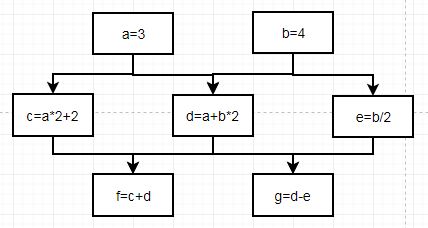

# 四、数据绑定

[[_TOC_]]

## 1. Vue 数据链 ( 单向 )

### (1) 数据链

数据链在学术上被定义为连通数据的链路，数据链上有一到多个数据起点 ( `元数据` )，并通过数据起点不断衍生扩展新的数据节点 ( `衍生数据` )，形成一个庞大的网状数据结构

修改元数据时，数据链上的所有衍生数据都将同步更新



### (2) 函数式编程

函数式编程的核心是根据元数据生成新的衍生数据，提供`唯一确定的输入`，函数将返回`唯一确定的输出`

* 函数式编程不会修改原变量的值
* 函数式编程的函数体只能包含运算过程，并且必须带返回值

通过函数式编程实现衍生数据，可以保证衍生数据的值只依赖元数据而不允许被外界修改

```javascript
const a = 3, b = 4

const c = (a => a*2+2)(a)
const d = ((a, b) => a+b*2)(a, b)
const e = (b => b/2)(b)
const f = ((c, d) => c+d)(c, d)
const g = ((d, e) => d-e)(d, e)

console.log(c) //8
console.log(d) //11
console.log(e) //2
console.log(f) //19
console.log(g) //9
```

### (3) Vue 数据链 ( Computed )

通过数据链和函数式编程，Vue 实现 computed 计算属性以供开发者生成衍生数据，

Vue 通过修改元数据的值来触发一系列 computed 衍生数据的更新

```html
<div id="app">
  a: <input v-model="a" /><br/>
  b: <input v-model="b" />
  <div>c: {{ c }}</div>
  <div>d: {{d}}</div>
  <div>e: {{e}}</div>
  <div>f: {{f}}</div>
  <div>g: {{g}}</div>
</div>

<script src="https://cdn.jsdelivr.net/npm/vue@2.5.16/dist/vue.min.js"></script>
<script>
const vm = new Vue({
  el: '#app',
  data(){
    return {
      a: 0,
      b: 0,
    }
  },
  computed: {
    c(){
      return this.a * 2 + 2
    },
    d(){
      return this.a + this.b * 2
    },
    e(){
      return this.b / 2
    },
    f(){
      return this.c + this.d
    },
    g(){
      return this.d - this.e
    }
  },
  methods: {}
})
</script>
```

## 2. Vue 数据与表单视图绑定 ( 双向 )

### (1) Vue 2.0

Vue 2.0 通过`对象属性的 get set 特性`实现数据与视图的双向绑定

```html
<input id="edit" />

<script>
const edit = document.querySelector('#edit')
const obj = {
  profile: 'aaa'
}
const store = {} //暂存obj的改动,避免栈溢出
Object.defineProperty(obj, 'profile', {
  get(){
    return store.profile
  },
  set(val){
    store.profile = val
    edit.value = val
  }
})
edit.addEventListener('keyup', function(){
  obj.profile = this.value
  console.log(obj.profile)
})
</script>
```

开发者将普通 JS 对象传给 Vue 实例的 data 选项时，Vue 遍历该 JS 对象的属性，并使用 Object.defineProperty() 将其全部转换为 getter/setter

```html
<div id="app">
  <input v-model="obj.profile" @keyup="handleChange"/>
</div>

<script src="https://cdn.jsdelivr.net/npm/vue@2.5.16/dist/vue.min.js"></script>
<script>
const vm = new Vue({
  el: '#app',
  data(){
    return {
      obj: {
        profile: 'hihj'
      }
    }
  },
  methods: {
    handleChange(){
      console.log(this.obj.profile)
    }
  }
})
</script>
```

### (2) Vue 3.0

Vue 3.0 通过 `Proxy` 实现数据与视图的双向绑定

```html
<input id="edit" />

<script>
const edit = document.querySelector('#edit')
const obj = {
  profile: 'aaa'
}
const handler = {
  get(obj, prop, receiver){
    return Reflect.get(obj, prop)
  },
  set(obj, prop, val, receiver){
    Reflect.set(obj, prop, val)
    edit.value = val
  },
}
const objProxy = new Proxy(obj, handler)
edit.addEventListener('keyup', function(){
  objProxy.profile = this.value
  console.log(obj.profile)
})
</script>
```

①②③④⑤⑥⑦⑧⑨⑩
