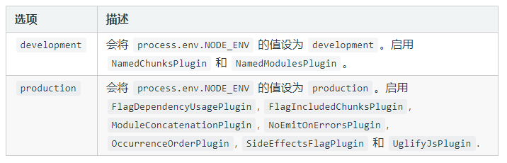
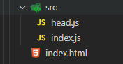
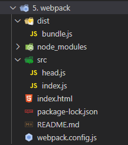

# 二、Webpack

[[_TOC_]]

## 1. Webpack

Webpack 本质上是一个现代 JS 应用程序的静态模块打包器，Webpack 处理应用程序时，会递归地构建一个`依赖关系图`，其中包含应用程序需要的每个模块，然后将所有模块打成一或多个包

### (1) 模块化问题解决

Webpack 以模块化思想为核心，帮助开发者更好的管理整个前端工程

* 对于有环境兼容性问题的代码，Webpack 可以在打包过程中通过 Loader 机制对其实现编译转换，然后再进行打包
* 对于零散的 JS 文件，Webpack 可以将其打包到一个 JS 文件中
* 对于不同类型的前端模块，Webpack 支持在 JS 中以模块化的方式载入任意类型的资源文件，如在 JS 中载入 CSS 文件，被载入的 CSS 文件将会以 `<style>` 标签的方式工作

### (2) 渐进式加载

<!-- Webpack 具备代码拆分的能力，能够将所有模块`按需分块打包`，这样就无需担心全部代码打包到一起，产生单个文件过大，加载缓慢的问题

可以将初次加载必须的模块打包到一起，其他的模块再单独打包，等到应用工作过程中实际需要某个模块时，再异步加载该模块，实现增量加载，这非常适合现代化的大型 Web 应用 -->

## 2. 模式 mode

### (1) mode

Webpack 4 的工作模式可以理解为针对不同环境的几组预设配置，mode 指示 Webpack 使用相应模式的内置优化

* production ( 默认 )：生产模式，`自动优化打包结果`，启动内置优化插件，打包速度偏慢
* development：开发模式，`自动优化打包速度`，添加一些调试过程中的辅助插件
* none：原始模式，`不做任何额外处理`，运行最原始的打包



webpack.config.js

```javascript
module.exports = {
  mode: 'development', //开发模式
  mode: 'production',  //生产模式
  mode: 'none'         //原始模式
}
```

### (2) 通过原始模式理解打包原理

将 mode 设置为 none，就是不做任何额外处理的原始打包，这种方式下打包出来的 JS 文件可以阅读源码，方便理解 Webpack 打包原理

#### ① 项目结构

项目目录如下



index/html

```html
<!DOCTYPE html>
<html lang="en">
<head>
  <meta charset="UTF-8">
  <title>Webpack</title>
</head>
<body>

<script src="src/index.js" type="module"></script>
</body>
</html>
```

src/index.js

```javascript
import createHeading from './head.js'
const heading = createHeading()
document.body.append(heading)
```

src/head.js

```javascript
// 导出一个箭头函数
export default () => {
  const element = document.createElement('h2')
  element.textContent = 'Hello webpack'
  element.addEventListener('click', () => alert('Hello webpack'))
  return element
}
```

#### ② Webpack 配置

* 工作台输入 npm i webpack webpack-cli --save-dev
  
  安装 webpack-cli，由此在根目录生成 node_modules 文件夹和 package-lock.json 文件

* webpack.config.js 文件
  
  项目根目录添加 `webpack.config.js` 文件，完成 Webpack 配置

```javascript
const config = {
  mode: 'none', //不做任何额外工作的原始打包，方便阅读打包后的JS文件代码
  entry: './src/index.js',
  output: {
    filename: 'bundle.js'
  }
}

module.exports = config
```

#### ③ 打包

工作台输入 `npx webpack`，按照 webpack.config.js 文件的配置开始打包



#### ④ bundle.js

VSCode 中折叠代码的快捷键是 Ctrl + K，Ctrl + 0，折叠文件方便了解整体结构

## 3. 入口 entry

入口指示 Webpack 应该使用哪个模块作为构建依赖关系图的开始，Webpack 首先进入入口，然后找出入口直接或间接依赖的模块和库，每个依赖项随即被处理，最后被输出到称之为 bundles 的文件中

* Webpack 配置项 entry 属性可以指定`一或多个`入口

webpack.config.js

```javascript
module.exports = {
  entry: {
    app: './src/main.js', //单页面应用程序
  },
  entry: {
    pageOne: './src/pageOne/index.js', //多页面应用程序
    pageTwo: './src/pageTwo/index.js',
    pageThree: './src/pageThree/index.js'
  }
}
```

## 4. 出口 output

出口指示 Webpack 在磁盘哪里输出创建的 bundles，如何向磁盘写入编译文件，以及如何命名这些文件

* Webpack 配置项 output 属性只能指定`一个`出口

webpack.config.js

```javascript
const path = require('path');

module.exports = {
  output: {
    filename: 'bundle.js', //输出一个js文件
    path: path.resolve(__dirname, '../dist/static') //输出目录
  },
  output: {
    //多入口或使用CommonsChunkPlugin插件
    filename: '[name].js', //输出多个js文件,使用占位符确保每个文件具有唯一名称
    path: path.resolve(__dirname, '../dist/static')
  }
};
```

## 4. 加载 loader

Webpack 是 JS 模块打包工具，Webpack 自身只理解 JS

loader 机制使 Webpack 成为整个前端项目的打包工具，可以管理和打包前端项目任意类型的资源文件

loader 让 Webpack 能够处理非 JS 文件，loader 可以将所有类型文件转换成 Webpack 能够处理的有效模块，然后开发者就可以利用 Webpack 的打包能力对其进行处理

loader 配置有两个目标

* test 属性：标识应该被对应 loader 转换的某些文件
* use 属性：标识转换时应该使用哪个 loader

webpack.config.js

```javascript
const path = require('path');

const config = {
  output: {
    filename: 'my-first-webpack.bundle.js'
  },
  module: {
    rules: [
      // 碰到 require()/import 语句中被解析为 '.txt' 的路径时,打包之前先用 raw-loader 转换一下
      { test: /\.txt$/, use: 'raw-loader' }
    ]
  }
};

module.exports = config;
```

## 5. 插件 plugins

插件执行的范围包括：打包优化和压缩、重定义环境中的变量等，插件的功能及其强大，可以用来处理各种各样的任务

webpack.config.js

```javascript

```

## 6. 配置 configuration

## 7. 模块 modules

①②③④⑤⑥⑦⑧⑨⑩
