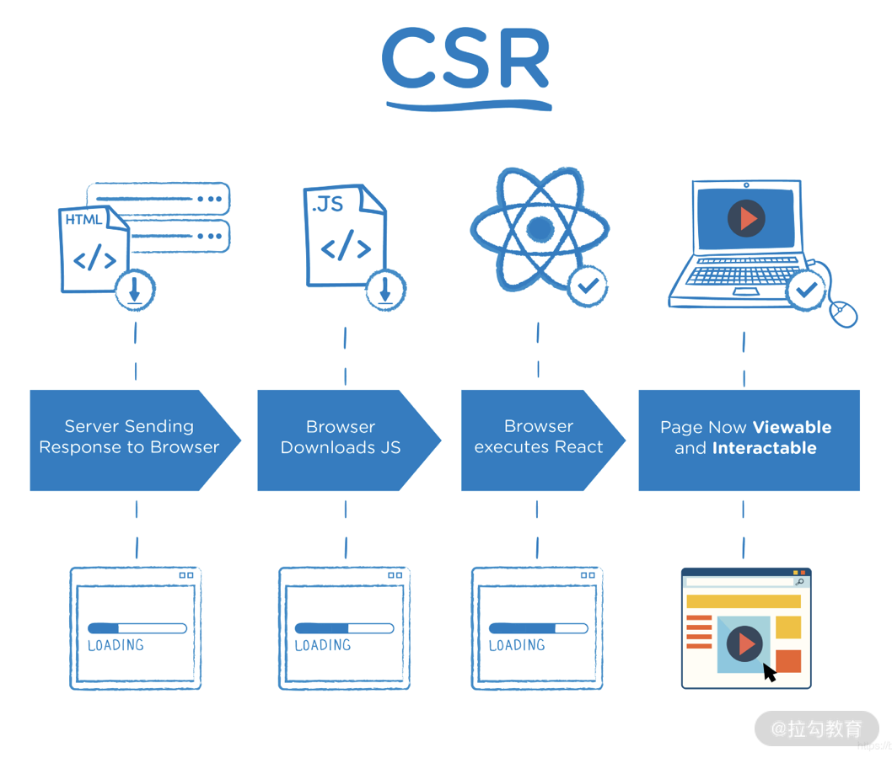
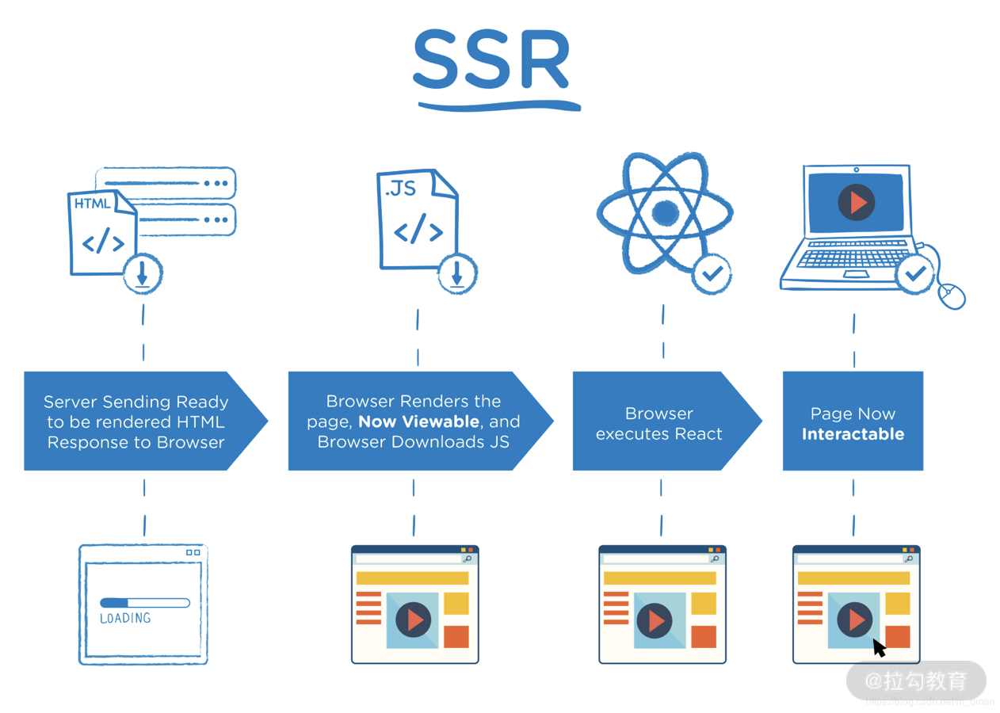

# 一、渲染方式

[[_TOC_]]

## 1. 渲染方式

## 2. 客户端渲染 CSR

所谓客户端渲染，指的就是从服务器发回来的 HTML 中并没有页面内容，所有的内容都是等到页面中的 JavaScript 代码执行完成过后，动态创建出来的。大体过程我们可以参考下图：

这种客户端渲染模式的弊端显而易见：

页面的“白屏”时间更长，用户体验不好；
HTML 中无内容，SEO 不友好。

## 3. 服务器渲染 SSR

服务端渲染就是在服务端多做了一些额外的工作：传统客户端渲染模式，在服务端接收到请求过后，只需要找到对应的 HTML 静态文件返回给客户端即可；而服务端渲染模式下，服务端接收到请求过后，会先执行一遍对应的 JavaScript，让页面在服务端先渲染一遍，然后将渲染的结果发送给客户端。所以客户端接收到的就是渲染过后的 HTML，自然也就没有上述问题。

目前主流的前端框架，比如 React、Vue.js、Angular 都有对应的服务端渲染方案，不过如果直接原生实现服务端渲染，那么需要你掌握的内容会比较多，也比较杂，其中的很多概念也会比较难理解。很多时候我们会选择直接使用一些集成式的服务端渲染框架，比如 Next.js 或者 Nuxt.js。

①②③④⑤⑥⑦⑧⑨⑩
