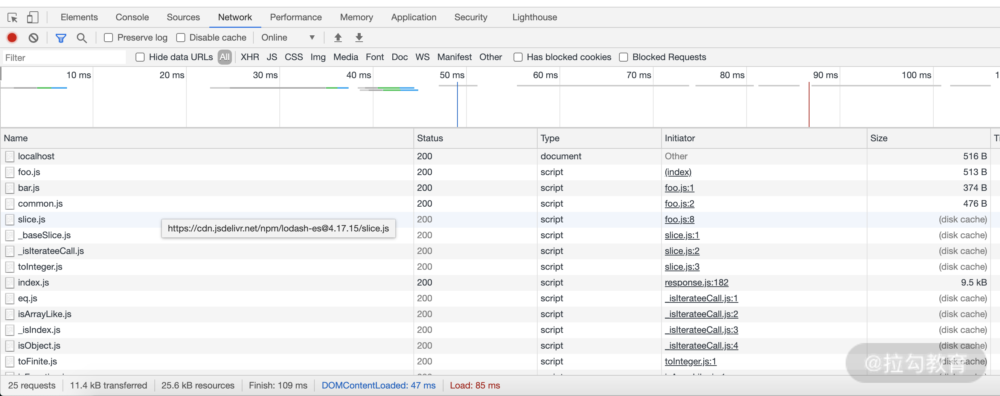

# 五、Vite

[[_TOC_]]

## 1. 无包构建

### (1) 打包构建工具

打包构建工具例如 Webpack、Rollup、Parcel，都是基于一或多个入口模块，通过依赖分析将有依赖关系的模块打包到一起，形成少数几个产物代码包的形式

### (2) 无包构建工具 Native-ESM（Native ES Module）

无包构建指的是在构建时只需处理模块的编译而无需打包，将模块间的依赖关系完全交给浏览器处理，浏览器自动加载入口模块，分析依赖后再通过网络请求依赖模块，通过这样的方式简化构建时的处理过程，提升构建效率，这种方式是通过浏览器原生的模块解析方式

```javascript
//./src/index.html
<script type="module" src="./modules/foo.js"></script>

//.src/modules/foo.js
import { bar } from './bar.js'
import { appendHTML } from './common.js'
import('https://cdn.jsdelivr.net/npm/lodash-es@4.17.15/slice.js').then((module) => {...})
```

如下图所示，在没有任何构建工具的情况下，在页面中引入带有 type="module" 属性的 JS 脚本，浏览器会在加载入口模块时依次加载所有依赖模块



#### ① ES6 Module 注意事项

* JS 脚本需要带上 `type="module"` 属性，默认通过 `defer` 的方式下载执行
* defer 属性，异步下载，不阻塞 HTML 解析，下载完成后，渲染树生成并且所有其他脚本执行完成后按照 `script 标签出现的顺序`执行
* async 属性，异步下载，不阻塞 HTML 解析，下载完成后，按照脚本`下载完成的顺序`执行
* 即使多次加载相同模块，也只会`执行一次`
* 只支持引用 `ES6 Module 模块`，不支持 CSS、图片等其他类型文件
* 只支持 ES6 风格的模块导入方式 `import`
* 只支持`相对路径`（/x、./x、../x）和 `URL 方式`（http://x、https://x）

#### ② 无包构建的优点

* **初次构建启动快**：打包构建流程在启动时，需要进行一系列的模块依赖分析与编译，无包构建中这些工作都是由`浏览器渲染页面时异步处理`的，启动服务时只需进行少量的优化处理即可，因此启动非常快
* **按需编译**：打包构建流程在启动时，需要完整地编译打包所有模块，无包构建则是在浏览器渲染时根据入口模块分析加载所需模块，`编译过程按需处理`，相比之下处理内容更少，速度更快
* **增量构建速度快**：修改代码后的重新打包过程中，打包构建需要编译修改模块和打包产物，无包构建只需要编译修改模块，相比之下速度更胜一筹

#### ③ 无包构建的缺点

* **浏览器兼容性不好**：目前主流浏览器大多支持 ES6 Module 特性，但仍有一些低版本浏览器不支持
* **浏览器网络请求次数剧增**：无包构建的运行模式决定了在一般项目里渲染页面所需发起的请求数远比打包构建多得多，使得打开页面会产生瀑布式的大量网络请求，延迟页面渲染，这对于服务稳定性和访问性能要求极高的生产环境而言是不能接受的，因此只在开发环境下使用无包构建，在生产环境下仍使用打包构建
* **只支持 ES6 Module 模块**：其他类型的文件必须要编译成 ES6 Module 模块才能被浏览器正常加载
* **URL 导入路径繁琐**：许多第三方包在通过第三方 URL 引用时，不仅过程繁琐，往往难以进行灵活的版本控制与更新，因此需要更适合的方式解决引用路径的问题
* **缺少辅助开发技术**：对于现实的项目而言，一些便利的辅助开发技术例如热更新等还是需要由构建工具提供

## 2. Vite

Vite 是 Vue 作者尤雨溪最新推出的基于 Native-ESM 的 Web 构建工具，开发环境下基于 Native-ESM 只编译不打包，生产环境下基于 Rollup 打包

### (1) Vite 的使用限制

* 面向支持 ES6 的现代浏览器
* 仅支持最新的 Vue 3 框架，不兼容低版本

### (2) Vite 辅助功能

* **多框架**：Vite 支持 Vue、React，默认提供了 Vue、React 对应的脚手架模板
* **热更新 HMR**：Vite 在默认提供的脚手架模板中内置了热更新 HMR 功能，同时也提供了 HMR API 供第三方插件或项目代码使用
* **自定义配置文件**：Vite 支持自定义配置文件来细化构建配置
* **HTTPS、HTTPS**：Vite 支持开启使用 HTTPS、HTTP2 协议的开发服务器
* **代理**：Vite 支持在自定义配置文件中配置代理，将部分请求代理到第三方服务
* **环境变量**：Vite 支持通过 mode 指定构建模式为 development、production，相应模式下自动读取 dotenv 类型的环境变量配置文件
* **生产环境打包**：Vite 支持在生产环境下使用 Rollup 打包，并且支持传入自定义配置

①②③④⑤⑥⑦⑧⑨⑩
