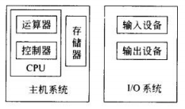
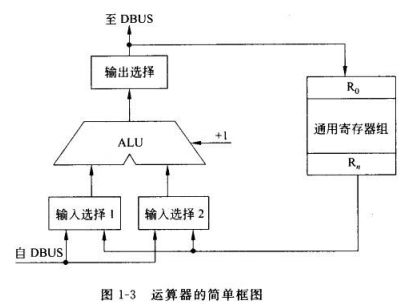
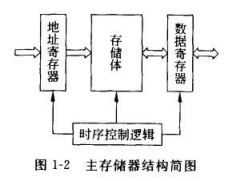
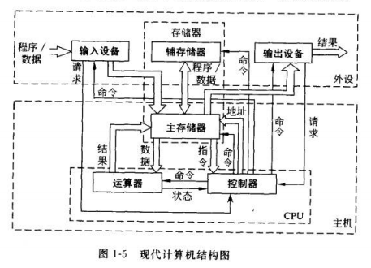

# 一、计算机组成

[[_TOC_]]

## 1. 计算机硬件

计算机的硬件系统是指组成一台计算机的各种物理装置，由各种实实在在的器件组成，是计算机工作的物质基础

### (1) 计算机硬件的组成

计算机硬件系统由控制器、运算器、存储器、输入设备、输出设备五个部分组成

#### ① 控制器

控制器是计算机的控制中心，控制器根据`计算机程序`控制计算机各个部件有条不紊地自动工作

#### ② 运算器

运算器是计算机的执行部件，用于对数据的加工处理，完成算术运算和逻辑运算

**① 算术逻辑部件 ALU**：运算器的核心

**② 寄存器**：运算器中设有若干寄存器，用于暂存操作数据和中间结果

#### ③ 存储器

存储器是计算机的存储部件，用来存放`计算机程序`和`数据`

#### 主/内存储器

主存用于存放大部分计算机程序和数据，CPU 能够直接访问主存

* **存储体**：主存的存储体分为很多个存储单元，每个存储单元都有唯一的地址码，要访问主存的某个存储单元，对其进行读写操作，必须给出被访存储单元的地址码
* **地址寄存器**：地址寄存器存放被访存储单元的地址码
* **数据寄存器**：数据寄存器是主存与其他计算机部件的接口，用于暂存从主存读出/向主存写入的信息
* **时序控制逻辑**：时序控制逻辑用于产生存储器各种操作所需的时序信号

#### 辅/外存储器

外存用于帮助主存记忆更多的信息，外存的信息必须调入主存后才能被 CPU 使用

#### ④ 输入设备

输入设备用于将计算机程序和数据以计算机能够识别和接收的信息形式输入到计算机

**常用的输入设备**：键盘、鼠标、扫描仪、摄像机

#### ⑤ 输出设备

输出设备用于将计算机的处理结果以人们能识别和接收的信息形式输出

**常用的输出设备**：显示器、打印机

### (2) 计算机硬件的发展

#### ① 微处理器 CPU

随着微电子技术的进步，人们研制出了将控制器和运算器合二为一，集成到一个芯片里的微处理器 CPU

#### ② 主机

将 CPU 、`主存`统称为主机

#### ③ 外设 IO

将`外存`、输入设备、输出设备统称为外设

## 2. 计算机软件

计算机软件就是计算机程序，CPU 就是根据`计算机程序`控制计算机各个部件有条不紊地自动工作，计算机程序分为系统程序和应用程序两大类

计算机程序通常由高级语言编写`源程序`，源程序包含数据结构、算法、存储方式等，源程序经过语言处理程序转换成计算机接受的`机器语言`

### (1) 系统程序

系统程序是一组保证计算机高效正确运行的基础软件，通常由计算机制造厂商或专业软件公司设计，如操作系统、语言处理程序等

#### ① 操作系统

操作系统是计算机软件系统的核心，负责管理和控制计算机的硬件资源、软件资源、程序的运行过程，包括内存管理、并发控制、进程/线程调度、磁盘调度、IO 管理，文件管理等

操作系统是用户与计算机之间的接口，提供了`应用程序`的开发环境和运行环境

#### ② 语言处理程序

计算机硬件只能识别和处理机器语言，因此任何由其他语言编写的程序都必须由语言处理程序翻译为机器语言后才能由计算机硬件去执行和处理

**编译程序**：编译程序将源程序全部翻译为机器语言的目标程序后，再执行目标程序

**解释程序**：解释程序对源程序边解释边执行

### (2) 应用程序

应用程序是为了解决用户特定问题而设计的程序，通常由专业软件公司或用户自己设计，如账务处理程序、文字处理程序等

操作系统是应用程序的开发环境和运行环境，所有的应用程序都是运行在操作系统这个系统程序之上的

#### ① 脚本程序

脚本程序是用脚本语言开发的程序，脚本语言比较接近自然语言，可以不经过编译、直接解释执行

**常见脚本语言**：JS、Python、PHP、Shell、SQL

#### ② Web 程序

①②③④⑤⑥⑦⑧⑨⑩

## 3. 硬件和软件的关系

计算机由硬件系统和软件系统两部分组成，硬件和软件紧密相关、缺一不可，硬件是计算机的物质基础，软件需要在硬件的基础上运行，软件是计算机的灵魂，没有软件，硬件毫无用途

计算机硬件和软件在逻辑功能上等效，理论上来说，计算机的任意功能都既可以用硬件实现，也可以用软件实现，因此在设计一个计算机系统时，必须根据设计要求、现有技术、器件条件，明确哪些功能由硬件实现，哪些功能由软件实现
