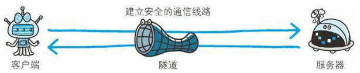

# 三、Web 服务器

[[_TOC_]]

## 1. 虚拟主机

在一台运行在互联网的 `Web 服务器`上，划分出一定的`磁盘空间`，供用户放置站点、应用组件等，提供必要的数据存放、站点功能、传输功能，对外表现为多个虚拟 Web 服务器，从而充分利用 Web 服务器硬件资源

### (1) 端口对应

借助同一个 IP 地址的不同`端口号`来管理同一台 Web 服务器上的多个服务

### (2) IP 地址对应

借助不同的 `IP 地址`来管理同一台 Web 服务器上的多个服务

### (3) 网址名称对应

借助不同的`域名`来管理同一台 Web 服务器上的多个服务
  
HTTP/1.1 协议允许一台 Web 服务器通过`网址名称对应的虚拟主机功能`搭建多个 Web 站点，互联网上，域名通过 DNS 服务器映射到 IP 地址之后访问 Web 服务器，可见当请求发送到 Web 服务器时已经是 IP 地址的形式了，因此当一台 Web 服务器内托管了多个域名时，收到请求就必须弄清楚是访问哪个域名，因此发送 HTTP 请求时必须在 `Host` 首部字段指定带域名的主机名的完整 URI

## 3. Web 通信数据转发程序

### (1) 代理

**原理**：代理是一种具有转发功能的应用程序，扮演了客户端和服务器中间人的角色，接收客户端发送的请求并转发给服务器，接收服务器返回的响应并转发给客户端

* HTTP 通信过程中，可级联多台代理服务器，请求和响应的转发会经过数台类似锁链一样连接起来的代理服务器，转发时需要附加 `Via` 首部字段以标记经过的服务器信息

* **缓存代理**：缓存代理转发响应时，会预先将资源的副本保存在代理服务器上，当再次收到对相同资源的请求时，就可以不从源服务器获取资源，而是将之前缓存的资源作为响应返回，利用缓存代理可以减少网络带宽

* **访问控制**：通过设置代理服务器可做到针对特定 URI 访问的控制

### (2) 隧道

**原理**：隧道是一种在`相隔甚远`的客户端和服务器间进行中转，并保持双方进行`安全`的通信连接的应用程序

* 隧道可以使用 SSL 等加密手段，隧道的目的是确保客户端能与服务器进行`安全`的通信

* 隧道本身不会去解析 HTTP 请求，请求会保持原样中转给源服务器，隧道会在通信双方断开连接时结束

### (3) 网关

**原理**：网关是转发其他服务器通信数据的服务器，接收从客户端发送的请求并对请求进行一定的加工处理 (协议转换)

* **协议转换器**：网关具有协议转换的作用，能使通信线路上的服务器提供非 HTTP 协议服务

* 利用网关能够提高通信的安全性，因为可以在客户端与网关之间的通信线路上加密以确保连接的安全

①②③④⑤⑥⑦⑧⑨⑩
