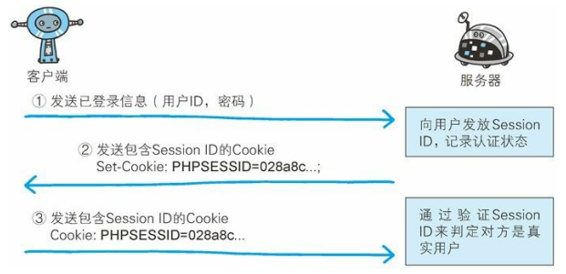

# 一、Cookie

[[_TOC_]]

## 1. Cookie

### (1) Cookie 的由来

**由来**：HTTP 协议是无状态协议，用户登陆 Web 页面后不会记录已登陆状态，那么每次跳转新页面都需要再次登陆，或者在每次的 HTTP 请求报文中附加参数来管理登陆状态，针对这种情况，引入了 Cookie 技术，Cookie 技术通过在 HTTP 请求报文中附加 Cookie 信息来控制客户端状态

**标准化**：HTTP 报文中与 Cookie 相关的字段有 2 个，响应报文的 Set-Cookie 字段、请求报文的 Cookie 字段，这两个字段都没有计入 HTTP 协议的 RFC 标准，属于 HTTP 报文首部的其他首部字段

① 用户登陆 Web 页面时，客户端将用户 ID 和密码放入报文主体，然后将请求发送给服务器

② 服务器验证客户端发送的登陆信息进行身份认证，验证通过后发放用以识别用户的 `Session ID`，然后将用户的认证状态和 Session ID 绑定后记录在服务器，服务器返回响应时，添加其他首部字段 Set-Cookie 记录 Session ID 值

③ 客户端收到服务器返回的 Set-Cookie 字段后，从中获取 Session ID 值，将其作为 Cookie 保存在本地，下次向服务器发送请求时，浏览器会自动发送 Cookie，服务器就可以通过验证 Session ID 识别用户及其认证状态



### (2) Cookie 的特点

#### ① 存储空间小

Cookie 的数量和大小受到不同的浏览器限制，一般来说，`单个源 (协议、域名、端口)` 下设置的 Cookie 不应超过 `30 个`，每个 Cookie 的大小不应超过 `4KB`，超过限制的 Cookie 将被忽略不会被设置

#### ③ 同源限制

Cookie 受到`同源限制`，网页只能访问自身源下的 Cookie，而不能访问跨域的 Cookie

## 2. 服务器设置/添加/修改/删除 Cookie

服务器返回给客户端的 HTTP 响应报文，通过 `Set-Cookie 字段` 在客户端浏览器生成 Cookie

### (1) 服务器设置 Cookie

#### ① Cookie 名称和值

* Cookie 的名称和值就是服务器对用户身份认证通过后，发放的用以识别用户及其登陆状态的 `Session ID`

```javascript
Set-Cookie: sid=a3fWa;
```

#### ② Domain、Path 属性

* Domain 属性指定 Cookie 的所属域名。若 Set-Cookie 字段指定 Domain 属性，Cookie 对`指定域名及其子域名`生效；若 Set-Cookie 字段未指定 Domain 属性，浏览器默认 Cookie 只对`当前域名`生效，当前域名的子域名不生效
* Path 属性指定 Cookie 的生效路径
* 浏览器访问某个路径之前，会先找出对该域名和路径有效且未到期的 Cookie 一起发送给服务器
  
```javascript
//当前 Cookie 对域名 example.com 及其子域名 www.example.com 等生效
Set-Cookie: sid=a3fWa; Domain=example.com;

//当前 Cookie 只有在访问 www.example.com 及其子路径才生效
Set-Cookie: sid=a3fWa; Domain=www.example.com; Path=/

//当前 Cookie 只有在访问 www.example.com/forms 及其子路径才生效
Set-Cookie: sid=a3fWa; Domain=www.example.com; Path=/forms
```

#### ③ Max-Age、Expires 属性

* Max-Age 属性指定从现在开始 Cookie 存在的秒数，过了指定时间浏览器将不再保留这个 Cookie
* Expires 属性指定 Cookie 的过期时间，到了指定时间浏览器将不再保留这个 Cookie
* 如果 Set-Cookie 字段同时指定 Max-Age 属性和 Expires 属性，那么 Max-Age 属性优先生效
* 如果 Set-Cookie 字段没有指定 Max-Age 属性和 Expires 属性，那么这个 Cookie 的有效期仅限于维持浏览器会话的时间段内，通常限于浏览器应用程序关闭之前

```javascript
Set-Cookie: sid=a3fWa; Max-Age=60; Expires=Wed, 21 Oct 2015 07:28:00 GMT;
```

#### ④ Secure、HttpOnly 属性

* Secure 属性指定浏览器只有在加密协议 HTTPS 下才将 Cookie 发送给服务器
* HttpOnly 属性指定 Cookie 无法由 JS 脚本使用 `document.cookie` 获得，主要目的是为了防止跨站脚本攻击 XSS (Cross-site scripting) 对 Cookie 信息的窃取

```javascript
Set-Cookie: sid=hdhfhbg136254; Secure; HttpOnly
```

#### ⑤ SameSite 属性

**CSRF 攻击**：恶意网站设法伪造带有正确 Cookie 的 HTTP 请求，例如用户登陆银行网站，银行服务器返回一个 Cookie，用户又访问恶意网站，上面有一个表单，用户一旦被诱骗发送这个表单，银行网站就会收到带有正确 Cookie 的请求，这种由第三方网站引导发出的 Cookie，就被称为第三方 Cookie，Chrome 51 浏览器为 Cookie 新增了一个 SameSite 属性，用来限制第三方 Cookie 以防止 CSRF 攻击，SameSite 属性可以设置三个值

* Strict 完全禁止第三方 Cookie，跨站点时任何情况下都不会发送 Cookie，换言之，只有当前网页的 URI 与请求 URI 完全一致，才会带上 Cookie
  
  ```javascript
  Set-Cookie: sid=sjkhfiuegfie; SameSite=strict;
  ```

* Lax 是大多数情况下不发送 Cookie，如下表格所示
  
  |请求类型|示例|正常情况|Lax|
  |-------|----|-------|---|
  |链接    |`<a href="..."></a>`                |发送|发送|
  |预加载  |`<link rel="prerender" href="..."/>`|发送|发送|
  |GET表单 |`<form method="GET" action="...`    |发送|发送|
  |POST表单|`<form method="POST" action="...">` |发送|不发送|
  |iframe  |`<iframe src="..."></iframe>`       |发送|不发送|
  |AJAX    |`$.get("...")`                      |发送|不发送|
  |Image   |``                   |发送|不发送|

* Chrome 计划默认设置 SameSite=Lax，这是可以通过设置 SameSite=None 显式关闭 SameSite 属性，不过前提是必须同时设置 Secure 属性，否则无效
  
  ```javascript
  //无效
  Set-Cookie: sid=abc123; SameSite=None;

  //有效
  Set-Cookie: sid=abc123; SameSite=None; Secure;
  ```

### (2) 服务器添加 Cookie

服务器返回给客户端的 HTTP 响应报文，可以包含多个 `Set-Cookie 字段`，意在客户端浏览器生成多个 Cookie

```javascript
//服务器在客户端浏览器生成 3 个 Cookie
Set-Cookie: sid=sjkhfiuegfie; //用户登陆状态
Set-Cookie: fontSize=14;      //用户偏好(网页字体大小)
Set-Cookie: color=red;        //用户偏好(网页背景颜色)
```

### (3) 服务器修改 Cookie

服务器想要修改一个早先设置的 Cookie，必须同时满足 4 个条件，Cookie 的`名称、domain、path、secure 属性`都匹配，只要有一个属性不同，就是一个全新的 Cookie，而不是替换掉原有的 Cookie

```javascript
//原有的 Cookie
Set-Cookie: sid=value1; Domain=example.com; Path=/blog; secure

//修改原有的 Cookie
Set-Cookie: sid=value2; Domain=example.com; Path=/blog; secure
```

### (4) 服务器删除 Cookie

一旦 Cookie 从服务器发送至客户端，服务器就无法显式删除 Cookie，但是可以通过修改其 Expires 属性为一个过去的日期，实现实质性的删除操作

```javascript
//原有的 Cookie
Set-Cookie: sid=value1; Domain=example.com; Path=/blog; secure;

//删除原有的 Cookie
Set-Cookie: sid=value2; Domain=example.com; Path=/blog; secure; Expires=Thu, 01-Jan-1970 00:00:01 GMT
```

## 3. 客户端获取/添加/修改/删除 Cookie

### (1) 客户端获取 Cookie

① 浏览器每次访问服务器某个路径前，都会先找出对该域名和路径下有效且未到期的所有 Cookie，将找到的所有 Cookie 组合成以分号 `;` 分割的字符串后一起发送给服务器

② 浏览器可以通过 `navigator.cookieEnabled` 设置不启用 Cookie，那么浏览器就不会接收服务器的 Cookie，也不会向服务器发送 Cookie

```javascript
navigator.cookieEnabled //返回/设置浏览器是否启用Cookie
```

③ JS 脚本可以通过 `document.cookie` 获取当前网页所有未设置 HttpOnly 属性的 Cookie 以分号 `;` 分割的字符串

```javascript
document.cookie //返回当前文档的Cookie
```

```javascript
//随便找一个网站,控制台打印 document.cookie.split(';')

//Array ["_ga=GA1.2.736024803.1592790934",
//       "_gid=GA1.2.263324974.1592790934",
//       "Hm_lvt_5eec262881855af3dede6a71234571f6=1592790934",
//       "Hm_lpvt_5eec262881855af3dede6a71234571f6=1592804578"]
```

### (2) 客户端添加 Cookie

JS 脚本通过 Cookie 的`名称`识别同一个 Cookie，JS 脚本可以通过 document.cookie 可以添加一个新的 Cookie

```javascript
//随便找一个网站,控制台打印 document.cookie.split(';')

//Array ["_ga=GA1.2.736024803.1592790934",
//       "_gid=GA1.2.263324974.1592790934",
//       "Hm_lvt_5eec262881855af3dede6a71234571f6=1592790934",
//       "Hm_lpvt_5eec262881855af3dede6a71234571f6=1592804578"]

document.cookie = 'fontSize=14'
//Array ["_ga=GA1.2.736024803.1592790934",
//       "_gid=GA1.2.263324974.1592790934",
//       "Hm_lvt_5eec262881855af3dede6a71234571f6=1592790934",
//       "Hm_lpvt_5eec262881855af3dede6a71234571f6=1592804578",
//       "fontSize=14"]
```

### (3) 客户端修改 Cookie

JS 脚本通过 Cookie 的`名称`识别同一个 Cookie，然后通过document.cookie 修改 Cookie 的值

```javascript
//随便找一个网站,控制台打印 document.cookie.split(';')

//Array ["_ga=GA1.2.736024803.1592790934",
//       "_gid=GA1.2.263324974.1592790934",
//       "Hm_lvt_5eec262881855af3dede6a71234571f6=1592790934",
//       "Hm_lpvt_5eec262881855af3dede6a71234571f6=1592804578"]

document.cookie = '_ga=小可爱'
//Array ["_ga=小可爱",
//       "_gid=GA1.2.263324974.1592790934",
//       "Hm_lvt_5eec262881855af3dede6a71234571f6=1592790934",
//       "Hm_lpvt_5eec262881855af3dede6a71234571f6=1592804578"]
```

### (4) 客户端删除 Cookie

客户端一旦成功设置 Cookie，就无法显式删除 Cookie，只能通过设置 Cookie 的 `Expires 属性`为一个过去的日期，实现实质性的删除操作

```javascript
//随便找一个网站,控制台打印 document.cookie.split(';')

//Array ["_ga=GA1.2.736024803.1592790934",
//       "_gid=GA1.2.263324974.1592790934",
//       "Hm_lvt_5eec262881855af3dede6a71234571f6=1592790934",
//       "Hm_lpvt_5eec262881855af3dede6a71234571f6=1592804578"]

document.cookie = '_ga=GA1.2.736024803.1592790934;Expires=Thu, 01-Jan-1970 00:00:01 GMT"'
//Array ["_gid=GA1.2.263324974.1592790934",
//       "Hm_lvt_5eec262881855af3dede6a71234571f6=1592790934",
//       "Hm_lpvt_5eec262881855af3dede6a71234571f6=1592804578"]
```

## 4. Cookie 的作用

Cookie 不是一种理想的客户端储存机制，Cookie 容量很小，一般只有 4KB，并且缺乏数据操作接口，只有那些每次请求都需要让服务器知道的信息，才应该放在 Cookie 中

① 状态管理：保存登录状态

② 个性化信息：保存用户的偏好，如网页的字体大小、背景色等

③ 追踪用户：记录和分析用户行为
