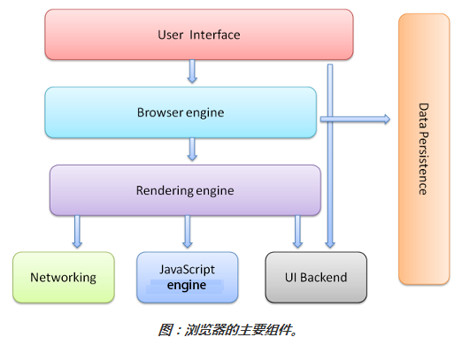
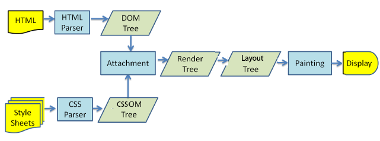
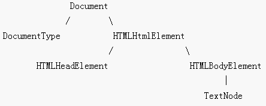
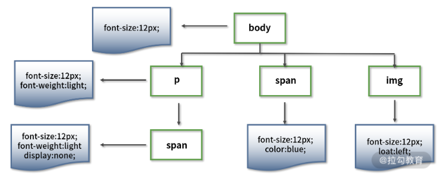
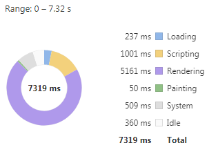
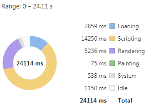
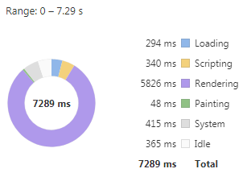
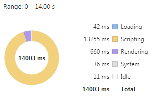
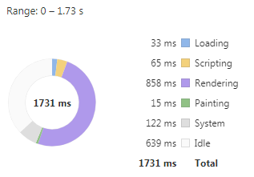

# 一、浏览器组成和渲染

[[_TOC_]]

## 1. 浏览器组成

浏览器的主要组件有以下 7 个

### (1) 用户界面

包括地址栏、前进/后退按钮、书签菜单等，除了标签页以外，浏览器显示的其他部分都属于用户界面

### (2) 浏览器引擎

负责在用户界面和渲染引擎之间传送指令

### (3) 渲染引擎

负责渲染和显示网页

Firefox 使用的是 Gecko 渲染引擎，这是 Mozilla 公司自己研发的渲染引擎

Chrome 使用的是 WebKit 渲染引擎，WebKit 是一种开放源代码渲染引擎，起初用于 Linux 平台，随后由 Apple 公司进行修改，从而支持苹果机和 Windows

后面的浏览器渲染都以 Chrome 的 WebKit 渲染引擎为例

### (4) 网络

负责网络调用以请求各种资源，例如 HTTP 请求

### (5) JS 引擎

负责解析和执行 JS 代码

### (6) 用户界面后端

负责绘制浏览器的窗口小部件，例如组合框和窗口，底层使用了操作系统的用户界面方法

### (7) 数据存储

负责浏览器在`客户端本地磁盘`上保存各种数据，例如 Cookie、SessionStorage、LocalStorage、IndexedDB



## 2. 浏览器进程

### (1) 进程和线程

#### ① 进程

进程是一个`可拥有资源`的基本单位

#### ② 线程

线程是一个`可独立调度`的基本单位 ( 从进程的 2 个基本属性中分离出的 )

#### ③ 进程和线程的比较如下

* 拥有资源：进程作为拥有资源的基本单位，线程本身并不拥有系统资源，而是拥有自己的必不可少的、能保证独立运行的资源 ( 线程控制块 TCB、寄存器、栈 )，但是同一进程的所有线程共享该进程拥有的系统资源
* 调度的基本单位：线程作为调度的基本单位，进程不再作为调度的基本单位，同一进程中线程的切换不会引起进程的切换，而从一个进程中的线程切换到另一个进程中的线程会引起进程的切换
* 并发性：多个进程之间可以并发执行，同一进程的多个线程之间也可以并发执行，例如文字处理进程可以设置三个线程，一个用于从键盘读取数据，一个用于在后台进行拼写和语法检查，一个用于显示文字和图片
* 独立性：不同进程间都拥有独立的地址空间和其他资源，除了共享全局变量外，不允许其他进程的访问，而同一进程的所有线程共享该进程的所有资源，因此线程的独立性更低

### (2) 浏览器进程

一个应用程序至少有一个进程，一个进程至少有一个线程

浏览器通常需要一边渲染页面，一边请求后端数据，一边响应用户事件，而 CPU 同一时刻只能执行一个进程，因此要么多进程并发执行，要么同一进程的多线程并发执行，要么多进程且多线程并发执行

Chrome 浏览器的任务管理器 ( 快捷键 Shift + ESC ) 可以查看谷歌浏览器的进程状态


#### ① 浏览器进程

浏览器进程主要负责浏览器界面的显示 ( 地址栏、导航栏、书签等 )，处理用户事件，管理其他进程

#### ② GPU 进程

GPU ( 图形处理器 Graphics Processing Unit ) 进程主要负责处理来自其他进程的 GPU 任务，例如来自渲染进程或扩展程序进程的 CSS3 动画渲染效果，来自浏览器进程的界面绘制等

GPU 进程还可以利用 GPU 硬件来加速渲染，包括 Canvas 绘制、CSS3 Transitions 转换、CSS3 Transforms 变换、WebGL 等，具体原理就是如果 DOM 元素使用了这些属性，GPU 进程就会在合成层的时候对它进行单独处理，提升到一个独立的层进行绘制，这样就能避免重新布局和重新绘制

#### ③ Network Service 进程

Network Service 进程主要负责网络资源加载，例如在地址栏输入一个网页地址，网络进程会将请求后得到的资源交给渲染进程处理

#### ④ 扩展程序进程

浏览器为`每个插件`单独启动一个扩展程序进程

扩展程序进程主要负责插件的运行

#### ⑤ 标签页渲染进程

浏览器会为`每个标签页`单独启动一个渲染进程

渲染进程主要负责将 HTML、CSS、JS 转化为用户可以与之交互的网页，每个渲染进程都会启动单独的`渲染引擎线程`、`JS 引擎线程`、`事件触发线程` ( 负责接收事件，并把事件放入 JS 引擎线程的事件队列中 )、`定时器线程` ( 负责处理定时任务 )

**每个标签页一个渲染进程的优势**

* 这种设计既保障了程序与系统的安全性，可以通过操作系统提供的权限机制来为每个渲染进程建立一个沙箱运行环境，从而防止恶意破坏用户系统或影响其他标签页的行为
* 同时也保障了渲染进程的稳定性，因为如果某个标签页失去响应，用户可以关掉这个标签页，此时其他标签页依然运行着，可以正常使用，如果所有标签页都运行在同一进程上，那么当某个标签页失去响应，所有标签页都会失去响应

**引擎线程互斥机制**

* **引擎线程互斥机制**：浏览器为了避免两个引擎线程同时修改页面而造成渲染结果不一致的情况，增加了互斥性机制，也就是说在某个时刻只能有一个引擎线程在运行，另一个引擎线程会被阻塞
* **线程上下文切换**：操作系统在进行线程切换时需要保存上一个线程执行时的状态信息并读取下一个线程的状态信息，俗称上下文切换，这个操作相对是比较耗时的

### (3) 浏览器进程服务化

Chrome 官方团队在 2016年 提出了面向服务的设计模型，在系统资源允许的情况下，将浏览器主进程的各种模块拆分成独立的服务，每个服务在独立的进程中运行，通过高内聚、低耦合的结构让 Chrome 变得更稳定更安全

## 3. 浏览器渲染

渲染引擎线程一开始会通过网络请求各种资源，然后进行如下所示的基本流程



### (1) 解析 HTML

#### ① 将 HTML 字符转化成令牌 ( Token )

HTML 代码对于浏览器来说是`字符数据`，而解析 HTML 代码的第一步就是将字符数据转化为令牌 ( Token )

渲染引擎线程使用一种`类似状态机的算法`，每次接收一或多个输入流中的字符，然后根据当前状态和这些字符来更新下一个状态，也就是说在不同状态下接收同样的字符可能会产生不同的结果，例如接收到 body 字符串时，在标签打开状态会被解析成元素节点，在标签关闭状态会被解析成文本节点

```html
<html>
  <head>
  </head>
  <body>
    lagou
  </body>
</html>
```

* 初始化为“数据状态”（Data State）；
* 匹配到字符 <，状态切换到 “标签打开状态”（Tag Open State）；
* 匹配到字符 !，状态切换至 “标签声明打开状态”（Markup Declaration Open State），后续 7 个字符可以组成字符串 DOCTYPE，跳转到 “DOCTYPE 状态”（DOCTYPE State）；
* 匹配到字符为空格，当前状态切换至 “DOCTYPE 名称之前状态”（Before DOCTYPE Name State）；
* 匹配到字符串 html，创建一个新的 DOCTYPE 标记，标记的名字为 “html” ，然后当前状态切换至 “DOCTYPE 名字状态”（DOCTYPE Name State）；
* 匹配到字符 >，跳转到 “数据状态” 并且释放当前的 DOCTYPE 标记；
* 匹配到字符 <，切换到 “标签打开状态”；
* 匹配到字符 h，创建一个新的起始标签标记，设置标记的标签名为空，当前状态切换至 “标签名称状态”（Tag Name State）；
* 从字符 h 开始解析，将解析的字符一个一个添加到创建的起始标签标记的标签名中，直到匹配到字符 >，此时当前状态切换至 “数据状态” 并释放当前标记，当前标记的标签名为 “html” 。
* 解析后续的 的方式与 一致，创建并释放对应的起始标签标记，解析完毕后，当前状态处于 “数据状态” ；
* 匹配到字符串 “标记” ，针对每一个字符，创建并释放一个对应的字符标记，解析完毕后，当前状态仍然处于 “数据状态” ；
* 匹配到字符 <，进入 “标签打开状态” ；
* 匹配到字符 /，进入 “结束标签打开状态”（End Tag Open State）；
* 匹配到字符 b，创建一个新的结束标签标记，设置标记的标签名为空，当前状态切换至“标签名称状态”（Tag Name State）；
* 重新从字符 b 开始解析，将解析的字符一个一个添加到创建的结束标签标记的标签名中，直到匹配到字符 >，此时当前状态切换至 “数据状态” 并释放当前标记，当前标记的标签名为 “body”；
* 解析 的方式与 一样；
* 所有的 html 标签和文本解析完成后，状态切换至 “数据状态” ，一旦匹配到文件结束标志符（EOF），则释放 EOF 标记。

最终生成如下的令牌结构

```html
开始标签:html
  开始标签:head
  结束标签:head
  开始标签:body
    字符串:lagou
  结束标签:body
结束标签:html
```

#### ② 使用令牌生成 DOM 树

渲染引擎线程在将 HTML 代码全部转换成令牌后，就创建一个 Document 对象作为根节点，然后根据令牌不断对 DOM 树进行修改和扩充，HTML5 标准中定义了每类令牌对应的 DOM 元素，当渲染引擎线程接收到某个令牌时就会创建该令牌对应的 DOM 元素并将该元素插入到 DOM 树

* 进入初始状态 “initial” 模式；
* 树构建器接收到 DOCTYPE 令牌后，树构建器会创建一个 DocumentType 节点附加到 Document 节点上，DocumentType 节点的 name 属性为 DOCTYPE 令牌的名称，切换到 “before html” 模式；
* 接收到令牌 html 后，树构建器创建一个 html 元素并将该元素作为 Document 的子节点插入到 DOM 树中和开放元素栈中，切换为 “before head” 模式；
* 虽然没有接收到 head 令牌，但仍然会隐式地创建 head 元素并加到 DOM 树和开放元素栈中，切换到“in head”模式；
* 将开放元素栈中的 head 元素弹出，进入 “after head”模式；
* 接收到 body 令牌后，会创建一个 body 元素插入到 DOM 树中同时压入开放元素栈中，当前状态切换为 “in body” 模式；
* 接收到字符令牌，创建 Text 节点，节点值为字符内容“标记”，将 Text 节点作为 body 元素节点插入到 DOM 树中；
* 接收到结束令牌 body，将开放元素栈中的 body 元素弹出，切换至 “after body” 模式；
* 接收到结束令牌 html，将开放元素栈中的 html 元素弹出，切换至 “after after body” 模式；
* 接收到 EOF 令牌，树构建器停止构建，html 文档解析过程完成。



### (2) 解析 HTML 过程中遇到 `<style>`

CSSOM 树的节点具有`继承`特性，也就是会先继承父节点样式作为当前样式，然后再进行补充或覆盖

```css
body { font-size: 12px }
p { font-weight: light }
span { color: blue }
p span { display: none }
img { float: left }
```



①②③④⑤⑥⑦⑧⑨⑩

### (3) 解析 HTML 过程中遇到 `<script>`

#### ① 同步加载脚本

默认情况下，渲染引擎线程在解析 HTML 过程中遇到 `<script>` 标签就会停下来，由于浏览器引擎线程的互斥机制，渲染引擎线程将执行权交给 JS 引擎线程

* 如果是内嵌脚本，JS 引擎线程直接解析并执行 JS 代码
  
  ```html
  <script>
    //JS 代码
  </script>
  ```

* 如果是外部脚本，JS 引擎线程先下载 JS 脚本再解析和执行 JS 代码
  
  ```html
  <script src="./example.js"></script>
  ```

JS 引擎线程执行完毕脚本代码后，将执行权交给渲染引擎线程，渲染引擎线程继续解析 HTML，如果 JS 脚本体积很大，就容易造成浏览器堵塞

#### ② 异步加载外部脚本

`<script>` 标签打开 defer 属性或者 async 属性，脚本就会异步加载，渲染引擎线程在解析 HTML 过程中遇到 `<script>` 标签的外部脚本，就会开始下载脚本，但是不会等待，而是继续向下渲染

* defer 要等到整个页面在内存中正常渲染结束，即 DOM 结构完全生成，并且其他脚本执行完成，此时才会执行当前外部脚本，如果有多个 defer 外部脚本，按照在页面中出现的顺序执行
  
  ```html

  ```

* async 是当前外部脚本下载完就开始执行，如果有多个 async 外部脚本，不能保证执行顺序
  
  ```html

  ```

#### ③ 异步加载 ES6 模块

* 浏览器加载 ES6 模块，也使用 `<script>` 标签，但是要加入 `type="module"` 属性，浏览器对于 type="module" 的 `<script>` 都是`异步加载`，等同于使用了 `<script>` 标签的 `defer` 属性，不会造成浏览器堵塞
  
  ```html
  <script type="module" src="./person.js"></script>
  ```

* 也可以给 ES6 模块的脚本添加 async 属性，浏览器就会使用 async 属性的加载方式
  
  ```html
  <script type="module" src="./person.js" async></script>
  ```


* 绿色的线：渲染引擎线程解析 HTML
* 蓝色的线：JS 引擎线程下载 JS 外部脚本
* 红色的线：JS 引擎线程解析和执行 JS

除此之外还应当注意，当渲染引擎解析 HTML 遇到 script 标签引入文件时，会立即进行一次渲染。所以这也就是为什么构建工具会把编译好的引用 JavaScript 代码的 script 标签放入到 body 标签底部，因为当渲染引擎执行到 body 底部时会先将已解析的内容渲染出来，然后再去请求相应的 JavaScript 文件。如果是内联脚本（即不通过 src 属性引用外部脚本文件直接在 HTML 编写 JavaScript 代码的形式），渲染引擎则不会渲染

①②③④⑤⑥⑦⑧⑨⑩

### (4) 构建渲染树

DOM 树包含的结构内容和 CSSOM 树包含的样式规则都是独立的，为了方便渲染，需要先将两者合并为一颗渲染树

渲染引擎线程先从 DOM 树的根节点开始遍历，然后开始在 CSSOM 树上找到每个节点对应的样式，遍历过程会自动忽略`无需渲染的节点` ( head 元素 )以及`不可见的节点` ( display:none 的元素 )，因此渲染树和 DOM 树不是一一对应的

### (5) 布局 ( 重排 )

渲染树并不包含位置和大小信息

布局就是计算元素的大小和位置，渲染引擎线程从渲染树的根节点开始递归遍历所有节点，为每一个需要计算的节点计算几何信息，完成后输出布局树

### (6) 绘制 ( 重绘 )

绘制就是将布局树上的每个节点转换为屏幕上的实际像素的过程

* 绘制的第一步是遍历布局树，生成绘制记录，之所以如此是因为渲染引擎线程不知道绘制顺序，容易导致页面被错误的渲染，例如使用 z-index 属性的元素未被正确渲染，将导致最终结果与预期结果不符
* 然后渲染引擎线程再根据绘制记录去绘制相应的内容

对于无动画效果的情况，只需考虑空间维度，生成不同的图层，然后将这些图层进行合成，最终成为我们看到的页面，这个绘制过程是`动态`的，会随着页面的不断滚动合成新的图层

## 4. DOM 操作造成的渲染损耗

浏览器会为`每个标签页`单独启动一个渲染进程

渲染进程主要负责将 HTML、CSS、JS 转化为用户可以与之交互的网页，每个渲染进程都会启动单独的`渲染引擎线程`、`JS 引擎线程`

### (1) 引擎线程互斥

浏览器为了避免两个引擎线程同时修改页面而造成渲染结果不一致的情况，增加了互斥性机制，也就是说在某个时刻只能有一个引擎线程在运行，另一个引擎线程会被阻塞

### (2) 线程切换

操作系统在进行线程切换时需要保存上一个线程执行时的状态信息并读取下一个线程的状态信息，俗称上下文切换，这个操作相对是比较耗时的

### (3) DOM 操作

每次 DOM 操作都会引发线程切换，从 JS 引擎线程切换到渲染引擎线程执行对应操作，然后再切换回 JS 引擎线程继续执行，这就带来了性能损耗，如果频繁大量切换，就会产生性能问题

### (4) 重排

会引起其他元素排布的 DOM 操作，就会引起重排，进而引起重绘

* 修改元素边距大小
* 添加删除元素
* 改变窗口大小

```javascript
const times = 100000
let html = ''
for(let i=0;i<times;i++) {
  html+= `<div>${i}</div>`
}
document.body.innerHTML += html

const divs = document.querySelectorAll('div')
Array.from(divs).forEach(item => item.style.margin = '10px')
```


渲染耗时 = 5407 ( Rendering ) + 58 ( Painting ) = 5465

### (5) 重绘

不会引起其他元素排布的 DOM 操作，只会引起重绘

* 设置背景图片
* 修改字体颜色
* 改变 visibility 属性值

```javascript
const times = 100000
let html = ''
for(let i=0;i<times;i++) {
  html+= `<div>${i}</div>`
}
document.body.innerHTML += html
  
const divs = document.querySelectorAll('div')
Array.from(divs).forEach(item => item.style.color = 'red')
```



渲染耗时 = 5161 ( Rendering ) + 58 ( Painting ) = 5219

与上述对比可知，两者 Painting 耗时相近，Rendering 耗时相差较大，由此也可知，重排耗时明显高于重绘，并且重排会导致重绘

### (6) DOM 操作优化

#### ① 循环外批量操作元素

```javascript
//循环内单独操作元素
const times = 100000
for(let i=0;i<times;i++) {
  const div = document.createElement('div')
  div.innerHTML = i
  document.body.append(div)
}
```



渲染耗时 = 5236 ( Rendering ) + 75 ( Painting ) = 5311

```javascript
//循环外批量操作元素
const times = 100000
let html = ''
for(let i=0;i<times;i++) {
  html+= `<div>${i}</div>`
}
document.body.innerHTML += html
```



渲染耗时 = 5826 ( Rendering ) + 48 ( Painting ) = 5874

与上述对比可知，循环外批量操作元素对比循环内单独操作元素，渲染耗时减少 563 ms

#### ② 缓存要再次使用的元素

```javascript
const times = 100000
let html = ''
for(let i=0; i<times; i++) {
  html+= `<div>${i}</div>`
}
document.body.innerHTML += html

//不缓存要再次使用的元素
for(let i = 0; i<document.querySelectorAll('div').length; i++){
  document.querySelectorAll(`div`)[i].innerText = i + 1
}
```



渲染耗时 = 660 ( Rendering ) + 36 ( Painting ) = 696

缓存耗时 = 13255 ( Scripting )

```javascript
const times = 100000
let html = ''
for(let i=0; i<times; i++) {
  html+= `<div>${i}</div>`
}
document.body.innerHTML += html

//缓存要再次使用的元素
const divs = document.querySelectorAll('div')
for(let i = 0; i<divs.length; i++){
  divs[i].innerText = i + 1
}
```



渲染耗时 = 858 ( Rendering ) + 15 ( Painting ) = 873

缓存耗时 = 65 ( Scripting )

与上述对比可知，两者渲染耗时相差不大，但是缓存耗时相差几乎 200 倍
