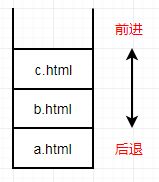

# 七、History对象

[[_TOC_]]

## 1. History 对象

History 对象表示当前浏览器窗口的`浏览历史`，

History 对象保存了当前浏览器窗口浏览过的所有文档地址，由于安全原因，浏览器不允许脚本读取这些地址，但是允许在地址之间导航，浏览器工具栏的 前进 和 后退 按钮，就是对 History 对象进行操作

```javascript
定义：window.history
属性：history.length                       //返回当前浏览器窗口的访问过的文档数量(包括当前文档)
**​     **history.state                        //返回History栈中顶层文档的state对象
方法：状态方法：
     history.pushSate(state,title,url)    //无返回值,向history对象添加一条最新浏览记录,地址栏立刻变化,但是不会跳转
     history.replaceSate(state,title,url) //无返回值,修改history对象的当前浏览记录
     地址导航方法：
     history.back()                       //无返回值,当前浏览器窗口加载上一个访问文档(浏览器后退键)
     history.forward()                    //无返回值,当前浏览器窗口加载下一个访问文档(浏览器前进键)
     history.go(n)                        //无返回值,当前浏览器窗口加载指定文档(以当前文档为基准,n=0则刷新当前文档,n>0则前进)
```

### (1) History 栈

浏览器访问顺序：a.html -> b.html -> c.htmld



### (2) 状态方法

#### 参数 state

与将要添加的浏览记录相关联的状态对象，浏览器会将这个状态对象序列化以后保存在本地，载入这个记录时可以拿到这个对象，不需要这个对象可以填 null，主要用于 popstate 事件，popstate 事件触发时，state 对象会传入该事件回调函数

#### history.pushState()

① 向 History 对象添加一条最新浏览记录，浏览器地址栏立刻变化，但是不会跳转，

② 浏览器也不会检查该文档是否存在，只是成为浏览历史中的最新记录

③ 点击浏览器后退按钮，浏览器地址栏立即变成上一条记录，页面不变

```javascript
//当前文档URL：[https://wangdoc.com/javascript/bom/history.html](https://wangdoc.com/javascript/bom/history.html)

history.pushState(null, '', 'https://www.iconfont.cn/search/index');           //报错
history.pushState(null, '', 'https://wangdoc.com/javascript/bom/window.html'); //浏览器地址栏立即变化,但是页面不会跳转

//点击浏览器后退按钮,浏览器地址栏变成[https://wangdoc.com/javascript/bom/history.html](https://wangdoc.com/javascript/bom/history.html),页面不变化
```

#### history.replaceState()

① 将 History 对象当前浏览器记录替换成指定 URL，浏览器地址栏立即变化，但是不会跳转，

② 浏览器也不会检查该文档是否存在，只是成为浏览历史中的最新记录

③ 点击浏览器后退按钮，浏览器地址栏立即变成上上一条记录，页面跳转

```javascript
//当前文档URL：[https://wangdoc.com/javascript/bom/history.html](https://wangdoc.com/javascript/bom/history.html)

history.replaceState(null, '', 'https://www.iconfont.cn/search/index');           //报错
history.replaceState(null, '', 'https://wangdoc.com/javascript/bom/window.html'); //浏览器地址栏立即变化,但是页面不会跳转

//点击浏览器后退按钮,浏览器地址栏变成[https://wangdoc.com/javascript/dom/element.html](https://wangdoc.com/javascript/dom/element.html#elementclientheight，elementclientwidth),页面跳转
```

### (3) 地址导航方法

将要加载的文档若是访问过，则从`浏览器缓存`中加载，否则要求服务器发送文档

```javascript
//当前文档URL：[https://wangdoc.com/javascript/bom/history.html](https://wangdoc.com/javascript/bom/history.html)
history.go(0);  //刷新当前页面
hostory.go(-1); //后退
hidtory.go(1);  //前进
```

## 2. popstate 事件

每当`同一个文档`的 history 对象变化时，就会触发 popstate 事件，如果浏览历史的切换，导致加载不同的文档，不会触发 popstate 事件

① 用户点击浏览器 后退 和 前进 按钮，会在 window 对象上触发 popstate 事件，

② 调用 back()、forward()、go() 方法时，会在 window 对象上触发 popstate 事件，

③ 调用 pushState()、replaceState() 方法时，不会触发 popstate 事件，

Event对象相关属性如下

```javascript
e.state //返回浏览器History对象当前记录的state对象
```

实例

```javascript
//当前文档URL：[https://wangdoc.com/javascript/bom/history.html](https://wangdoc.com/javascript/bom/history.html)

window.addEventListener('popstate', function(e){
  console.log('state');
});

history.pushState(null, '', 'https://wangdoc.com/javascript/bom/window.html'); //控制台无反应
history.back(); //'state', 文档不变,history.html

history.replaceState(null, '', 'https://wangdoc.com/javascript/bom/same-origin.html'); //控制台无反应
history.go(); //控制台无反应, 文档变化,same-origin.html
```
