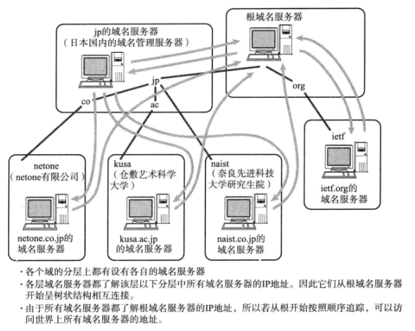
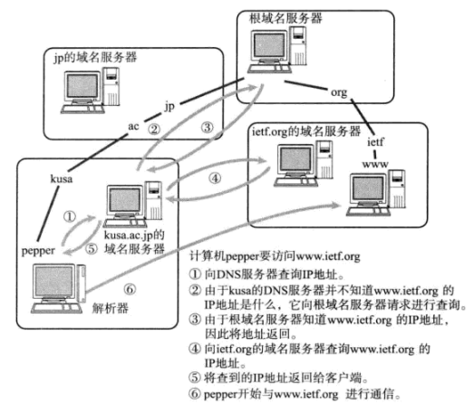

# 一、同源政策

[[_TOC_]]

## 1. 主机名&域名

### (1) 主机名&域名

#### ① 单一主机名

单一主机名是为每台计算机赋予的唯一主机名 (实际上并不唯一)，用来替换不便于用户记忆的 IP 地址

#### ② 域名

* 域名是用于识别组织机构名称的一种具有分层的名称

* 域名是分层管理的：`.` 三级域名 `.` 二级域名 `.` 一级域名

```javascript
document.domain //返回/设置当前文档域名
```

#### ③ 带域名的主机名

带域名的主机名是互联网上某一台计算机或某一组计算机的名称，用于识别单一主机名和具有分层结构的组织机构名称，带域名的主机名互联网`唯一`

```javascript
URL对象：
url.origin   //协议、主机、端口
url.protocol //协议
url.host     //主机、端口
url.hostname //主机
url.port     //端口
```

```javascript
//新浪博客：http://blog.sina.com.cn

单一主机名：blog
域名：.sina.com.cn (.sina代表新浪 .com代表商业机构 .cn代表中国)
带域名的主机名：blog.sina.com.cn
```

```javascript
//百度网：https://www.baidu.com
console.log(url.hostname);    //"www.baidu.com"
console.log(document.domain); //"www.baidu.com"

//新浪网：https://www.sina.com.cn
console.log(url.hostname);    //"www.sina.com.cn"
console.log(document.domain); //"sina.com.cn"

//新浪博客：http://blog.sina.com.cn
console.log(url.hostname);    //"blog.sina.com.cn"
console.log(document.domain); //"sina.com.cn"
```

### (2) 域名服务器 DNS

① 域名服务器 DNS (Domain Name Server) 是进行域名和与之对应的 IP 地址相互转换的服务器

② 从根域名服务器开始，各层域名服务器呈树状结构相互连接，每个域名服务器都了解该层下一层所有域名服务器的 IP 地址，所以若从根域名服务器开始追踪，可以访问世界上所有域名服务器

③ 所有域名服务器都必须注册根域名服务器的 IP 地址，因为根据 IP 地址进行检索时，需要从根域名服务器开始按顺进行



### (3) 域名检索

以百度网为例：https://www.baidu.com

① 用户在浏览器地址栏输入网址，浏览器先检测本地缓存中是否有之前的查询记录，有就直接读取结果，没有就则向本地 DNS 服务器发送查询请求，本地 DNS 服务器没有就需要向根服务器发送请求，根服务器管理所有顶级域名，再没有就依次向下级域名服务器发送请求

② 用户在浏览器地址栏输入一个域名，浏览器向这个用户的服务提供商 ISP 发出域名请求，提供商的域名服务器 DNS 查询域名数据库，找到该域名对应的 IP 地址，提供商的服务器去这个 IP 地址对应的服务器上抓取网页内容，然后传输给发出请求的浏览器



## 2. 同源政策

1995 年，Netscape 公司将同源政策引入浏览器，目前，所有浏览器都实行这个政策，同源政策 \( Same\-origin policy \) 是浏览器安全的基石

### (1) 同源

① 协议相同 ( url.protocol )

② 域名相同 ( document.domain )

③ 端口相同 ( url.port )

```javascript
//当前网页：http://www.example.com/dir/page.html

https://www.example.com/dir/page.html    //不同源(协议不同)
http://example.com/dir/other.html        //不同源(主机名不同)
http://v2.www.example.com/dir/other.html //不同源(主机名不同)
http://www.example.com:81/dir/other.html //不同源(端口不同)
http://www.example.com/dir2/other.html   //同源
```

### (2) 限制范围

① 无法读取非同源网页的 Cookie、LocalStorage、IndexedDB，

② 无法接触非同源网页的 DOM，

③ 无法向非同源网页发送 AJAX 请求 ( 可以发送，但是浏览器拒绝接受服务器的响应 )，

④ 只允许通过 JS 脚本接触非同源网页的 window 对象的 8 个属性和 4 个方法，其中，8 个属性只有 window.location 属性可读写，其他都是只读，location 对象也只允许调用 location.href 属性和 location.replace 方法，

```javascript
属性：原理属性：
     window.location                                 //指向location对象
     状态信息属性：
     window.closed                                   //返回布尔值,表示当前窗口是否关闭
     window.opener                                   //返回打开当前窗口的父窗口,没有则返回null
     窗口属性：
     window.frames                                   //返回当前文档所有框架窗口构成的类数组对象
     window.length                                   //返回当前文档包含的框架窗口总数
     window.self                                     //返回当前框架窗口(只读)
     window.parent                                   //返回当前框架窗口的父窗口,没有则返回自身
     window.top                                      //返回当前框架窗口的顶层窗口 
方法：window.close()                                  //无返回值,关闭当前由window.open()打开的窗口
     window.focus()                                  //无返回值,当前窗口获得焦点(位于其他窗口之前),触发focus事件
     window.blur()                                   //无返回值,当前窗口失去焦点,触发blur事件
     window.postMessage(msg,targetOrigin,[transfer]) //无返回值,安全地实现跨域通信
```

### (3) 目的

同源政策的目的，是为了保证用户信息的安全，防止恶意的网站窃取数据，同源政策是必须的，否则 Cookie 可以共享，互联网就毫无安全可言

① A 网站是一家银行，用户登陆以后，A 网站返回了一个 Cookie，包含一些隐私信息 \( 如存款总额 \)，用户离开 A 网站，又去访问 B 网站，如果没有同源政策，B 网站就可以读取 A  网站的 Cookie，那么隐私信息就会泄漏，

② 更可怕的是，Cookie 往往用来保存用户的登录信息，如果用户没有退出登陆    其他网站就可以冒充用户，为所欲为，因为浏览器还同时规定，提交表单不受同源政策的限制

## 3. 跨文档通信

### (1) 松散域名

Cookie 是服务器写入浏览器的一小段信息，只有同源网页才能共享

如果两个网页一级域名相同，次级域名不同，浏览器允许通过设置松散域名共享 Cookie，

```javascript
定义：document.cookie         //返回当前文档的Cookie
属性：navigator.cookieEnabled //返回布尔值,浏览器是否启用Cookie
```

来自不同域的页面和内嵌框架，均设置为`相同的松散域名`后，能够通过 JS 通信，互相访问对方的 JS 对象

```javascript
//假设当前网页主机名为：www.wrox.com,内嵌框架主机名为：p2p.wrox.com

document.domain = "wrox.com";    //成功
document.domain = "www.wrox.com";//失败,先设置为松散域名后不能再次设置为紧绷域名
document.domain = "nonline.net"; //失败,不能设置为URL不包含的域名
```

dd

```javascript

```

dd

### (2) 片段识别符

dd

### (3) window.postMessage()

dd

## 4. 跨域 AJAX

同源政策规定，AJAX 请求只能发送给同源网址，否则浏览器会拒绝接受服务器的响应

### (1) JSONP

JSONP 是客户端和服务端跨源通信的常用方法，

#### ① 基本思想

网页通过添加一个 <script> 元素，向服务器请求 JSON 数据，这种做法不受同源政策的限制，服务端收到请求后，将数据放在一个指定名字的回调函数中传回来

#### ② 优点

简单适用，老式浏览器全部支持，服务端改造非常小

#### ③ 缺点

只能发送 GET 请求

```javascript

```

dd

### (2) WebSocket

WebSocket 是一种通信协议，使用 ws:// ( 非加密 ) 和 wss:// ( 加密 ) 作为协议前缀，该协议不实行同源政策，只要服务器支持，就可以通过它实现跨域通信

dd

### (3) CORS

跨域资源分享 CORS ( Cross-Origin Resource Sharing ) 是 W3C 标准，属于跨域 AJAX 请求的根本解决方法

优点

可以发送任何类型的请求

dd

### (4) 服务器代理

浏览器请求同源服务器，同源服务器请求跨域服务器，以 Nginx 为例

dd
