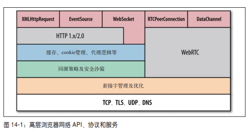
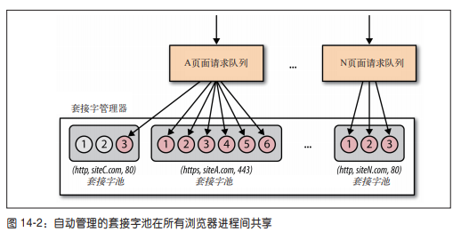

# 一、浏览器网络

[[_TOC_]]

## 1. 浏览器网络

现代浏览器是专门设计用来快速、高效、安全地交付 Web 应用的，在其表面之下，现代浏览器完全是一个囊括数百个组件的操作系统，包括进程管理、线程管理、安全沙箱、分层的优化缓存、JS 引擎、渲染引擎、存储系统、传感器、音频与视频、网络机制等等

现代浏览器乃至于运行其中的 Web 应用的性能，取决于若干组件：解析、布局、CSS 样式计算、JS 执行速度、渲染速度、网络相关各层协议的配合，其中每个组件的角色都很重要

现代浏览器对各层网络协议的实现，远不止一个套接字管理器那么简单，现代浏览器的网络 API 如下图所示

## 2. 套接字管理及优化

运行在浏览器中的 Web 应用并不负责管理网络套接字的声明周期，而是把这个任务委托给浏览器，由浏览器自动化性能优化任务，包括套接字重用、请求优先级排定、协议协商、施加连接数限制等等

### (1) 套接字池

套接字池是指同属一个来源 `( 协议、域名、端口 )` 的一组套接字

每个套接字池都有自己的连接限制和安全约束，所有主流浏览器的最大池规模都是 `6` 个套接字，并且一个套接字可以自动用于多个请求

### (2) 自动化的套接字池管理

* 浏览器可以预测请求提前打开套接字
* 浏览器可以优化何时关闭空闲套接字
* 浏览器可以优化分配给所有套接字的带宽
* 浏览器可以重用套接字以最小化延迟并提升吞吐量
* 浏览器可以按照优先次序发送排队的请求

## 3. 网络安全与沙箱

### (1) 沙箱机制

默认情况下，一个应用程序时可以访问机器上的所有资源，例如 CPU、内存、文件系统、网络等等，但这是不安全的，如果随意操作系统资源，可能破坏其他应用程序的运行环境，由此诞生了沙箱机制，为进程提供一个受限的独立的运行环境

### (2) 浏览器的沙箱机制

浏览器某种意义上来说也算是一个操作系统，浏览器沙箱机制就是一种隔离浏览器进程的机制

Chrome 浏览器采用多进程且多线程并发执行的方式，打开 Chrome 浏览器的任务管理器 ( 快捷键 Shift + ESC ) 可以查看谷歌浏览器的进程状态

由上图可看出，Chrome 浏览器为每个标签页分配了一个渲染进程

* 这种沙盒模型设计既保障了程序与系统的安全性，可以通过操作系统提供的权限机制来为每个渲染进程建立一个沙箱运行环境，从而防止恶意破坏用户系统或影响其他标签页的行为
* 同时也保障了渲染进程的稳定性，因为如果某个标签页失去响应，用户可以关掉这个标签页，此时其他标签页依然运行着，可以正常使用，如果所有标签页都运行在同一进程上，那么当某个标签页失去响应，所有标签页都会失去响应

## 4. 应用 API 与协议

浏览器提供的网络服务的最上层，就是应用 API 和协议，无论是 HTTP 请求，SSE 事件流、WebSocket 会话、WebTRC 连接，都需要与浏览器提供的一些或全部底层网络服务打交道

不存在哪个协议或 API 最好的问题，复杂的应用会基于不同的需求应用各种不同的传输机制
