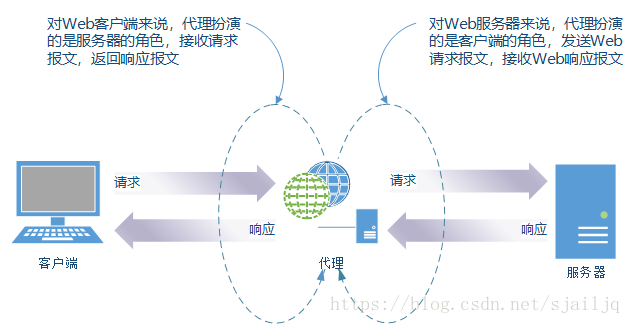
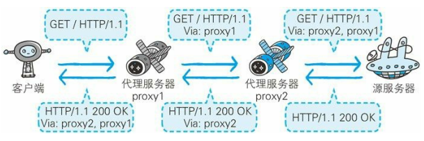
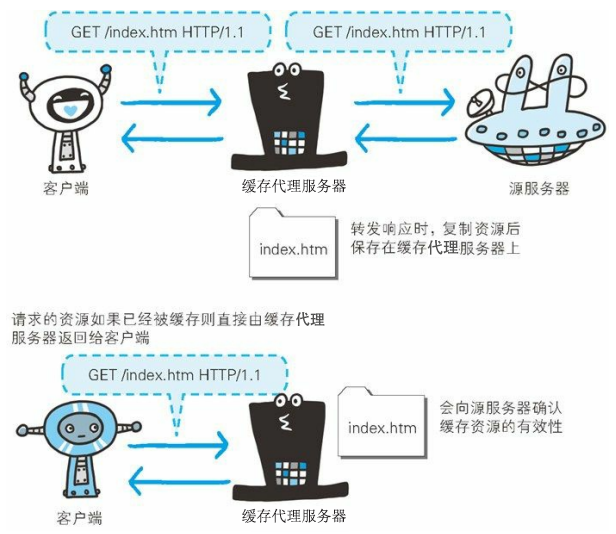
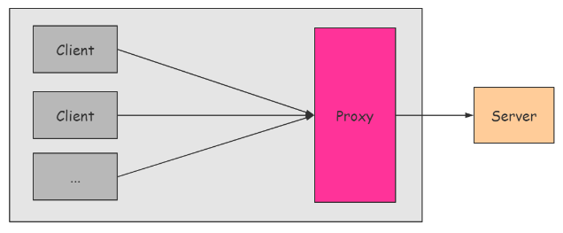
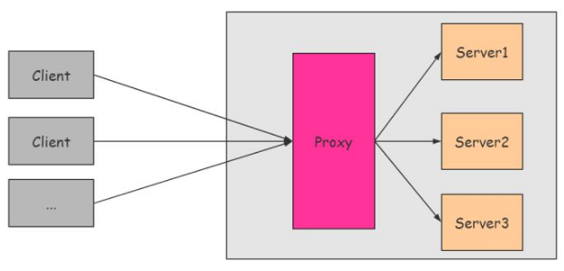
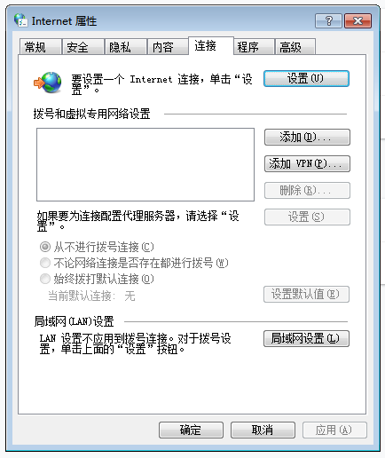
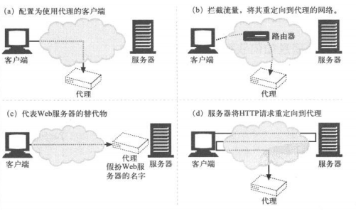
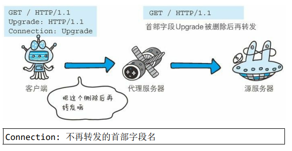

# 六、Nginx

[[_TOC_]]

## 1. 代理

### (1) 代理

#### ① 代理

**代理**：代理是一种具有转发功能的`应用程序`，扮演了客户端和服务器中间人的角色，接收客户端发送的请求并转发给服务器，接收服务器返回的响应并转发给客户端

**代理服务器**：代理服务器是部署了`代理应用程序`的服务器



#### ② 标记代理服务器

HTTP 通信过程中，可级联多台代理服务器，请求和响应的转发会经过数台类似锁链一样连接起来的代理服务器，转发时需要附加通用首部字段 `Via` 以标记经过的代理服务器信息



#### ③ 缓存资源

代理转发响应时，会预先将资源的副本保存在代理服务器上，当再次收到对相同资源的请求时，就可以不从源服务器获取资源，而是将之前缓存的资源作为响应返回，利用代理服务器缓存资源可以减少网络带宽



### (2) 代理的分类

#### ① 正向代理

正向代理代理`客户端`，服务器不知道实际发起请求的客户端

* A 想借钱，A 知道 C 有很多钱，想向 C 借钱
* A 和 C 有矛盾，于是 A 想通过 B 向 C 借钱
* B 向 C 借到钱再给 A，C 不知道 A 的存在
* 这样 A 就通过 B 向 C 借到了钱



#### ② 反向代理

反向代理代理`服务器`，客户端不知道实际提供服务的服务器

* A 想借钱，A 不知道 C 有很多钱
* A 向 B 借钱
* B 没有钱，B 知道 C 有很多钱
* B 向 C 借钱再给 A
* A 以为钱是 B 的，A 不知道 C 的存在
* 这样 B 就用 C 的钱借给了 A



### (3) 代理如何获取客户端流量

客户端通常直接与 Web 服务器通信，如何才能使客户端 HTTP 请求首先流向代理？

#### ① 修改客户端

很多客户端浏览器都支持手动或自动的代理配置，将客户端浏览器配置为使用代理服务器，客户端浏览器就会直接将 HTTP 请求发送给代理服务器，而非源服务器

Chrome 浏览器 — 设置 — 高级 — 系统 — 打开您计算机的代理设置



#### ② 修改网络

网络基础设施 ( 如路由器 ) 可以通过若干技术手段，在客户端不知情或未参与的情况下，拦截客户端 HTTP 请求并将其导向代理

#### ③ 修改 DNS 命名空间

代理直接假扮源服务器的主机名和 IP 地址

#### ④ 修改 Web 服务器

源服务器上配置向客户端发送 HTTP 重定向响应，将客户端请求重定向到代理



### (4) 代理转发报文首部字段

#### ① 逐跳首部字段

HTTP 报文首部字段因`代理是否可以转发给源服务器`，分为逐跳首部字段 ( Hop-by-hop Header ) 和端到端首部字段 ( End-to-end Header ) 两类

逐跳首部字段只对`单次转发`有效，不会通过代理再次转发

* **TE (请求)**：客户端支持的分块传输编码方式及优先级
* **Transfer-Encoding (通用)**：指定报文主体的分块传输编码方式
* **Trailer (通用)**：报文末端的首部一览
* **Upgrade (通用)**：检测 HTTP 协议是否可升级为指定的其他协议
* **Connection (通用)**：控制逐跳首部字段、管理持久连接
* **Proxy-Authorization (请求)**：客户端告知代理服务器其要求的认证信息
* **Proxy-Authenticate (响应)**：代理服务器对客户端的认证信息

#### ② 控制逐跳首部字段

HTTP 请求报文和 HTTP 响应报文通过通用首部字段 Connection 来指明代理无需转发给源服务器的逐跳首部字段



### (5) 代理认证

#### ① 请求首部字段 Proxy-Authorization

客户端的 Proxy-Authorization 字段用于客户端与代理服务器之间的认证，客户端收到代理服务器发来的认证质询时，通过 Proxy-Authorization 字段告知代理服务器认证信息

#### ② 响应首部字段 Proxy-Authenticate

服务器的 Proxy-Authenticate 字段用于客户端与代理服务器之间的认证，将代理服务器要求的认证信息发送给客户端


## 2. Nginx

### (1) Nginx

前后端分离项目，可以在一台物理服务器上使用`端口对应的虚拟主机功能`，将前端项目和后端项目部署到这台服务器的同一个 IP 地址的不同端口号上，但是由于`浏览器同源政策`的限制 ( 协议、域名、端口 )，前后端通信需要解决跨域问题

由于浏览器具有同源政策，不允许跨域，所以 HTTP 请求避开浏览器就可以避开跨域问题，Nginx 服务器

### (2) Nginx 正向代理

### (3) Nginx 反向代理

Nginx 反向代理时，所有客户端请求直接发送到 Nginx 代理服务器，再由 Nginx 代理服务器转发给源服务器，所以 Nginx 代理服务器需要将`客户端真实协议、域名、端口、IP` 添加到 HTTP 请求报文首部告知源服务器，因为源服务器无法直接从客户端获取客户端信息

```javascript
server {
  listen 443;
  server_name localhost;
  root html;
  index index.html index.htm;
  
  location / {
    root html;
    index index.html index.htm;

    //nginx反向代理
    proxy-pass http://$host$request_uri //请求全部转发到指定服务器
    proxy_set_header X-Forwarded-Proto $scheme;                 //客户端真实协议
    proxy_set_header Host $http_host;                           //客户端真实域名、端口
    proxy_set_header X-Real-IP $remote_addr                     //客户端真实 IP
    proxy_set_header X-Forwarded-For $proxy_add_x_forwarded_fo; //多层代理时包含客户端真实 IP 和每个代理服务器 IP
  }
}
```

①②③④⑤⑥⑦⑧⑨⑩
