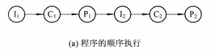
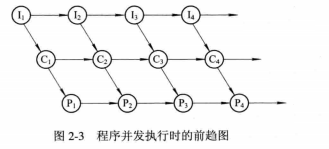
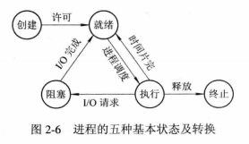
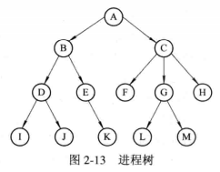
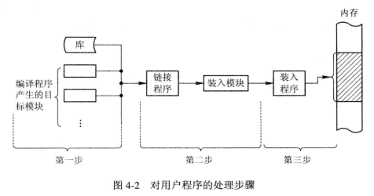
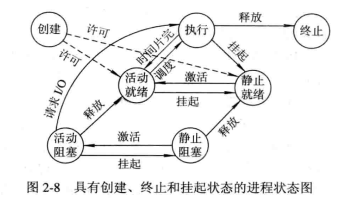
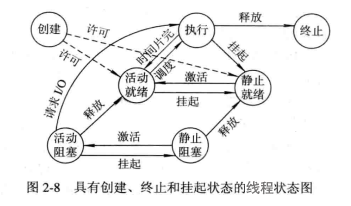

# 三、CPU 管理

[[_TOC_]]

## 1. 程序

### (1) 程序的顺序执行

多个程序`先后`执行，一个程序执行完才能执行下一个程序

一个应用程序由若干子程序组成，每个子程序完成特定的功能，子程序必须`按序执行`，例如必须先执行输入程序，再执行计算程序，最后执行打印程序，子程序的前驱图如下所示，I 代表输入程序，C 代表计算程序，P 代表打印程序

程序顺序执行的特征如下

* **顺序性**：CPU 严格按照应用程序规定的顺序执行，每个子程序必须在上一个子程序完成之后开始
* **封闭性**：程序在封闭的环境下运行，程序运行时独占全机资源，资源的状态只有本程序才能改变，程序一旦开始执行，其执行结果不受外界因素影响
* **可再现性**：只要程序执行时的环境和初始条件相同，程序重复执行时，无论是一气呵成地执行，还是走走停停的执行，都可以获得相同的结果

### (2) 程序的并行执行

多个程序在`同一时刻`执行

CPU 在同一时刻只能执行一个程序，因此单处理机只能`并发`执行内存中的多个程序，而多处理机可以`并行`执行内存中的多个程序

### (3) 程序的并发执行

多个程序在`同一时间间隔内`执行

内存中存在多个应用程序，每个应用程序都有输入程序、计算程序、打印程序这三个子程序，第一个应用程序的输入程序输入数据后，第一个应用程序的计算程序获得 CPU 进行计算，与此同时，第二个应用程序的输入程序可`同时`输入数据，从而使得第一个应用程序和第二个应用程序`并发`执行

程序并发执行的特征如下

* **间断性**：系统的各种资源被并发执行的应用程序共享，致使并发程序间形成`相互制约`的关系，相互制约将导致并发程序具有 `执行-暂停-执行` 这种间歇性的活动规律，例如计算程序 C1 完成后，输入程序 I2 尚未完成，那么计算程序 C2 就只能暂停执行，等待输入程序 I2 完成后才能恢复执行
* **失去封闭性**：系统的各种资源被并发执行的应用程序共享，致使任一程序运行时，环境都必然会受到其他程序的影响，例如 CPU 分配给一个程序时，其他程序必须等待
* **不可再现性**：由于失去封闭性，将导致不可再现性

## 2. 进程

### (1) 进程的概念

由于并发执行的程序具有间断性，并且失去封闭性和可再现性，因此一般的程序是无法参与并发执行的，为了能对并发执行的程序加以控制，引入了进程这个概念

**进程控制块 PCB**：描述进程的基本情况和活动过程，进而控制和管理进程

**进程实体**：PCB、程序、相关的数据

**进程**：进程实体通常简称为进程，进程也被定义为`能独立运行并作为资源分配的基本单位`

### (2) 进程的属性

#### ① 进程是一个可拥有资源的基本单位

一个进程要能够独立运行，必须拥有一定的资源，例如存放程序、数据的内存和磁盘空间，运行时所需的 IO 设备等

#### ② 进程是一个可独立调度的基本单位 ( 该属性转至线程 )

一个进程要能够独立运行，还必须是一个可独立调度的基本单位，每个进程拥有唯一的 PCB，操作系统根据 PCB 感知进程的存在，利用 PCB 中的信息对进程进行调度，将断电信息保存在 PCB 中之后在利用其恢复进程运行的现场

### (3) 进程的特征

#### ① 动态性
  
程序是`一组有序指令的集合`，存放于磁盘等介质上，程序本身是静态的，并不具有活动的意义
  
进程是`程序及其数据的一次执行过程`，具有一定的生命期，进程由创建而产生，由调度而执行，由撤销而消亡

#### ② 并发性
  
多个进程同时存在于内存中，并且能在一段时间间隔内并发执行，凡是未建立 PCB 的程序都不能参与并发执行

进程并发执行的特性如下

* **间断性**：系统的各种资源被并发进程共享，致使并发进程间形成`相互制约`的关系，相互制约将导致并发进程具有 `执行-暂停-执行` 这种间歇性的活动规律，例如进程 A 请求使用打印机，而操作系统已经将打印机分配给其他进程，则进程 A 自动进入阻塞状态，等待打印机空闲时才被中断处理程序唤醒
* **失去封闭性**：系统的各种资源被并发进程共享，致使任一进程运行时，环境都必然会受到其他进程的影响，例如将 CPU 分配给一个进程，其他进程则必须等待
* **可再现性**：并发进程之间通过`进程同步机制`保证可再现性

#### ③ 独立性
  
进程是一个能`独立获得资源、独立接收调度和运行`的基本单位，凡是未建立 PCB 的程序都不能作为一个独立的单位参与运行

#### ④ 异步性
  
进程是按异步方式运行的，即进程是按各自独立的、不可预知的速度向前推进，而`进程同步`机制保证了进程并发执行的结果是`可再现`的

### (4) 进程的状态

由于多个进程在并发执行时共享资源，致使在运行过程中呈现 `执行-暂停-执行` 这种间歇性的活动规律，所以进程在其生命周期内具有多种基本状态

#### ① 创建状态

要执行一个应用程序时，先将其装入内存，为其创建进程，为新进程分配除 CPU 以外的所有必须资源，然后将新进程转为就绪状态并且插入就绪队列

#### ② 终止状态

一个进程到达了自然结束点、出现了无法克服的错误、被操作系统终止、被其他有权限的进程终止时，这个进程都将进入终止状态

#### ③ 就绪状态

进程已被分配到除 CPU 以外的所有必要资源，只要获得 CPU，进程便可以立即执行，所有就绪状态的进程按照优先级策略排列成`就绪队列`

#### ④ 执行状态

进程已获得 CPU 正在执行，一个 CPU 在任何时刻只能执行一个进程

#### ⑤ 阻塞状态

正在执行的进程由于发生某些事件暂时无法继续执行而自动阻塞，此时操作系统会把 CPU 分配给另一个就绪进程，所有阻塞状态的进程按照优先级策略排列成`阻塞队列`

### (5) 进程的层次结构

#### ① Unix

Unix 系统中，允许父进程创建子进程，子进程再创建更多的孙进程，由此便形成了进程间的层次结构 ( 进程树 )

`子进程可以继承父进程的所有资源`，例如父进程打开的文件、分配到的缓存区等等，父进程无法拒绝子进程的继承权

撤销父进程时，也必须撤销其所有的子进程

#### ② Windows

Windows 系统中不存在进程层次结构的概念，所有的进程都具有相同的地位，进程 A 创建进程 B 时，进程 A 会获得一个`句柄`，用来控制进程 B，这个句柄是可以`传递`的，因此进程之间的关系不是层次关系，而是`获得句柄与否、控制与被控制`的关系

## 3. 进程控制

**进程控制**：应用程序调度、进程调度、终止进程、控制进程在运行过程中的状态转换、为进程创建若干线程

### (1) 应用程序调度

应用程序要在操作系统运行，必须先将其`从磁盘装入内存`，然后再为其创建进程

**① 编译**：编译程序将应用程序的源程序编译成若干目标模块

**② 链接**：链接程序将若干目标模块以及所需要的库函数链接在一起，形成一个完整的装入模块

**③ 装入**：装入程序将装入模块装入内存

### (2) 进程的创建

#### ① 引起进程创建的事件

* 应用程序调度：操作系统将要执行的应用程度装入内存，为其创建进程，为新进程分配除 CPU 以外的所有必须资源，然后将新进程转为就绪状态并且插入就绪队列
* 提供服务：运行中的应用程序提出某种服务请求后，操作系统专门创建一个进程来为其提供所需的服务

#### ② 进程的创建过程

* 申请空白 PCB
* 为新进程分配除 CPU 以外的所有必须资源，如内存、文件、IO 设备等，从操作系统或者父进程获得
* 初始化 CPB 填写用于控制和管理进程的信息
* 如果就绪队列能够接纳新进程，就将新进程转为就绪状态并插入就绪队列

### (3) 进程的终止

#### ① 引起进程终止的事件

* 正常结束：进程的任务已经完成，正常结束退出运行
* 异常结束：进程在运行时发生某种异常事件而无法继续运行
  * 越界错：进程访问越界的内存
  * 保护错：进程访问不允许的资源、以不正当的方式访问资源
  * 非法指令：进程试图执行不存在的指令
  * 特权指令错：进程试图执行只允许 OS 执行的指令
  * 运行超时：进程的执行时间超过指定的最大时间
  * 等待超时：进程等待某事件的时间超过指定最大值
  * 算术运算错：进程试图执行一个被禁止的运算
  * IO 故障：IO 过程发生错误
* 外界干预：进程因外界的请求而终止运行

#### ② 进程的终止过程

* 从 PCB 集合中检索出将要被终止进程的 PCB
* 若被终止进程处于执行状态，立即终止
* 若被终止进程具有子孙进程，立即终止其所有子孙进程
* 将被终止进程的所有资源归还其父进程，若没有父进程则归还操作系统
* 将被终止进程的 PCB 从所在进程队列移出

### (4) 进程的阻塞

#### ① 引起进程阻塞的事件

* 向操作系统请求共享资源失败：例如进程 A 请求使用打印机，而操作系统已经将打印机分配给其他进程，则进程 A 自动进入阻塞状态，等待打印机空闲时才被中断处理程序唤醒
* 等待某种操作的完成：例如进程 A 启动了 IO 设备，必须在 IO 设备完成指定的 IO 操作后才能继续执行，则进程 A 在启动 IO 设备后自动进入阻塞状态，IO 操作完成后再由中断处理程序唤醒
* 新数据尚未到达：对于相互合作的进程，如果进程 A 需要获得进程 B 提供的数据后才能对数据进行处理，只要所需数据尚未到达，进程 A 就只能阻塞，等待进程 B 提供数据后唤醒进程 A
* 等待新任务的到达：网络环境下操作系统往往会设置一个特定的系统进程，这些系统进程完成任务后便会自动进入阻塞状态，等待新任务的到达，例如网络环境下的发送进程，发送完成已有的数据包后便会自动进入阻塞状态，只有当新的数据包到达时才由中断处理程序唤醒

#### ② 进程的阻塞过程

进程的阻塞是一种`进程自身的主动行为`，主动变成阻塞状态，并且插入阻塞队列

### (5) 进程的挂起操作

#### ① 引起进程挂起的事件

为了用户和操作系统观察和分析进程，引入了对进程的挂起操作，`挂起进程无法被调度执行`，挂起进程有以下三个原因

* 终端用户的需要：用户在应用程序运行期间发现有可疑问题，希望暂停程序的运行，以便用户研究其执行情况或对程序进行修改
* 操作系统的需要：操作系统有时需要挂起某个进程，以便检查资源的使用情况或进行记账
* 父进程的请求：父进程有时希望挂起自己的某个子进程，以便考察和修改该子进程，或者协调各子进程间的活动

#### ② 进程的挂起和激活过程

* 检查将要被挂起进程的状态，若处于执行状态，挂起后处于静止就绪状态，若出于活动就绪状态，挂起后处于静止就绪状态，若处于活动阻塞状态，挂起后处于静止阻塞状态，无论是静止就绪状态还是静止阻塞状态，`挂起进程都无法被调度执行`
* 静止就绪状态的进程激活后处于活动就绪状态，静止阻塞状态的进程激活后处于活动阻塞状态，`激活进程可以被正常调度执行`
* 挂起进程会从内存被调至`磁盘`

## 4. 进程同步

### (1) 进程同步的概念

进程同步机制是为了`保证进程的可再现性`，对多个并发进程的执行次序进行协调，使并发进程能按照一定的规则共享系统资源

常用的进程同步机制有：信号量机制、管程机制

#### ① 临界资源

一段时间内只允许`指定数量进程`访问的资源被称为临界资源

* 软件临界资源：变量、表格、栈等
* 硬件临界资源：打印机等诸多物理设备

#### ② 临界区

每个进程中访问临界资源的那段`代码`被称为临界区

#### ③ 并发进程间的制约关系

系统的各种资源被并发进程共享，致使并发进程间形成`相互制约`的关系

* 间接相互制约关系：并发进程间关于`临界资源的共享`会形成间接相互制约关系，并发进程要使用临界资源，必须先`向操作系统提出申请，由操作系统统一分配`，而不允许直接使用
* 直接相互制约关系：并发进程间关于`相互合作完成某项任务`会形成直接相互制约关系，例如输入进程 A 和计算进程 B 通过`共享内存`通信，输入进程 A 通过共享内存向计算进程 B 提供数据，计算进程 B 从共享内存中取出数据并对数据进行处理，若共享内存空，计算进程 B 会因不能获得所需数据而自动阻塞，当输入进程 A 将数据输入共享内存便将计算进程 B 唤醒，如共享内存满，输入进程 A 因不能再向共享内存投入数据而自动阻塞，当计算进程 B 将共享内存中数据取出便将输入进程 A 唤醒

#### ④ 同步机制应遵循的规则

* 空闲让进：当无进程处于临界区时，表示临界资源处于空闲状态，应允许一个请求进入临界区的进程进入自己的临界区，访问临界资源
* 忙则等待：当已有进程处于临界区时，表示临界资源正在被访问，因此所有请求进入临界区的进程都必须等待
* 有限等待：请求进入临界区的进程，应保证在有限时间内进入自己的临界区，必须死等
* 让权等待：当进程不能进入自己的临界区时，应立即释放 CPU，避免忙等

### (2) 信号量机制

① 某个临界资源允许 n 个进程同时访问

② 信号量就是给临界资源上 n 把锁，先到的进程就取一把钥匙，出来时再把钥匙挂回原处，后到的进程发现钥匙架空了就在门口排队

### (3) 管程机制

**由来**：虽然信号量机制是一个既方便又有效的进程同步机制，但是每个要访问临界资源的进程都必须自备原子操作 wait、signal，这使得大量同步操作分散在各个进程中，不但给管理带来了麻烦，还会因同步操作的使用不当而导致死锁

①②③④⑤⑥⑦⑧⑨⑩

## 5. 进程通信

一组相互合作的进程完成一个共同的任务时，进程之间需要交换信息，例如输入进程、计算进程、打印进程相互合作时，输入进程将输入数据传送给计算进程，计算进程将计算结果传送给打印进程

进程通信是指进程之间的信息交换，进程间需要传送大量数据时，应当利用操作系统提供的高级通信工具来实现进程之间的通信

### (1) 共享内存

需要通信的进程在通信前，先向操作系统申请申请获得一块`共享内存`，并将其附加到自己的地址空间

相互通信的进程可通过对该共享内存的读写操作交换信息实现通信，数据的形式、位置、访问控制都是由`进程`负责，而不是操作系统，

### (2) 客户机/服务器 ( 套接字 )

客户机/服务器的通信机制，在`网络环境`的各种领域已经成为当前最主流的通信机制，用于实现不同计算机间的进程双向通信

#### ① 套接字

一个套接字就是一个通信标识类型的数据结构，包含了`进程所在的 IP 地址、通信目的 IP 地址、通信端口号、通信传输层协议`，以及针对客户机和服务器提供的不同系统调用 API

#### ② 套接字的通信过程

* 通信双方的进程位于不同主机的网络环境下
* 客户端发送进程发出连接请求，随机申请一个套接字，主机为之分配一个端口，与该套接字绑定，不再分配给其他进程
* 服务器接收进程拥有全局公认的套接字和指定端口 ( ftp 服务器监听端口 21，Web 服务器监听端口 80 )，并通过监听端口等待客户端请求，建立连接后就可以实现进程间的通信

## 6. 线程

### (1) 线程的引入

#### ② 进程并发执行的开销

为了能使进程并发执行，操作系统必须进行以下操作

* 创建进程：操作系统需要先申请空白 PCB，为新进程分配除 CPU 以外的所有必须资源，如内存空间、IO 设备等，然后初始化 CPB 填写用于控制和管理进程的信息，最后将新进程转为就绪状态并插入就绪队列
* 撤销进程：操作系统需要先终止进程，然后回收其所有的资源，最后再将进程 PCB 从所在进程队列移出
* 进程切换：操作系统需要先将当前进程的 CPU 环境保留到其 PCB 中，然后再为新选中进程设置 CPU 环境，因此需要花费不少的 CPU 时间

#### ② 引入线程的目的

由上述可知，进程是一个资源的拥有者，因此在创建、撤销、切换进程时，操作系统必须为之付出较大的开销，这就限制了并发进程的数目，并且进程切换也不宜过于频繁，从而限制了并发程度的进一步提高

因此引入了线程的概念，线程是为了减少并发进程执行时操作系统付出的开销，使操作系统具有更好的并发性

### (2) 线程的概念

引入线程的实质就是`将进程的两个基本属性分开`，由操作系统分开处理

引入多线程的操作系统中，进程将不再作为可独立调度的基本单位，因此`进程也就不再作为可执行的实体`，但是进程仍然具有五种状态，例如进程处于执行状态，表示进程至少有一个线程处于执行状态

**进程**：进程是一个`可拥有资源`的基本单位

**线程**：线程是一个`可独立调度`的基本单位 ( 从进程的 2 个基本属性中分离出的 )

**线程控制块 TCB**：描述线程的基本情况和活动过程，进而控制和管理线程

进程和线程的比较如下

* 拥有资源：进程作为拥有资源的基本单位，线程本身并不拥有系统资源，而是拥有自己的必不可少的、能保证独立运行的资源 ( 线程控制块 TCB、寄存器、栈 )，但是同一进程的所有线程共享该进程拥有的系统资源
* 调度的基本单位：线程作为调度的基本单位，进程不再作为调度的基本单位，同一进程中线程的切换不会引起进程的切换，而从一个进程中的线程切换到另一个进程中的线程会引起进程的切换
* 并发性：多个进程之间可以并发执行，同一进程的多个线程之间也可以并发执行，例如文字处理进程可以设置三个线程，一个用于从键盘读取数据，一个用于在后台进行拼写和语法检查，一个用于显示文字和图片
* 独立性：不同进程间都拥有独立的地址空间和其他资源，除了共享全局变量外，不允许其他进程的访问，而同一进程的所有线程共享该进程的所有资源，因此线程的独立性更低

### (3) 线程的状态

① 线程与进程一样，同样拥有五种基本状态：创建状态、终止状态、就绪状态、执行状态、阻塞状态

② 线程也具有挂起和激活操作

