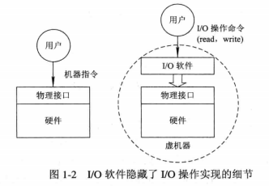
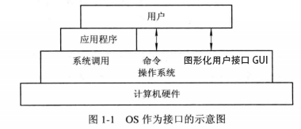

# 二、操作系统

[[_TOC_]]

## 1. 操作系统的作用

### (1) 管理计算机系统的资源

计算机系统包含多种硬件资源和软件资源，归纳起来可分为 4 类：CPU、内存、IO 设备 ( 磁盘、输入设备、输出设备 )、文件 ( 程序、数据 )

操作系统的主要功能就是管理这四类资源

#### ① CPU 管理

#### ② 内存管理

#### ③ IO 设备管理

#### ④ 文件管理

### (2) 抽象计算机硬件系统的物理接口

一台完全没有软件的计算机裸机，向用户提供的仅仅是`硬件的物理接口`，用户对硬件的物理接口的实现细节没有了解就无法使用计算机

#### ① 硬件设备管理软件

硬件设备管理软件实现了对硬件进行操作的细节，并向上将硬件抽象为`一组数据结构及操作命令`，用户就可以直接利用这些数据结构和操作命令来操纵计算机硬件

#### ② 虚机器

通常把覆盖了硬件设备管理软件的计算机称作虚机器，向用户提供了一个硬件操作的抽象模型，用户利用模型提供的接口使用计算机，无需了解物理接口实现的细节，使用户更容易地使用计算机硬件资源

#### ③ 操作系统

可以在硬件设备管理软件上再次覆盖一层面向用户的窗口软件，用户可以在窗口环境下更方便地使用计算机，从而形成一台功能更强的虚机器

由此可见操作系统就是铺设在计算机硬件上的多层硬件设备管理软件的集合，实现了对计算机硬件操作的多个层级的抽象模型，随着抽象层次的提高，抽象接口提供的功能也就越强，用户使用也就越方便

### (3) 用户与计算机硬件系统之间的接口

用户在操作系统的帮助下能够快速便捷地运行自己的程序或者操纵计算机硬件，用户能够通过三种方式实现与操作系统的通信

#### ① 系统调用 ( 应用程序 )

系统调用是为了应用程序在执行过程中访问系统资源而设置的，是`应用程序获得操作系统服务`的唯一途径

每一个系统调用都是一个能完成特定功能的子程序，每当应用程序要求操作系统提供某种服务时，就调用具有相应功能的系统调用

在高级程序语言中，往往提供了与各个系统调用一一对应的`库函数`

#### ② 命令 ( 用户 )

用户通过向应用程序发出`命令`以控制应用程序的运行

用户在终端或控制台键入一条命令后，命令解释程序立即对该命令加以解释执行，完成指定功能后又返回到终端或控制台，等待用户键入下一条命令，这样用户便可以通过先后键入不同命令的方式控制应用程序的执行

#### ③ 图形化用户接口 GUI ( 用户 )

由于命令不便于用户记忆和使用，因此诞生了图形化用户接口 GUI

GUI 采用了图形化的操作界面，将窗口、图标、菜单、鼠标和面向对象技术集成到一起，引入形象的各种图标，将操作系统的各项功能、各种应用程序、各种文件直观逼真的表示出来，形成一个图文并茂的视窗操作环境

有了 GUI，可以直接在系统桌面上显示各种常用图标，每个图标对应一个应用程序，用户只需双击图标就可以启动应用程序 ( 无需键入命令 )，用户还可以通过选择窗口、菜单、对话框、滚动条，完成对应用程序的各种控制和操作

### (4) 计算机系统安全

操作系统需要确保在计算机系统中存储和传输数据的保密性、完整性、可用性

#### ① 认证技术

确认对象的真实性，防止入侵者进行假冒和篡改

#### ② 密码技术

对计算机系统中存储和传输的数据进行加密

#### ③ 访问控制技术

* 通过对用户存取权限的设置，限定用户对计算机系统资源的访问范围
* 通过对文件属性的设置，保障指定文件的安全性，例如设置文件属性为只读，该文件就不能被修改

#### ④ 反病毒技术

反病毒软件安装到计算机后，对磁盘上的所有可执行文件进行扫描，若发现有病毒，就立即清除

### (5) 网络通信

① 操作系统需要`支持用户联网`以取得各类网络所提供的服务，如 Web 服务、电子邮件服务等

② 在源主机和目标主机之间，实现`无差错的数据传输`

## 2. 操作系统的内核

### (1) OS 内核

现代操作系统一般将 OS 划分为若干层次，再将 OS 的不同功能软件分别设置在不同的层次中，通常将一些与硬件紧密相关的功能软件、各种常用设备的驱动程序、运行频率较高的功能软件 ( 时钟管理、进程调度等 )，安排在紧靠硬件的软件层次中，将其`常驻内存`，被称为 OS 内核

设置 OS 内核的原因

* 对 OS 内核的软件进行保护，防止遭受其他应用程序的破坏
* 提高 OS 的运行效率

### (2) CPU 的执行状态

#### ① 系统态

系统态具有较高的特权，能够执行一切指令，访问所有的 CPU 寄存器和内存

系统程序 ( 操作系统、语言处理程序 ) 都在系统态运行

#### ② 用户态

用户态具有较低的特权，仅能执行规定的指令，访问指定的 CPU 寄存器和内存

应用程序都在用户态运行

## 3. 操作系统的特征

### (1) 并发

#### ① 程序的并发执行

多个程序在`同一时间间隔内`执行

内存中存在多个应用程序，每个应用程序都有输入程序、计算程序、打印程序这三个子程序，第一个应用程序的输入程序输入数据后，第一个应用程序的计算程序获得 CPU 进行计算，与此同时，第二个应用程序的输入程序可`同时`输入数据，从而使得第一个应用程序和第二个应用程序`并发`执行

程序并发执行的特征如下

* **间断性**：应用程序间的并发执行，虽然提高了系统的吞吐量和资源的利用率，但由于其共享资源，致使并发程序间必然形成`相互制约`的关系，例如计算程序 C1 完成后，输入程序 I2 尚未完成，那么计算程序 C2 就只能暂停执行，等待输入程序 I2 完成后才能恢复执行，由此可见，相互制约将导致并发程序具有 `执行-暂停-执行` 这种间歇性的活动规律

* **失去封闭性**：内存中存在多个并发程序时，系统的各种资源将被共享，致使任一程序运行时，环境都必然会受到其他程序的影响，例如 CPU 分配给一个程序时，其他程序必须等待

* **不可再现性**：由于失去封闭性，将导致不可再现性

#### ② 进程的并发执行

多个进程在`同一时间间隔内`执行

进程并发执行的特性如下

* **间断性**：系统的各种资源被并发进程共享，致使并发进程间形成`相互制约`的关系，相互制约将导致并发进程具有 `执行-暂停-执行` 这种间歇性的活动规律，例如进程 A 请求使用打印机，而操作系统已经将打印机分配给其他进程，则进程 A 自动进入阻塞状态，等待打印机空闲时才被中断处理程序唤醒
* **失去封闭性**：系统的各种资源被并发进程共享，致使任一进程运行时，环境都必然会受到其他进程的影响，例如将 CPU 分配给一个进程，其他进程则必须等待
* **可再现性**：并发进程之间通过`进程同步机制`保证可再现性

### (2) 进程

#### ① 进程的概念

由于并发执行的程序将具有间断性，并且失去封闭性和可再现性，因此一般的程序是无法参与并发执行的，为了能对并发执行的程序加以控制，引入了进程这个概念

**进程控制块 PCB**：描述进程的基本情况和活动过程，进而控制和管理进程

**进程实体**：PCB、程序、相关的数据

**进程**：进程实体通常简称为进程，进程也被定义为`能独立运行并作为资源分配的基本单位`

创建进程实际上就是创建 PCB，撤销进程实际上就是撤销 PCB

#### ② 进程的特征

* **动态性**：程序是`一组有序指令的集合`，存放于磁盘等介质上，程序本身是静态的，并不具有活动的意义
  
  进程是`程序及其数据的一次执行过程`，具有一定的生命期，进程由创建而产生，由调度而执行，由撤销而消亡

* **并发性**：多个进程同时存在于内存中，并且能在一段时间间隔内并发执行，凡是未建立 PCB 的程序都不能参与并发执行
  
  进程并发执行的特性如下
  * **间断性**：系统的各种资源被并发进程共享，致使并发进程间形成`相互制约`的关系，相互制约将导致并发进程具有 `执行-暂停-执行` 这种间歇性的活动规律，例如进程 A 请求使用打印机，而操作系统已经将打印机分配给其他进程，则进程 A 自动进入阻塞状态，等待打印机空闲时才被中断处理程序唤醒
  * **失去封闭性**：系统的各种资源被并发进程共享，致使任一进程运行时，环境都必然会受到其他进程的影响，例如将 CPU 分配给一个进程，其他进程则必须等待
  * **可再现性**：并发进程之间通过`进程同步机制`保证可再现性

* **独立性**：进程是一个能`独立运行、独立获得资源、独立接收调度`的基本单位，凡是未建立 PCB 的程序都不能作为一个独立的单位参与运行

* **异步性**：进程是按异步方式运行的，即进程是按各自独立的、不可预知的速度向前推进，而`进程同步`机制保证了进程并发执行的结果是`可再现`的

### (3) 共享

系统的各种资源被并发进程共享，致使并发进程间形成`相互制约`的关系，因而诞生了`进程同步机制`

进程同步机制是为了保证进程的`可再现性`，对多个并发进程的执行次序进行协调，使并发进程能按照一定的规则共享系统资源

常见的进程同步机制有：信号量机制、管程机制

#### ① 并发进程间的制约关系

* 间接相互制约关系：并发进程间关于`临界资源的共享`会形成间接相互制约关系，并发进程要使用临界资源，必须先`向操作系统提出申请，由操作系统统一分配`，而不允许直接使用
* 直接相互制约关系：并发进程间关于`相互合作完成某项任务`会形成直接相互制约关系，例如输入进程 A 和计算进程 B 共享一个缓冲区，输入进程 A 通过缓冲区向计算进程 B 提供数据，计算进程 B 从缓冲区中取出数据并对数据进行处理，若缓冲区空，计算进程 B 会因不能获得所需数据而自动阻塞，当输入进程 A 将数据输入缓冲区便将计算进程 B 唤醒，如缓冲区满，输入进程 A 因不能再向缓冲区投入数据而自动阻塞，当计算进程 B 将缓冲区数据取出便将输入进程 A 唤醒

#### ② 信号量机制

#### ③ 管程机制

### (4) 虚拟

通过`时分复用技术`将一个物理实体变成若干个逻辑上的虚拟实体

#### ① 虚拟 CPU

为内存中的每个应用程序建立至少一个进程，让多个应用程序`并发`执行，此时虽然计算机只有一个 CPU，但是通过时分复用的虚拟 CPU 技术，能够实现宏观上的同时为多个用户服务，使每个终端用户都认为有一个 CPU 专门为其服务

#### ② 虚拟设备

将一台物理 IO 设备虚拟为多台逻辑 IO 设备，并让每个用户占用一台逻辑 IO 设备，这样就可以让`独占资源变成共享资源`，宏观上实现为多个用户服务

### (5) 异步

① 对于内存中的每个进程，何时能够获得 CPU 运行，何时因提出某种资源请求而暂停，进程以怎样的速度推进，进程需要多少时间才能完成，这些都是不可预知的

② 由于各个应用程序的性能不同，比如有的侧重于计算而有的侧重于 IO，因此很有可能先进入内存的应用程序后完成，而后进入内存的应用程序先完成，这就是进程的异步性
