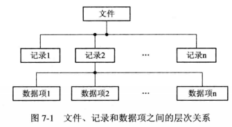

# 七、文件管理

[[_TOC_]]

## 1. 文件

### (1) 文件的组成

文件系统的管理功能就是将管理的`程序和数据`组织为一系列文件

#### ① 数据项

数据项是一个对象的某种属性的字符集，数据项又称字段，是数据组织中可以命名的最小逻辑单位，例如姓名、年龄

#### ② 记录

记录是一个对象在某方面的属性，关键字能够唯一标识某个记录

```javascript
//数据项：name=张三、age=20
//记录：{ name: '张三', age: 20 }, name为关键字

{
  name: '张三',
  age: 20,
},
{
  name: '李四',
  age: 20,
},
{
  name: '王五',
  age: 20,
}
```



### (2) 文件的属性

#### ① 文件类型

通过文件`扩展名/后缀名`来标识文件类型，例如 file.txt 中 txt 表示文本文件

#### ② 文件长度

文件的长度，可以是字节

#### ③ 文件的物理位置

文件在磁盘上的物理位置

#### ④ 文件的建立时间

文件的`最后一次修改时间`

### (3) 文件的分类

#### ① 按用途分类

* 系统文件：系统程序构成的文件
* 用户文件：应用程序构成的文件
* 库文件：系统调用文件

#### ② 按数据形式分类

* 源文件：源程序和数据构成的文件
* 目标文件：源文件编译后的目标文件
* 可执行文件：目标文件链接后的可执行文件

#### ③ 按存取控制属性分类

* 只执行文件：不允许读写
* 只读文件
* 读写文件

## 2. 文件管理系统

### (1) 文件管理系统的管理对象

#### ① 文件

文件管理系统管理者各种不同类型的文件

#### ② 目录

设置目录是为了方便对文件的存取和检索，目录的每个目录项中必须包含：文件名、文件属性说明、文件所在的物理地址

对目录的组织和管理，不但能方便用户，还能提高文件的存取速率

#### ③ 磁盘空间

文件和目录必定占据存储空间，对这部分磁盘空间的有效管理，不仅能提高磁盘的利用率，还能提高文件的存取速率

### (2) 文件管理系统的功能

#### ① 文件磁盘空间管理

为每个文件分配必要的磁盘空间，提高磁盘的利用率，进而提高文件系统的读写速度，为此需要设计相应的数据结构用于记录文件磁盘空间的使用情况，以供分配和回收时参考

#### ② 文件目录管理

为每个文件建立一个目录项，包括文件名、文件属性、文件在磁盘上的物理位置等，

对众多目录项加以有效地组织，以实现方便地按名存取

#### ③ 文件读写管理

操作系统根据用户给出的文件名检索文件目录，获得文件在磁盘上的位置，然后利用文件读写指针对文件进行读写

#### ④ 文件保护

* 防止未经核准的用户存取文件
* 防止冒名顶替的用户存取文件
* 防止以不正确的方式使用文件
