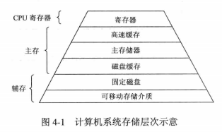

# 四、内存管理

[[_TOC_]]

## 1. 层次存储系统

无论内存的容量有多大都无法满足人们的期望，随着技术的发展，人们希望在内存内存放更多的信息，存储大量数据的传统办法是采用层次存储结构

### (1) 层次存储系统的组成

#### ① 寄存器

CPU 寄存器主要用于暂存 `CPU 执行计算机程序的操作数据和中间结果`，CPU 寄存器具有与 CPU 相同的速度，完全能与 CPU 协调工作

#### ② 高速缓存 ( Cache )

高速缓存主要用于存放 `CPU 将要运行或刚运行过的程序和数据`，也就是备份内存中 CPU 常用的数据，减少 CPU 对内存的访问次数，用于`解决 CPU 和内存间的速度匹配问题`

#### ③ 内存

内存主要用于存放`运行中的程序和数据`，CPU 能够直接访问内存

#### ④ 磁盘缓存

磁盘缓存主要用于存放`频繁使用的磁盘程序和数据`，用于`解决内存和磁盘的速度匹配问题`

#### ⑤ 磁盘

磁盘主要用于存放`未运行的程序和数据`，磁盘的信息必须调入内存后才能被 CPU 使用

#### ⑥ 可移动存储介质

光盘和磁带等存储介质

### (2) 层次存储系统的特点

按层次结构`自上而下`，层次存储系统具有以下三个特点

**① 访问时间逐渐增长**：寄存器的访问时间是几 ns，高速缓存的访问时间是十几 ns，内存的访问时间是几十 ns，再往后的访问时间突然增大，因为 CPU 不能直接访问磁盘，必须将磁盘的数据调入内存后访问，磁盘的访问时间最少要十几 ms，磁带和光盘等可移动存储介质的访问时间得以秒来计算

**② 存储容量逐渐增大**：寄存器有 128 个字节就很合适，高速缓存可以是几 MB，内存在几十 MB 到数千 MB 之间，磁盘在几 GB 到几十 GB 之间，磁盘和光盘等可移动存储介质的容量只受限于用户的预算

**③ 存储每位价格逐渐减小**：内存的价格在每兆字节几美元，磁盘的价格在每兆字节几美分，磁带和光盘等可移动存储介质的价格更低

## 2. 虚拟内存

### (1) 虚拟内存的定义

用户看到应用程序能在操作系统中正常运行，认为计算机的内存容量比应用程序大，也就是说用户感受到的内存容量比实际内容容量大的多，但用户看到的大容量只是一种错觉，是虚的，这就是虚拟内存

虚拟内存是指具有`请求调入功能和对换功能`，能从逻辑上对内存容量加以扩充的一种方式，虚拟内存的逻辑容量由`内存容量和磁盘容量之和`决定

### (2) 虚拟内存的特征

#### ① 多次性

要执行的应用程序的程序和数据无需一次性装入内存，只需将当前要运行的那部分程序和数据装入内存即可开始运行，每当要运行到尚未装入内存的程序时，再将需要的程序和数据装入内存

#### ② 对换性

正在执行的应用程序的程序和数据，无需一直常驻内存，可以在执行过程中换进 ( 从磁盘装入内存 )、换出 ( 从内存调至磁盘 )，也就是将暂不使用的程序和数据换出，等待将要使用时再换进

#### ③ 虚拟性

从逻辑上扩充内存容量，使用户看到的内存容量远大于实际内存容量

## 3. 内存保护

① 确保每个应用程序仅在自己的内存空间内运行，彼此互不干扰

② 不允许应用程序访问操作系统的程序和数据

## 4. 内存分类

当我们在电脑上双击打开 QQ 时，通过鼠标向 CPU 发送一条指令，CPU 接收到指令后将 QQ 程序从磁盘加载到内存，加载完成后 CPU 开始执行 QQ 程序，执行完成后 CPU 让 QQ 程序显示在显示器上，也就是用户看到的最终结果

CPU 在内存中运行应用程序时，需要内存空间存放数据，操作系统会划分出两种不同的内容空间用于存放数据，一种是堆，一种是栈

### (1) 进程和线程

* **进程**：进程是一个`可拥有资源`的基本单位
  
  **进程实体**：进程控制块 PCB、程序代码、相关的数据

  **进程资源**：进程可拥有的资源指的是计算机系统资源，主要是指 内存、IO 设备 ( 磁盘、输入设备、输出设备 )

* **线程**：线程是一个`可独立调度`的基本单位 ( 从进程的 2 个基本属性中分离出的 )
  
  **线程实体**：线程控制块 TCB、程序代码，相关的数据

### (2) 堆内存 ( Heap )

* 每个`进程`分配一个堆，堆是该进程的所有线程共享的
* 堆的大小不确定，需要的话可以不断增加
* 堆是没有结构的，数据可以任意存放

### (3) 栈内存 ( Stack )

* 每个`线程`分配一个栈，栈是每个线程独占的
* 栈的大小确定，数据超过这个大小，就会发生栈溢出
* 栈是有结构的，数据按照一定次序存放，可以明确知道每个数据的大小
