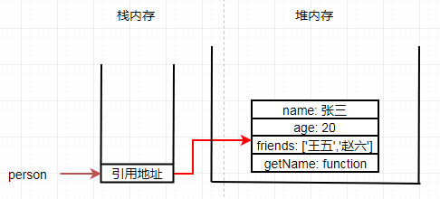

# 四、内存管理

[[_TOC_]]

## 1. 层次存储系统

无论内存的容量有多大都无法满足人们的期望，随着技术的发展，人们希望在内存内存放更多的信息，存储大量数据的传统办法是采用层次存储结构


### (1) 层次存储系统的组成

#### ① 寄存器

CPU 寄存器主要用于暂存 `CPU 的操作数据和中间结果`，CPU 寄存器具有与 CPU 相同的速度，完全能与 CPU 协调工作

#### ② 高速缓存 ( Cache )

高速缓存主要用于存放 `CPU 立即要运行或刚运行过的程序和数据`，也就是备份内存中 CPU 常用的数据，减少 CPU 对内存的访问次数，用于`解决 CPU 和内存间的速度匹配问题`

#### ③ 内存

内存主要用于存放`运行进程的程序和数据`，CPU 能够直接访问内存

#### ④ 磁盘缓存

磁盘缓存主要用于存放`频繁使用的磁盘程序和数据`，用于`解决内存和磁盘的速度匹配问题`

#### ⑤ 磁盘

磁盘主要用于存放`未执行的计算机程序和数据`，磁盘的信息必须调入内存后才能被 CPU 使用

#### ⑥ 可移动存储介质

光盘和磁带等存储介质

### (2) 层次存储系统的特点

按层次结构`自上而下`，层次存储系统具有以下三个特点

**① 访问时间逐渐增长**：寄存器的访问时间是几 ns，高速缓存的访问时间是十几 ns，内存的访问时间是几十 ns，再往后的访问时间突然增大，因为 CPU 不能直接访问磁盘，必须将磁盘的数据调入内存后访问，磁盘的访问时间最少要十几 ms，磁带和光盘等可移动存储介质的访问时间得以秒来计算

**② 存储容量逐渐增大**：寄存器有 128 个字节就很合适，高速缓存可以是几 MB，内存在几十 MB 到数千 MB 之间，磁盘在几 GB 到几十 GB 之间，磁盘和光盘等可移动存储介质的容量只受限于用户的预算

**③ 存储每位价格逐渐减小**：内存的价格在每兆字节几美元，磁盘的价格在每兆字节几美分，磁带和光盘等可移动存储介质的价格更低

## 2. 虚拟内存

### (1) 虚拟内存的定义

用户看到应用程序能在操作系统中正常运行，认为计算机的内存容量比应用程序大，也就是说用户感受到的内存容量比实际内容容量大的多，但用户看到的大容量只是一种错觉，是虚的，这就是虚拟内存

虚拟内存是指具有`请求调入功能和对换功能`，能从逻辑上对内存容量加以扩充的一种方式，虚拟内存的逻辑容量由`内存容量和磁盘容量之和`决定

### (2) 虚拟内存的特征

#### ① 多次性

要执行的应用程序的程序和数据无需一次性装入内存，只需将当前要运行的那部分程序和数据装入内存即可开始运行，每当要运行到尚未装入内存的程序时，再将需要的程序和数据装入内存

#### ② 对换性

正在执行的应用程序的程序和数据，无需一直常驻内存，可以在执行过程中换进 ( 从磁盘装入内存 )、换出 ( 从内存调至磁盘 )，也就是将暂不使用的程序和数据换出，等待将要使用时再换进

#### ③ 虚拟性

从逻辑上扩充内存容量，使用户看到的内存容量远大于实际内存容量

## 3. 内存保护

① 确保每个应用程序仅在自己的内存空间内运行，彼此互不干扰

② 不允许应用程序访问操作系统的程序和数据

## 4. 内存分类

当我们在电脑上双击打开 QQ 时，通过鼠标向 CPU 发送一条指令，CPU 接收到指令后将 QQ 程序从磁盘加载到内存，加载完成后 CPU 开始执行 QQ 程序，执行完成后 CPU 让 QQ 程序显示在显示器上，也就是用户看到的最终结果

CPU 在内存中运行应用程序时，需要内存空间存放数据，操作系统会划分出两种不同的内容空间用于存放数据，一种是堆，一种是栈

### (1) 堆内存 ( Heap )

① 每个进程分配一个堆，堆是该进程的所有线程共享的

② 堆的大小不确定，需要的话可以不断增加

③ 堆是没有结构的，数据可以任意存放

### (2) 栈内存 ( Stack )

① 每个线程分配一个栈，栈是每个线程独占的

② 栈的大小确定，数据超过这个大小，就会发生栈溢出

③ 栈是有结构的，数据按照一定次序存放，可以明确知道每个数据的大小

#### 以 JS 语言为例

* 基本数据类型值：`大小固定`，在栈内存中存储，`按值访问`，栈内存中直接读取值，读写较快

* 引用数据类型值：`大小不固定`，在堆内存中存储，由于结构复杂，数据量大，在堆内存中表现为`一段连续的内存地址`，`按引用地址访问`，先到栈内存中读取引用地址，再到引用地址指向的堆内存中读取对象，故而读写较慢


```javascript
const person = {
  name: name,
  age: age,
  friends: ['王五', '赵六'],
  getName(){
    return this.name
  }
}
```



### (3) 调用栈/执行上下文栈

① 调用栈表示函数像堆积木一样存放，以实现层层调用

② 程序运行的时候，总是先完成最上层的调用，然后将它的值返回到下一层调用，直至完成整个调用栈，返回最后的结果

#### 以 JS 语言为例

```javascript
const a = "global";
function f1(){
  const a = "local";
  const f2 = () => a;
  return f2();
}
f1();
//ECStack.push(globalContext);
//ECStack.push(<f1> functionContext);
//ECStack.push(<f2> functionContext);
//ECStack.pop();
//ECStack.pop();


//创建全局执行上下文,全局上下文被压入执行上下文栈
ECStack = [
  globalContext
];

//全局上下文初始化
globalContext = {
  VO: [global],
  Scope: [globalContext.VO],
  this: globalContext.VO
}

//同时f1函数被创建,保存作用域链到f1函数内部属性[[scope]]
f1.[[scope]] = [
  globalContext.VO
];

//创建f1函数执行上下文,f1函数上下文被压入执行上下文栈
ECStack = [
  f1Context,
  globalContext
];

//f1函数上下文初始化
//1. 复制函数[[scope]]属性创建作用域链
//2. 用函数Arguments对象创建活动对象
//3. 初始化活动对象,即加入函数形参、函数声明、变量声明
//4. 将活动对象压入函数作用域链顶端
f1Context = {
  AO: {
    arguments: {
      length: 0
    },
    scope: undefined,
    f2: reference to function f2(){}
  },
  Scope: [AO, globalContext.VO],
  this: undefined
}

//同时f2函数被创建,保存当前作用域链到f2函数内部属性[[scope]]
f2.[[scope]] = [
  f1Context.AO,
  globalContext.VO
];

//创建f2函数执行上下文,f2函数上下文被压入执行上下文栈
ECStack = [
  f2Context,
  f1Context,
  globalContext
];

//f2函数上下文初始化
f2Context = {
  AO: {
    arguments: {
      length: 0
    }
  },
  Scope: [AO, f1Context.AO, globalContext.VO],
  this: undefined
}

//f2函数执行,沿着作用域链查找a值,返回a值

//f2函数执行完毕,f2函数上下文从执行上下文栈中弹出
ECStack = [
  f1Context,
  globalContext
];

//f1函数执行完毕,f1函数上下文从执行上下文栈中弹出
ECStack = [
  globalContext
];
```
