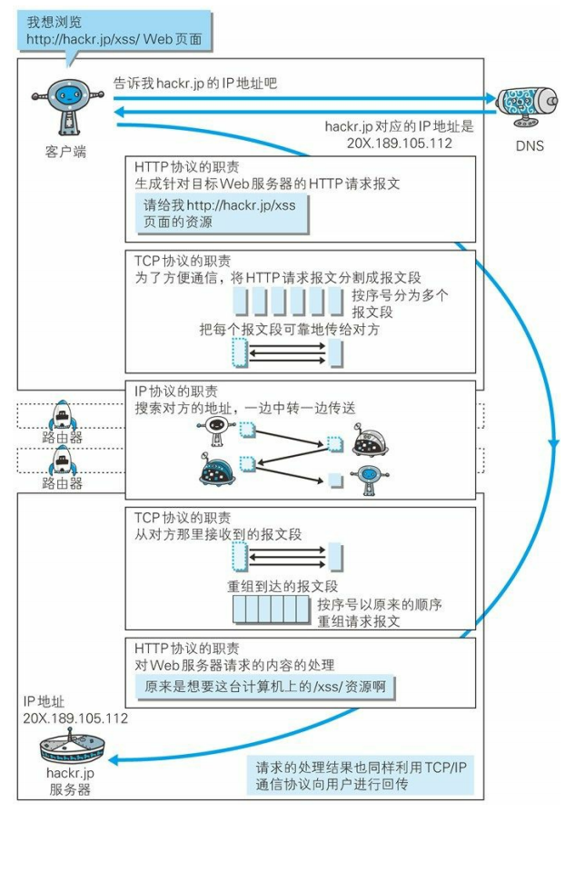

# 一、Web

[[_TOC_]]

## 1. Web

**由来**：蒂姆·伯纳斯·李提出一种能让远隔两地的研究者们共享知识的设想，最初设想的基本理念是借助多文档之间相互关联形成的超文本 (HyperText)，连成可相互参阅的万维网 WWW (Wrold Wide Web)

### (1) WWW 构建技术

**① 超文本标记语言 HTML**：HTML 作为文档

**② 统一资源定位符 URL**：指定文档所在地址

**③ 文档传递协议 HTTP**：Web 使用 HTTP  (HyperText Transfer Protocol) 协议作为规范，完成从客户端到服务端的一系列运作流程，Web 是建立在 HTTP 协议之上通信的

### (2) Web

WWW 当初是指用来浏览超文本的客户端应用程序的名称，现在则是指三项 WWW 构建技术的集合，也可简称 Web

## 2. HTTP 发展

**① HTTP 0.9**：HTTP 于 1990 年问世，HTTP 0.9 表示 HTTP 1.0 之前的版本

**② HTTP 1.0**：HTTP 于 1996 年正式作为标准发布，版本被命名为 HTTP 1.0

**③ HTTP 1.1**：HTTP 1.1 版本于 1997 年发布，是目前主流的版本

**④ HTTP 2.0**：

## 3. HTTP 通信

## 4. URI 和 URL

### (1) URI

统一资源标识符 URI (Uniform Resource Identifier)

**① Uniform**：规定统一的格式以方便处理多种不同类型的资源，无需根据上下文环境来识别资源的访问方式

**② Resource**：资源是指可标识的任何东西，除了文档文件、图像、服务等能够区别于其他类型的，全都可作为资源，资源不仅是单一的，也可以是多数的集合体

**③ Identifier**：可标识的对象，也称标识符

### (2) URL

统一资源定位符 URL (Uniform Resource Locator)

① URI 用字符串标识某一互联网资源

② URL 表示资源在互联网所处的位置

③ 可见 URL 是 URI 的子集

### (3) 绝对 URL 格式

