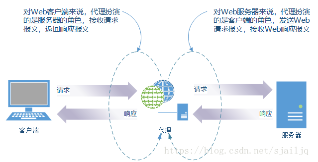

# 一、Web

[[_TOC_]]

## 1. Web

**由来**：蒂姆·伯纳斯·李提出一种能让远隔两地的研究者们共享知识的设想，最初设想的基本理念是借助多文档之间相互关联形成的超文本 (HyperText)，连成可相互参阅的万维网 WWW (Wrold Wide Web)

### (1) WWW 构建技术

**① 超文本标记语言 HTML**：HTML 作为文档

**② 统一资源定位符 URL**：指定文档所在地址

**③ 文档传递协议 HTTP**：Web 使用 HTTP  (HyperText Transfer Protocol) 协议作为规范，完成从客户端到服务端的一系列运作流程，Web 是建立在 HTTP 协议之上通信的

### (2) Web

WWW 当初是指用来浏览超文本的客户端应用程序的名称，现在则是指三项 WWW 构建技术的集合，也可简称 Web

## 2. HTTP 发展

**① HTTP 0.9**：HTTP 于 1990 年问世，HTTP 0.9 表示 HTTP 1.0 之前的版本

**② HTTP 1.0**：HTTP 于 1996 年正式作为标准发布，版本被命名为 HTTP 1.0

**③ HTTP 1.1**：HTTP 1.1 版本于 1997 年发布，是目前主流的版本

**④ HTTP 2.0**：

## 3. URI 和 URL

### (1) URI

统一资源标识符 URI (Uniform Resource Identifier)

**① Uniform**：规定统一的格式以方便处理多种不同类型的资源，无需根据上下文环境来识别资源的访问方式

**② Resource**：资源是指可标识的任何东西，除了文档文件、图像、服务等能够区别于其他类型的，全都可作为资源，资源不仅是单一的，也可以是多数的集合体

**③ Identifier**：可标识的对象，也称标识符

### (2) URL

统一资源定位符 URL (Uniform Resource Locator)

① URI 用字符串标识某一互联网资源

② URL 表示资源在互联网所处的位置

③ 可见 URL 是 URI 的子集

### (3) 绝对 URI 格式

## 4. Web 服务器

### (1) 虚拟主机

**原理**：在一台运行在互联网的物理服务器上，划分出一定的`磁盘空间`，供用户放置站点、应用组件等，提供必要的数据存放、站点功能、传输功能，对外表现为多个虚拟服务器，从而充分利用服务器硬件资源

#### ① 端口对应

借助同一个 IP 地址的不同`端口号`来管理同一台服务器上的多个服务

#### ② IP 地址对应

借助不同的 `IP 地址`来管理同一台服务器上的多个服务

#### ③ 网址名称对应

借助不同的`域名`来管理同一台服务器上的多个服务

* HTTP/1.1 协议允许一台 HTTP 服务器通过`网址名称对应的虚拟主机功能`搭建多个 Web 站点，互联网上，域名通过 DNS 服务器映射到 IP 地址之后访问服务器，可见当请求发送到服务器时已经是 IP 地址的形式了，因此当一台服务器内托管了多个域名时，收到请求就需要弄清楚是访问哪个域名，因此发送 HTTP 请求时必须在 `Host` 首部字段指定带域名的主机名的完整 URI

### (2) 通信数据转发程序

#### ① 代理

**原理**：代理是一种具有转发功能的应用程序，扮演了客户端和服务端中间人的角色，接收客户端发送的请求并转发给服务器，接收服务器返回的响应并转发给客户端

* HTTP 通信过程中，可级联多台代理服务器，请求和响应的转发会经过数台类似锁链一样连接起来的代理服务器，转发时需要附加 `Via` 首部字段以标记经过的服务器信息

* **缓存代理**：缓存代理转发响应时，会预先将资源的副本保存在代理服务器上，当再次收到对相同资源的请求时，就可以不从源服务器获取资源，而是将之前缓存的资源作为响应返回，利用缓存代理可以减少网络带宽

* **访问控制**：通过设置代理服务器可做到针对特定 URI 访问的控制

#### ② 隧道

**原理**：隧道是一种在`相隔甚远`的客户端和服务器间进行中转，并保持双方通信连接的应用程序

* 隧道可以使用 SSL 等加密手段，隧道的目的是确保客户端能与服务器进行`安全`的通信

* 隧道本身不会去解析 HTTP 请求，请求会保持原样中转给源服务器，隧道会在通信双方断开连接时结束

#### ③ 网关

**原理**：网关是转发其他服务器通信数据的服务器，接收从客户端发送的请求并对请求进行一定的加工处理 (协议转换)

* **协议转换器**：网关具有协议转换的作用，能使通信线路上的服务器提供非 HTTP 协议服务

* 利用网关能够提高通信的安全性，因为可以在客户端与网关之间的通信线路上加密以确保连接的安全

### (3) 缓存

**原理**：缓存是指缓存代理服务器或客户端本地磁盘内保存的资源副本，利用缓存可减少对源服务器的访问，节省通信流量和通信时间

#### ① 缓存代理

缓存代理服务器转发响应时，会预先将资源的副本保存在缓存代理服务器上，当再次收到对相同资源的请求时，就可以不从源服务器获取资源，而是将之前缓存的资源作为响应返回

#### ② 客户端缓存

客户端收到响应后，将资源的副本保存在客户端本地磁盘，客户端缓存也被称为`临时网络文件`，客户端缓存如果有效，就无需向服务器请求相同的资源，可以直接从本地磁盘读取

#### ③ 缓存过期

即使存在缓存，也会因为客户端的要求、缓存的有效期等因素，向源服务器确认缓存资源的有效性，若判断缓存失效，需要再次向源服务器请求更新后的资源，无论是缓存代理还是客户端缓存，都存在过期的可能

#### ④ 缓存行为控制

HTTP 报文的通用首部字段 `Cache-Control` 用于控制缓存行为，Cache-Control 字段值分为缓存请求指令和缓存响应指令

* **public**：服务器的 public 指令代表响应的缓存可以提供给任何用户

* **private**：服务器的 private 指令代表响应的缓存只能提供给特定用户
  

* **no-cache**：客户端的 no-cache 指令代表客户端不接受缓存的资源，只接收从源服务器返回的资源，服务器的 no-cache 指令代表源服务器允许缓存代理服务器缓存资源，但是每次使用缓存前必须向源服务器确认有效性
  

* **no-store**：客户端的 no-store 指令代表客户端不允许缓存请求，服务器的 no-store 指令代表源服务器不允许缓存响应

* **max-age**：客户端的 max-age 指令代表缓存资源的缓存时间如果小于指定数值，客户端就可以接受缓存资源，服务器的 max-age 指令代表资源保存为缓存的最长时间，缓存代理服务器在这段时间内将不再对缓存的有效性进行确认 (对于 HTTP/1.1 的缓存代理服务器而言，Cache-Control 字段的 max-age 指令优先级高于 Expires 字段)
  

* **s-maxage**：服务器的 s-maxage 指令代表资源保存为缓存的最长时间，缓存代理服务器将不再对缓存的有效性进行确认，但是 s-maxage 指令只适用于`供多用户使用的公共缓存代理服务器`，也就是说 s-maxage 指令对于向同一用户重复返回响应的缓存代理服务器来说没有任何作用 (对于 HTTP/1.1 的缓存代理服务器而言，Cache-Control 字段的 s-maxage 指令优先级高于 max-age 指令和 Expires 字段)

* **max-stale**：客户端的 max-stale 指令代表缓存即使过期，只要仍小于指定时间，依然会被客户端接收

* **min-fresh**：客户端的 min-fresh 指令代表客户端要求缓存代理服务器返回未过指定时间的缓存资源

* **only-if-cached**：客户端的 only-if-cached 指令代表客户端要求缓存代理服务器返回缓存资源，无需向源服务器确认缓存有效性，也无需向源服务器重新请求资源，若缓存代理服务器没有缓存，则返回状态码 `504 Gateway Timeout`

* **must-revalidate**：服务器的 must-revalidate 指令要求缓存代理服务器在向客户端返回缓存之前，必须再次向源服务器验证缓存是否有效，若无法连通源服务器，则返回状态码 `504 Gateway Timeout`

* **proxy-revalidate**：服务器的 proxy-revalidate 指令同 must-revalidate 指令功能相同

* **no-transform**：客户端和服务器的 no-transform 指令规定无论在请求还是响应中，缓存都不能改变实体的媒体类型，可以防止缓存代理压缩图片等操作

* **cache-extension**：客户端和服务器的 cache-extension 指令用于扩展 Cache-Control 首部字段的功能

#### ⑤ 缓存相关警告

HTTP 报文的通用首部字段 Warning 用于告知用户与缓存相关的警告

