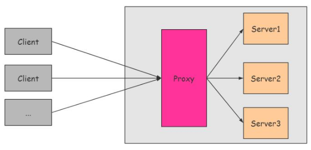
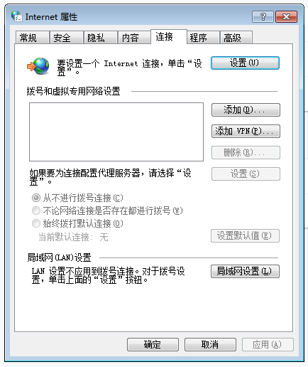
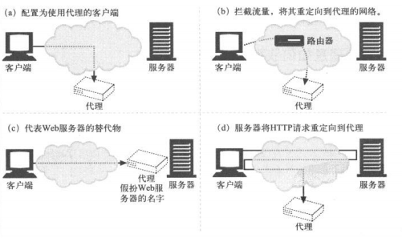
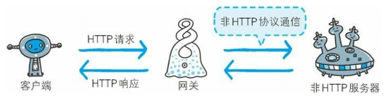

# 一、Web

[[_TOC_]]

## 1. Web

**由来**：蒂姆·伯纳斯·李提出一种能让远隔两地的研究者们共享知识的设想，最初设想的基本理念是借助多文档之间相互关联形成的超文本 (HyperText)，连成可相互参阅的万维网 WWW (Wrold Wide Web)

WWW 当初是指用来浏览超文本的客户端应用程序的名称，现在则是指三项 WWW 构建技术的集合，也可简称 Web

### (1) WWW 构建技术

**① 超文本标记语言 HTML**：HTML 作为文档

**② 统一资源定位符 URL**：指定文档所在地址

**③ 文档传递协议 HTTP**：Web 使用 HTTP  (HyperText Transfer Protocol) 协议作为规范，完成从客户端到服务器的一系列运作流程，Web 是建立在 HTTP 协议之上通信的

### (2) HTTP 发展

**① HTTP 0.9**：HTTP 于 1990 年问世，HTTP 0.9 表示 HTTP 1.0 之前的版本

**② HTTP 1.0**：HTTP 于 1996 年正式作为标准发布，版本被命名为 HTTP 1.0

**③ HTTP 1.1**：HTTP 1.1 版本于 1997 年发布，是目前主流的版本

**④ HTTP 2.0**：HTTP 2.0 版本于 2014 年标准化

### (3) URI 和 URL

#### ① 统一资源标识符 URI (Uniform Resource Identifier)

* **Uniform**：规定统一的格式以方便处理多种不同类型的资源，无需根据上下文环境来识别资源的访问方式
* **Resource**：资源是指可标识的任何东西，除了文档文件、图像、服务等能够区别于其他类型的，全都可作为资源，资源不仅是单一的，也可以是多数的集合体
* **Identifier**：可标识的对象，也称标识符

#### ② 统一资源定位符 URL (Uniform Resource Locator)

* URI 用字符串标识某一互联网资源
* URL 表示资源在互联网所处的位置
* 可见 URL 是 URI 的子集

#### ③ 互联网资源地址类型

* **绝对 URI**：资源的完整地址，格式如下
  
* **绝对 URL**：等于绝对 URI
* **相对 URL**：从浏览器基本 URI 处指定的 URL

## 2. 虚拟主机

在一台运行在互联网的物理服务器上，划分出一定的`磁盘空间`，供用户放置站点、应用组件等，提供必要的数据存放、站点功能、传输功能，对外表现为多个虚拟服务器，从而充分利用服务器硬件资源

### (1) 网址名称对应

借助不同的`域名`来管理同一台服务器上的多个应用程序服务

HTTP/1.1 协议允许一台 Web 服务器通过`网址名称对应的虚拟主机功能`搭建多个 Web 站点，互联网上，域名通过 DNS 服务器映射到 IP 地址之后访问 Web 服务器，可见当请求发送到 Web 服务器时已经是 IP 地址的形式了，因此当一台 Web 服务器内托管了多个域名时，收到请求就必须弄清楚是访问哪个域名，因此发送 HTTP 请求时必须在 `Host` 首部字段指定带域名的主机名的完整 URI，请求首部字段 Host 是 HTTP/1.1 协议规定的唯一必须包含在请求内的字段

### (2) IP 地址对应

借助不同的 `IP 地址`来管理同一台服务器上的多个应用程序服务

### (3) 端口对应

借助同一个 IP 地址的不同`端口号`来管理同一台服务器上的多个应用程序服务

## 3. 代理

### (1) 代理

#### ① 代理的定义

代理是一种具有转发功能的`应用程序`，扮演了客户端和服务器中间人的角色，接收客户端发送的请求并转发给服务器，接收服务器返回的响应并转发给客户端

#### ② 代理服务器

代理服务器是部署了`代理应用程序`的服务器

HTTP 通信过程中，可级联多台代理服务器，请求和响应的转发会经过数台类似锁链一样连接起来的代理服务器，转发时需要附加 `Via` 首部字段以标记经过的代理服务器信息

#### ③ 缓存资源

代理转发响应时，会预先将资源的副本保存在代理服务器上，当再次收到对相同资源的请求时，就可以不从源服务器获取资源，而是将之前缓存的资源作为响应返回，利用代理服务器缓存资源可以减少网络带宽

### (2) 代理的分类

#### ① 正向代理

正向代理代理`客户端`，服务器不知道实际发起请求的客户端

* A 想借钱，A 知道 C 有很多钱，想向 C 借钱
* A 和 C 有矛盾，于是 A 想通过 B 向 C 借钱
* B 向 C 借到钱再给 A，C 不知道 A 的存在
* 这样 A 就通过 B 向 C 借到了钱

#### ② 反向代理

反向代理代理`服务器`，客户端不知道实际提供服务的服务器

* A 想借钱，A 不知道 C 有很多钱
* A 向 B 借钱
* B 没有钱，B 知道 C 有很多钱
* B 向 C 借钱再给 A
* A 以为钱是 B 的，A 不知道 C 的存在
* 这样 B 就用 C 的钱借给了 A

### (3) 代理如何获取客户端请求

客户端通常直接与 Web 服务器通信，如何才能使客户端 HTTP 请求首先流向代理？

#### ① 修改客户端

很多客户端浏览器都支持手动或自动的代理配置，将客户端浏览器配置为使用代理服务器，客户端浏览器就会直接将 HTTP 请求发送给代理服务器，而非源服务器

Chrome 浏览器 — 设置 — 高级 — 系统 — 打开您计算机的代理设置

#### ② 修改网络

网络基础设施 ( 如路由器 ) 可以通过若干技术手段，在客户端不知情或未参与的情况下，拦截客户端 HTTP 请求并将其导向代理

#### ③ 修改 DNS 命名空间

代理直接假扮源服务器的主机名和 IP 地址

#### ④ 修改 Web 服务器

源服务器上配置向客户端发送 HTTP 重定向响应，将客户端请求重定向到代理

### (4) 代理转发报文首部字段

#### ① 逐跳首部字段

HTTP 报文首部字段因`代理是否可以转发给源服务器`，分为逐跳首部字段 ( Hop-by-hop Header ) 和端到端首部字段 ( End-to-end Header ) 两类

逐跳首部字段只对`单次转发`有效，不会通过代理再次转发

* **TE (请求)**：客户端支持的分块传输编码方式及优先级
* **Transfer-Encoding (通用)**：指定报文主体的分块传输编码方式
* **Trailer (通用)**：报文末端的首部一览
* **Upgrade (通用)**：检测 HTTP 协议是否可升级为指定的其他协议
* **Connection (通用)**：控制逐跳首部字段、管理持久连接
* **Proxy-Authorization (请求)**：客户端告知代理服务器其要求的认证信息
* **Proxy-Authenticate (响应)**：代理服务器对客户端的认证信息

#### ② 控制逐跳首部字段

HTTP 请求报文和 HTTP 响应报文通过通用首部字段 Connection 来指明代理无需转发给源服务器的逐跳首部字段

### (5) 代理认证

#### ① 请求首部字段 Proxy-Authorization

客户端的 Proxy-Authorization 字段用于客户端与代理服务器之间的认证，客户端收到代理服务器发来的认证质询时，通过 Proxy-Authorization 字段告知代理服务器认证信息

#### ② 响应首部字段 Proxy-Authenticate

服务器的 Proxy-Authenticate 字段用于客户端与代理服务器之间的认证，将代理服务器要求的认证信息发送给客户端

## 4. 网关

### (1) 网关

**网关**：网关是一种具有 Web 通信数据转发和`协议转换`功能的`应用程序`

**网关服务器**：网关服务器是部署了`网关应用程序`的服务器

### (2) 网关的分类

`Web 网关`在一侧使用 `HTTP 协议`，另一侧使用其他协议

#### ① 客户端网关

客户端网关使用其他协议与客户端通信，使用 HTTP 协议与服务器通信

例如前后端分离项目，前端项目使用 HTTPS，后端项目使用 HTTP，那么前后端之间就可以部署一个`客户端网关`

#### ② 服务器网关

服务器网关使用 HTTP 协议与客户端通信，使用其他协议与服务器通信

### (3) 网关如何获取客户端流量

客户端通常直接与 Web 服务器通信，如何才能使客户端 HTTP 请求首先流向网关？网关获取客户端流量的方式和代理获取客户端流量的方式是一样的

## 5. 隧道

### (1) 隧道

隧道是一种确保客户端和服务器进行安全通信的应用程序，隧道本身不会解析 HTTP 请求和 HTTP 响应，而是保持原样转发给客户端和服务器，隧道会在通信双方断开连接时结束

### (2) CONNECT 建立 HTTP 隧道

CONNECT 方法主要用于与代理服务器通信时建立 Web 隧道，实现通过隧道进行 TCP 通信，主要使用 SSL、TLS 协议将通信内容加密后经隧道传输
  

CONNECT 方法的请求·响应如下
  

### (3) SSL 隧道

#### ① HTTPS 客户端网关

#### ② SSL 隧道

#### ③ HTTPS 客户端网关和 SSL 隧道的对比

HTTPS 客户端网关需要支持完整的 SSL 实现

隧道中 SSL 会话建立在客户端和服务器之间，无需在代理中实现 SSL，代理服务器只是将加密数据经过隧道传输，并不会在安全事务中扮演其他角色

## 6. 缓存

缓存是指`代理服务器`或`客户端本地磁盘`内保存的资源副本，利用缓存可减少对源服务器的访问，节省通信流量和通信时间

### (1) 代理服务器缓存

代理服务器转发响应时，会预先将资源的副本保存在代理服务器上，当再次收到对相同资源的请求时，就可以不从源服务器获取资源，而是将之前缓存的资源作为响应返回

### (2) 客户端缓存

客户端收到响应后，将资源的副本保存在客户端本地磁盘，客户端缓存也被称为`临时网络文件`，客户端缓存如果有效，就无需向服务器请求相同的资源，可以直接从本地磁盘读取

### (3) 缓存过期

即使存在缓存，也会因为客户端的要求、缓存的有效期等因素，向源服务器确认缓存资源的有效性，若判断缓存失效，需要再次向源服务器请求更新后的资源，无论是缓存代理还是客户端缓存，都存在过期的可能

### (4) 缓存行为控制

HTTP 报文的通用首部字段 `Cache-Control` 用于控制缓存行为，Cache-Control 字段值分为缓存请求指令和缓存响应指令，多个指令之间通过逗号 `,` 分割

* **public**：服务器的 public 指令代表响应的缓存可以提供给任何用户

* **private**：服务器的 private 指令代表响应的缓存只能提供给特定用户
  

* **no-cache**：客户端的 no-cache 指令代表客户端不接受缓存的资源，只接收从源服务器返回的资源，服务器的 no-cache 指令代表源服务器允许代理服务器缓存资源，但是每次使用缓存前必须向源服务器确认有效性
  

* **no-store**：客户端的 no-store 指令代表客户端不允许缓存请求，服务器的 no-store 指令代表源服务器不允许缓存响应

* **max-age**：客户端的 max-age 指令代表缓存资源的缓存时间如果小于指定数值，客户端就可以接受缓存资源，服务器的 max-age 指令代表资源保存为缓存的最长时间，代理服务器在这段时间内将不再对缓存的有效性进行确认 (对于 HTTP/1.1 的缓存代理服务器而言，Cache-Control 字段的 max-age 指令优先级高于 Expires 字段)
  

* **s-maxage**：服务器的 s-maxage 指令代表资源保存为缓存的最长时间，代理服务器将不再对缓存的有效性进行确认，但是 s-maxage 指令只适用于`供多用户使用的公共代理服务器`，也就是说 s-maxage 指令对于向同一用户重复返回响应的代理服务器来说没有任何作用 (对于 HTTP/1.1 的代理服务器而言，Cache-Control 字段的 s-maxage 指令优先级高于 max-age 指令和 Expires 字段)

* **max-stale**：客户端的 max-stale 指令代表缓存即使过期，只要仍小于指定时间，依然会被客户端接收

* **min-fresh**：客户端的 min-fresh 指令代表客户端要求代理服务器返回未过指定时间的缓存资源

* **only-if-cached**：客户端的 only-if-cached 指令代表客户端要求代理服务器返回缓存资源，无需向源服务器确认缓存有效性，也无需向源服务器重新请求资源，若代理服务器没有缓存，则返回状态码 `504 Gateway Timeout`

* **must-revalidate**：服务器的 must-revalidate 指令要求代理服务器在向客户端返回缓存之前，必须再次向源服务器验证缓存是否有效，若无法连通源服务器，则返回状态码 `504 Gateway Timeout`

* **proxy-revalidate**：服务器的 proxy-revalidate 指令同 must-revalidate 指令功能相同

* **no-transform**：客户端和服务器的 no-transform 指令规定无论在请求还是响应中，缓存都不能改变实体的媒体类型，可以防止缓存代理压缩图片等操作

* **cache-extension**：客户端和服务器的 cache-extension 指令用于扩展 Cache-Control 首部字段的功能

### (5) 缓存相关警告

HTTP 报文的通用首部字段 Warning 用于告知用户与缓存相关的警告

