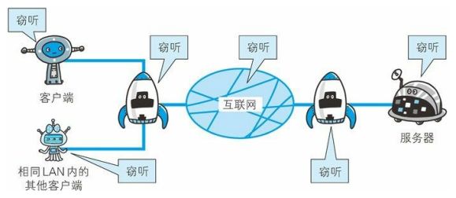
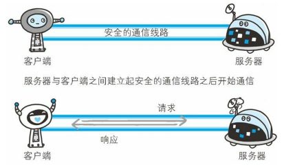
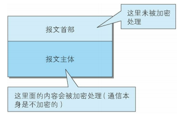
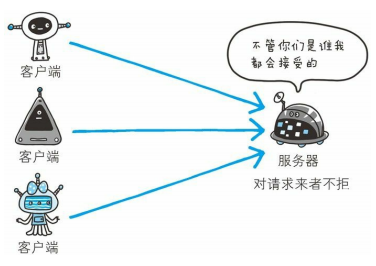
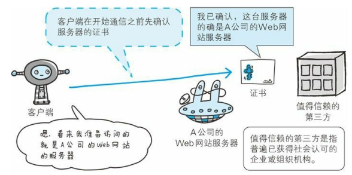

# 七、HTTPS

[[_TOC_]]

## 1. HTTP 的缺点

### (1) 通信使用明文

#### ① 互联网上的任何角落都存在通信窃听的风险

* 互联网是由能连接到全世界的网络组成的，无论世界上哪个角落的服务器在和客户端通信时，通信线路上的某些网络设备、光缆、计算机等都不可能是个人的私有物，所以不排除某个通信环节遭到恶意窥视的可能
* 即使是经过加密处理的报文，可能无法破解报文信息的含义，但是加密处理后的报文本身还是会被窥视到的
* 窃听同一数据链路上的通信并不是难事，只需要收集互联网上流动的`数据帧`，对于收集来的数据帧的解析工作，可以交给那些`抓包工具`或者嗅探器工具
  

#### ② 加密技术

HTTP 协议本身不具备加密的功能，无法对请求和响应内容进行加密，即 HTTP 报文使用明文方式传输

* **通信的加密**：HTTP 协议没有加密机制，但是可以使用 `SSL/TLS` 来加密 HTTP 的通信内容，与 SSL/TLS 组合使用的 HTTP 就被称为 HTTPS

  

* **内容的加密**：将 HTTP 报文主体加密之后再发送，因此为了做到有效的内容加密，要求客户端和服务器必须同时具备加密和解密机制

  

### (2) 不验证通信双方的身份

#### ① 任何人都可以发起请求

HTTP 协议中请求和响应不会对通信方进行确认，因此任何人都可以发起请求，服务器只要接收到请求无论对方是谁都会返回一个响应 (仅限于客户端的 IP 地址和端口号未被代理服务器设置访问限制)

* 无法确定请求发送至的服务器，是否是请求 URI 真正指定的服务器，有可能是已伪装的服务器
* 无法确定响应返回到的客户端，是否是实际发送请求的客户端，有可能是已伪装的客户端
* 即使是无意义的请求，服务器也会照单全收，无法阻止海量请求下的拒绝服务攻击 DoS (Denial of Service)

#### ② SSL 证书

* SSL 不仅提供加密处理，还使用了一种被称为证书的手段，可用于确认通信方

* 证书是由`值得信任的第三方机构`颁发的，用以证明客户端和服务器的真实身份，由于伪造证书是一件非常困难的事情，因此只要能够确定通信方的证书，就可以确认通信方的身份

### (3) 无法证明明文的完整性

#### ① 接收到的信息可能有误

完整性是指信息的准确度，无法证明信息的完整性也就意味着无法判断信息是否准确

#### ② 防止篡改

## 2. HTTPS 的诞生

①②③④⑤⑥⑦⑧⑨⑩⑪⑫⑬⑭⑮⑯
