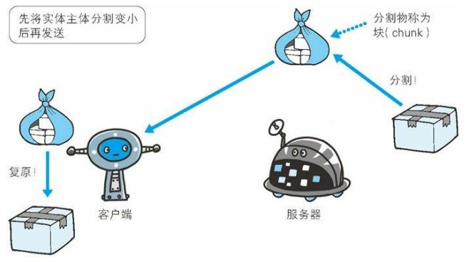
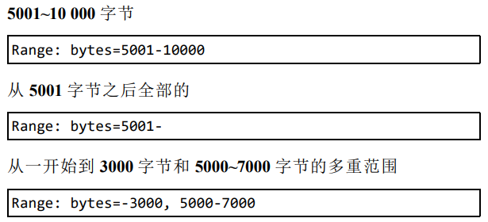
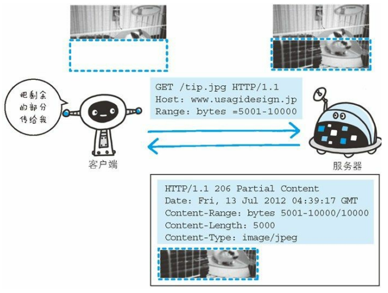

# 三、HTTP 报文

[[_TOC_]]

## 1. HTTP 报文

① HTTP 报文就是用于 HTTP 协议交互的信息，HTTP 报文本身是由`多行数据构成的字符串文本`

② HTTP 报文大致分为报文首部和报文主体两部分，两者通过`空行`区分，通常报文主体不是必须的

③ HTTP 报文首部字段起到 HTTP 协议通信过程中传递额外重要信息的作用，例如报文主体大小、使用的语言、认证信息等内容，HTTP 报文首部字段由字段名和字段值构成，中间用冒号 `:` 分割

**HTTP 请求报文**

**HTTP 响应报文**

## 2. HTTP 报文编码

HTTP 协议传输数据时可以直接按照数据原貌传输，也可以在传输过程中通过编码提升速率，通过传输时编码能有效地处理大量的访问请求，但是编码需要计算机来完成，因此会消耗更多的 CPU 等资源

### (1) 报文和实体

**① 报文**：报文就是指的 HTTP 报文

**② 实体**：实体是由 HTTP 报文的实体首部字段和报文主体组成，实体作为 HTTP 请求或响应的有效载荷数据被传输

**③ 实体主体**：通常实体主体等于报文主体，只有在传输过程在进行编码时，实体主体会发生变化，与报文主体产生差异

### (2) MIME 类型

HTTP 报文的媒体类型也就是 MIME 类型，常见的媒体类型如下

* **image/gif**：gif 图片格式
* **image/jpeg**：jpg 图片格式
* **image/png**：png 图片格式
* **text/plain**：纯文本格式
* **application/json**：JSON 数据格式
* **application/pdf**：pdf 格式
* **application/octet-stream**：二进制流数据
* **application/x-www-form-urlencoded**：form 表单数据被编码为 key/value 格式
* **multipart/form-data**：HTTP 请求时发送多种类型的实体，例如上传表单或文件
* **multipart/byteranges**：HTTP 响应时返回多个范围的实体

### (3) 内容编码

**由来**：HTTP 通信中，请求的实体资源过大时，传输时间会很长，为了缩短用户的等待时间，可以将实体资源进行编码来压缩容量

**原理**：HTTP 协议有一种被称为内容编码的功能，内容编码指明应用在实体上的编码格式，服务器保持实体信息原样压缩，客户端接收内容编码后的实体并解码

常用的内容编码如下：

① gzip (GNU zip)

② compress (UNIX 系统的标准压缩)

③ deflate (zlib)

④ identity (不进行编码)

### (4) 分块传输编码

**由来**：HTTP 通信中，请求的编码实体资源尚未全部传输完成之前，浏览器无法显示页面，因此在传输大容量数据时，通过把数据分割成多块，可以让浏览器逐步显示页面

**原理**：HTTP 协议中有一种被称为传输编码的功能，只定义作用于分块传输编码中，服务器通过分块传输编码将实体主体分成多个块，每一块用十六进行标记大小，最后一块用 0 来标记，客户端逐一收到每个分块后，负责解码，恢复到编码前的实体主体

## 3. HTTP 多部分对象集合

**由来**：随着 HTTP 协议的发展，产生了 HTTP 报文主体内可能含有多种类型的实体的需求

### (1) HTTP 请求时发送多种类型的实体

针对 HTTP 请求时发送多种类型的实体，例如上传表单或文件，通过 HTTP 请求报文的 `Content-type` 字段指明 `multipart/form-data`，就可以向服务器发送多种类型的实体

### (2) HTTP 响应时返回多个范围的实体

针对 HTTP 响应时返回多个范围的实体，通过 HTTP 响应报文的 `Content-type` 字段指明 `multipart/byteranges`，就可以向客户端返回状态码为 `206 Partial Content` 的响应报文，包含多个范围的内容

## 4. HTTP 范围请求

**由来**：以前 HTTP 请求下载图片或文件时，遇到网络中断的情况，就必须重头开始，为了解决这个问题，需要一种能从之前下载中断处恢复下载的机制，因此，范围请求由此诞生

**原理**：范围请求就是指定下载的实体范围，通过 HTTP 请求报文的 `Range` 字段指定资源的字节范围，服务器返回状态码为 `206 Partial Content` 的响应报文，针对多重范围的范围请求，服务器会通过 `Content-type` 字段标明 `multipart/byteranges` 后返回响应报文，如果服务器无法响应范围请求，会返回状态码为 `200 OK` 的包含完整内容的响应报文

## 5. HTTP 内容协商

**由来**：不同国家的语言不同，那么浏览器的默认语言不同，用户访问同一个 Web 网站时，需要根据浏览器的默认语言，返回内容相同但语言不同的页面，这样的机制就是内容协商

**原理**：内容协商机制就是客户端和服务器就响应的资源进行交涉，以响应资源的媒体类型、字符集、内容编码、自然语言等作为判断基准，然后提供给客户端最为合适的资源，HTTP 请求报文中可作为判断的基准字段

* Accept：客户端用户代理支持的媒体类型及优先级
* Accept-Charset：客户端用户代理支持的字符集及优先级
* Accept-Encoding：客户端用户代理支持的内容编码及优先级
* Accept-language：客户端用户代理支持的自然语言及优先级
  

### (1) 服务器驱动协商

由服务器进行内容协商，以 HTTP 请求的首部字段为参考，在服务器自动处理，并不一定能筛选出最优内容

### (2) 客户端驱动协商

由客户端进行内容协商，用户从浏览器显示的可选列表中手动选择，还可以利用 JS 脚本在 Web 上自动选择，比如按照 OS 类型或浏览器类型，自行切换成 PC 版页面或手机版页面

### (3) 透明协商

服务器驱动和客户端驱动的结合体
