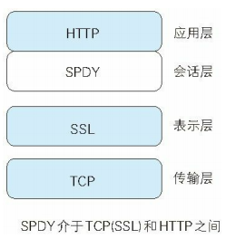
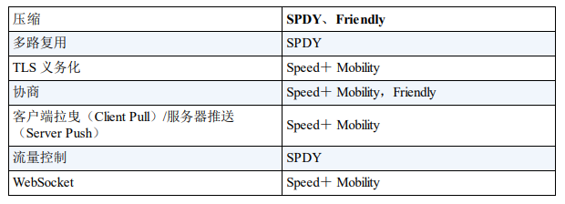

# 九、HTTP/1.1 的瓶颈

[[_TOC_]]

## 1. HTTP/1.1 的瓶颈

### (1) 发送冗长的首部

客户端和服务器每次互相发送相同的报文首部，造成的浪费较多

### (2) 首部不经过压缩

报文首部未经压缩就发送，信息越多延迟越大

### (3) 可选择任意数据压缩格式

非强制压缩发送

### (4) 一条 TCP 连接上只能发送一个 HTTP 请求

HTTP/1.1 协议中使用`持久连接`解决了这个问题

### (5) 请求只能由客户端发起

服务器在没有接收到请求的情况下无法主动返回响应，因此为了探知服务器上是否有内容更新，就必须频繁地从客户端到服务器进行确认，如果服务器上没有内容更新，就会产生徒劳的通信

## 2. SPDY

① SPDY 协议正是为了在协议级别消除 HTTP 协议存在的瓶颈而诞生的

② SPDY 协议并没有改写 HTTP 协议，而是在 TCP/IP 的应用层与传输层之间新增会话层的形式运作的，同时考虑到安全性问题，SPDY 协议规定在通信中使用 SSL 协议

### (1) 压缩首部

压缩 HTTP 报文首部，降低通信负载

### (2) 多路复用流

类似 HTTP/1.1 的持久连接功能，通过单一的 TCP 连接，无限制地处理多个 HTTP 请求

### (3) 请求优先级

SPDY 协议可以给请求逐个分配优先级，解决在发送多个请求时因带宽低而导致响应变慢的问题

### (4) 服务器提示功能

服务器可以主动提示客户端请求所需要的资源，在客户端发现资源之前，客户端就可以获知资源的存在，可以避免发送不必要的请求

### (5) 服务器推送功能

服务器有内容更新时，主动向客户端推送数据，而无需等待客户端的请求

## 3. WebSocket

① WebSocket 是 Web 浏览器和 Web 服务器之间的`双全工通信标准`

② WebSocket 协议建立在 HTTP 协议的基础上，因此连接的发起方仍然是客户端，一旦客户端和服务器建立起 WebSocket 协议的通信连接，无论是客户端还是服务器，任何一方都可以直接向对方发送报文

### (1) 减少通信量

类似 HTTP/1.1 的持久连接功能，只要建立起 WebSocket 连接，就一直保持连接状态，减少通信量

### (2) 服务器推送功能

服务器有内容更新时，主动向客户端推送数据，而无需等待客户端的请求

## 4. HTTP/2.0

①②③④⑤⑥⑦⑧⑨⑩⑪⑫⑬⑭⑮⑯
