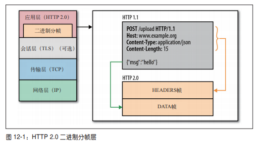

# 九、HTTP2

[[_TOC_]]

## 1. HTTP2

### (1) HTTP2 的诞生

**由来**：为了解决 HTTP1.1 的性能瓶颈，诞生了 HTTP2

### (2) HTTP2 的特点

① 流、消息、帧

② 二进制分帧层

③ 首部压缩

④ 多向请求与响应

⑤ 每个来源一个连接

⑥ 请求优先级

⑦ 流量控制

⑧ 服务器推送

## 2. 流、消息、帧

所有 HTTP2 通信都在`一个 TCP 连接`上完成，这个 TCP 连接可以承载`任意数量的双向数据流`，每个数据流都以`一个消息`的方式发送，消息由`一或多个帧`组成

### (1) 流

已建立的 TCP 连接上的双向数据流

### (2) 消息

完整的一系列数据帧

### (3) 帧

HTTP2 通信的最小单位

#### ① 帧首部

一个消息中的所有帧`共享一个 8 字节的帧首部`

* **长度**：16 位的长度字段意味着一帧大约可以携带 `64 KB` 的数据
* **类型**：8 位的类型字段定义帧的类型
  
  HTTP2 规定了如下的帧类型
  
  * **Data**：用于传输 HTTP 消息体
  * **HEADERS**：用于传输关于流的额外首部字段
  * **PUSH_PROMISE**：用于发出创建流和服务器引用资源的要约
  * **PRIORITY**：用于指定或重新指定引用资源的优先级
  * **RST_STREAM**：用于通知流的非正常终止
  * **SETTINGS**：用于通知两端通信方式的配置数据
  * **PING**：用于计算往返时间，执行活性检查
  * **GOAWAY**：用于通知对端停止在当前连接中创建流
  * **WINDOW_UPDATE**：用于针对个别流或个别连接实现流量控制
  * **CONTINUATION**：用于继续一系列首部块片段

* **标志**：8 位的标志字段允许不同的帧类型定义特定于帧的消息标志
* **流标识符**：31 位的流标识符字段唯一标识 HTTP2 的`流`
  
  <!-- 消息中的多个帧可以`乱序`发送，然后再根据每个帧首部的`流标识符`重新组装 -->

## 3. 二进制分帧层

### (1) HTTP1.1 报文

② HTTP1.1 报文分为报文首部和报文主体两部分，两者通过`空行`区分

③ HTTP1.1 报文首部由请求行和首部字段组成，首部字段起到通信过程中传递额外信息的作用，首部字段由字段名和字段值构成，中间用冒号 `:` 分割

### (2) HTTP2 报文

HTTP2 性能增强的核心全在于二进制分帧层，其定义了如何封装 HTTP 消息并在客户端和服务器之间传输

## 4. 首部压缩

HTTP1.1 中报文首部是通过纯文本形式发送的，通常会给每个请求增加 500 - 800 字节的负荷，如果算上 Cookie，增加的负荷将会达到上千字节

HTTP2 在客户端和服务器之间使用`首部表`来跟踪和存储之前发送的首部字段键值对，对于相同的键值对，不再通过每次请求和响应发送

首部表在 `TCP 连接存续期内`始终存在，由客户端和服务器共同渐进地更新，每个新的首部字段键值对要么被追加到当前首部表的末尾，要么替换首部表中之前的值

如下图所示，第二个请求只需发送变化的首部字段键值对，其他首部字段键值对没有变化则无需发送，这样就可以避免传输冗余的首部，从而减少每个请求的开销

## 5. 多向请求与响应

① HTTP1.1 中客户端如果想发送多个并行请求以改进性能，则必须使用多个 TCP 连接，每个连接只交付一个 HTTP 响应

② HTTP2 采用二进制分帧层突破了这个限制，实现了并行请求和响应，客户端和服务器可以将 HTTP 消息分解成互不依赖的多个帧，然后乱序发送，最后在另一端重新组合

如下图所示，一个 TCP 连接上有 3 个请求与响应并行交换，客户端向服务器发送 stream5 的一个 DATA 帧，服务器向客户端乱序返回 stream1 和 stream3 的一系列帧

#### 多向请求与响应带来的性能提升

* 可以并行交错的发送请求，请求之间互不影响
* 可以并行交错的返回响应，响应之间互不影响
* 一个 TCP 连接上可以并行发送多个请求和响应
* 消除不必要的延迟，从而减少页面加载的时间

## 6. 每个来源一个连接

HTTP2 有了二进制分帧层机制，就无须使用多个 TCP 连接实现多流并行，客户端和服务器之间只需要一个 TCP 连接，并且连接都是持久化的

#### 每个来源一个连接带来的性能提升

* 显著减少了相关资源占用
* 所有数据流的优先次序始终如一
* TCP 连接减少使得网络拥堵情况得以改善
* 慢启动时间减少，拥塞和丢包恢复速度更快

## 7. 请求优先级

HTTP 消息被分解成多个独立的帧之后，就可以通过优化这些帧的交错和传输顺序，决定每个流的`交付次序`，进一步提高性能，为了做到这一点，`每个流都可以带有一个 31 比特的优先值`

* 0 代表最高优先级
* 2 的 31 次方减 1 代表最低优先级

HTTP2 没有规定优先级的具体算法，优先级的次序排队策略因浏览器和服务器的具体实现而不同

#### 请求优先级带来的性能提升

* 客户端和服务器可以根据流的优先级，优先发送最高优先级的帧，并且控制资源分配 ( CPU、内存、带宽 )
* HTTP2 中浏览器可以在发现资源时立即分派请求，指定每个流的优先级，让服务器决定最优的响应次序，加快页面的加载渲染速度

## 8. 流量控制

一个 TCP 连接上传输多个数据流，意味着共享带宽，HTTP2 的流量控制机制决定每个流的`占用资源`

#### 流量控制的流程

* HTTP2 建立 TCP 后，客户端与服务器交换 SETTINGS 帧，目的是设置双向的流量控制窗口大小

* 流量控制基于每一跳进行，而非端到端的控制
* 流量控制基于窗口更新帧进行，即接收方广播自己准备接收某个数据流的多少字节，以及对整个连接要接收多少字节
* 流量控制窗口大小通过 WINDOW_UPDATE 帧更新，这个字段指定了流 ID 和窗口大小递增值
* 流量控制有方向性，即接收方可以根据自己的情况为每个流乃至整个连接设置任意窗口大小
* 流量控制可以由接收方禁用，包括针对个别的流和针对整个连接

## 9. 服务器推送

HTTP2 新增服务器推送功能，服务器有内容更新时，主动向客户端推送数据，而无需等待客户端的请求

#### (1) 服务器推送的机制

服务器如何确定哪些资源可以推送？HTTP2 并没有就此规定某种算法，推送内容因服务器的具体实现而不同

* 客户端通过额外的 HTTP 首部向服务器明确表示希望推送的资源
* 服务器不依赖客户端而是自动学习相关资源，服务器可以解析文档推断出需要推送的资源，服务器也可以根据请求首部字段 Referer 得知引荐人，从而收集依赖数据，自动向客户端推送关键资源

#### (2) 服务器推送带来的性能提升

* 客户端可以缓存服务器推送的资源
* 客户端可以拒绝服务器推送的资源
* 服务器推送的资源可以由不同的页面共享
* 服务器可以按照优先级推送资源

## 10. HTTP1.1 升级至 HTTP2

①②③④⑤⑥⑦⑧⑨⑩
