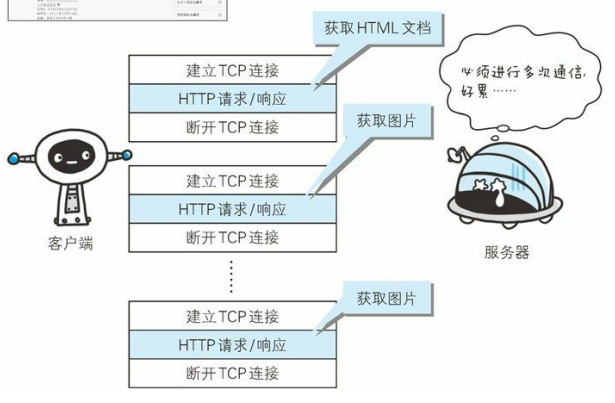
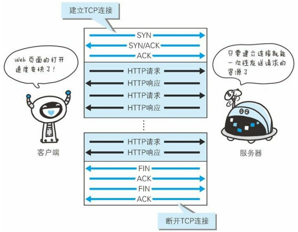
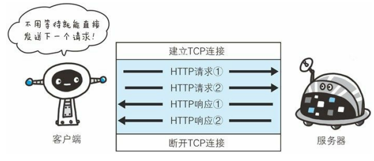

# 二、HTTP 协议

[[_TOC_]]

## 1. 无状态协议

### (1) 无状态协议

① HTTP 是无状态协议，即 HTTP 协议不具备保存之前发生过的请求或响应的功能，也就是说，HTTP 协议无法根据之前的状态进行本次的请求处理

② 这是为了让 HTTP/1.1 协议更快更简单地处理大量事务，确保协议的可伸缩性，才能被应用到各种场景里

### (2) Cookie

**由来**：HTTP 协议是无状态协议，用户登陆 Web 页面后不会记录已登陆状态，那么每次跳转新页面都需要再次登陆，或者在每次的 HTTP 请求报文中附加参数来管理登陆状态，针对这种情况，引入了 Cookie 技术，Cookie 技术通过在 HTTP 请求报文中附加 Cookie 信息来控制客户端状态

**标准化**：HTTP 报文中与 Cookie 相关的字段有 2 个，响应报文的 Set-Cookie 字段、请求报文的 Cookie 字段，这两个字段都没有计入 HTTP 协议的 RFC 标准，属于 HTTP 报文首部的其他首部字段

① 用户登陆 Web 页面时，客户端将用户 ID 和密码放入报文主体，然后将请求发送给服务器

② 服务器验证客户端发送的登陆信息进行身份认证，验证通过后发放用以识别用户的 `Session ID`，然后将用户的认证状态和 Session ID 绑定后记录在服务器，服务器返回响应时，添加其他首部字段 Set-Cookie 记录 Session ID 值

③ 客户端收到服务器返回的 Set-Cookie 字段后，从中获取 Session ID 值，将其作为 Cookie 保存在本地，下次向服务器发送请求时，浏览器会自动发送 Cookie，服务器就可以通过验证 Session ID 识别用户及其认证状态

## 2. 持久连接

### (1) 面向无连接

HTTP 协议是应用层的面向无连接协议，HTTP 协议建立在 TCP 协议之上，发送 HTTP 请求之前需要先建立 TCP 连接

### (2) 非持久连接

HTTP 协议的初始版本中，每进行一次 HTTP 通信就要建立和断开一次 TCP 连接，随着 HTTP 的普及，使用浏览器浏览一个 HTML 页面时，会发送多个请求，请求该 HTML 页面的各种资源，每次请求都会造成无畏的 TCP 连接的建立与断开，增加通信量的开销

### (3) 持久连接

**① 由来**：为解决非持久连接的问题，HTTP/1.1 版本提供了持久连接的方法，只要一端没有明确提出断开连接，则一直保持 TCP 连接状态，支持持久连接旨在建立 1 次 TCP 连接后多次 HTTP 请求和响应的交互

**② 持久连接的好处**：减少了 TCP 连接的重复建立和断开造成的额外开销，减轻了服务器的负载，另外，减少开销的那部分时间，使 HTTP 请求和响应能更早的结束，Web 页面的显示速度有所提高

**③ 管理持久连接**：HTTP 报文的通用首部字段 `Connection` 用于管理持久连接

* Connection 字段值为 `keep-alive` 表示服务器想建立持久连接
* Connection 字段值为 `close` 表示服务器想断开连接

### (3) 管线化

① 非持久连接发送请求后需要等待并收到响应，才能发送下一个请求

② 持久连接使得多数请求以管线化方式发送成为可能，管线化技术出现以后，无需等待响应亦可发送下一个请求

③ **队头堵塞**：管线化限定了客户端接收响应的顺序必须一一对应客户端发送请求的顺序，如下图所示，如果请求 1 阻塞，即使服务器已经处理完请求 2，也必须等待请求 1 处理完，然后先返回响应 1，再返回响应 2，这就是队头阻塞，第一个请求阻塞，后面的请求都需要等待

