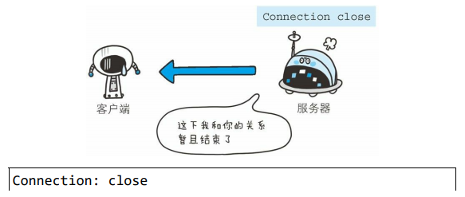

# 二、HTTP 协议

[[_TOC_]]

## 1. 客户端/服务端模型

**① 客户端**：请求访问文本或图像等资源的程序

**② 服务端**：提供资源响应的程序，服务端会被预先部署到计算机上，等待任何时候客户端可能发送的请求

## 2. 无状态协议

### (1) 无状态协议

① HTTP 是无状态协议，即 HTTP 协议不具备保存之前发生过的请求或响应的功能，也就是说，HTTP 协议无法根据之前的状态进行本次的请求处理

② 这是为了让 HTTP/1.1 协议更快更简单地处理大量事务，确保协议的可伸缩性，才能被应用到各种场景里

### (2) Cookie

**由来**：假设要求登陆认证的 Web 页面本身无法进行状态管理 (不记录已登陆的状态)，那么每次跳转新页面都需要再次登陆，或者在每次的 HTTP 请求报文中附加参数来管理登陆状态，针对这种情况，引入了 Cookie 技术，Cookie 技术通过在 HTTP 请求和响应报文中写入 Cookie 信息来控制客户端状态

**原理**：用户登陆时的请求，即第一次发送请求，没有 Cookie 状态信息，服务端会根据客户端请求在 HTTP 响应报文中添加 `Set-Cookie` 首部字段，客户端收到响应后会保存 Cookie 信息，下次再往服务端发送请求时，客户端会自动在 HTTP 请求报文中添加 `Cookie` 字段，服务端收到请求后，对比 HTTP 请求报文中的 Cookie 字段和服务端的记录，得到之前的状态信息

**注意**：与 Cookie 相关的报文首部字段有服务端的 Set-Cookie 字段和客户端的 Cookie 字段，这两个字段都没有写入 RFC 标准，属于 HTTP 报文首部的其他首部字段

#### ① Set-Cookie

服务器的 Set-Cookie 字段用于告知客户端，服务器针对当前客户端设置的 Cookie 信息

#### ② Cookie

客户端的 Cookie 字段用于告知服务器，客户端的 Cookie 信息

## 3. 持久连接

### (1) 非持久连接

HTTP 协议的初始版本中，每进行一次 HTTP 通信就要断开一次 TCP 连接，随着 HTTP 的普及，使用浏览器浏览一个 HTML 页面时，会发送多个请求，请求该 HTML 页面的各种资源，每次请求都会造成无畏的 TCP 连接的建立与断开，增加通信量的开销

### (2) 持久连接

**① 由来**：为解决非持久连接的问题，HTTP/1.1 版本提供了持久连接的方法，只要一端没有明确提出断开连接，则一直保持 TCP 连接状态，支持持久连接旨在建立 1 次 TCP 连接后多次 HTTP 请求和响应的交互

**② 持久连接的好处**：减少了 TCP 连接的重复建立和断开造成的额外开销，减轻了服务端的负载，另外，减少开销的那部分时间，使 HTTP 请求和响应能更早的结束，Web 页面的显示速度有所提高

**③ 管理持久连接**：HTTP 报文的通用首部字段 `Connection` 用于管理持久连接，当服务器明确想断开连接时，会指定响应报文的 Connection 字段值为 close

### (3) 管线化

① 非持久连接发送请求后需要等待并收到响应，才能发送下一个请求

② 持久连接使得多数请求以管线化方式发送成为可能，管线化技术出现以后，无需等待响应亦可发送下一个请求，就能够做到`并行发送多个请求`，而无需一个个等待响应

