# 四、HTTP 请求报文请求行

[[_TOC_]]

## 1. HTTP 请求报文

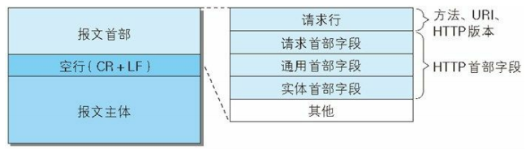

## 2. 请求方法

### (1) GET、POST

#### ① GET、POST

GET、POST 方法主要用来请求已被 URI 识别的资源，指定的资源经服务端解析后返回

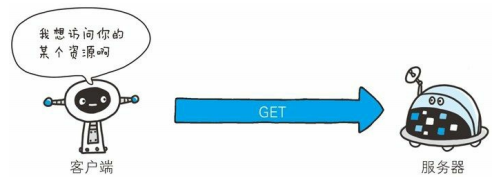

#### ② GET、POST 比较

|             | GET      | POST |
|-------------|----------|------|
|编码类型      |application/x-www-form-urlencoded|application/x-www-form-urlencoded、multipart/form-data|
|参数类型      |只允许 ASCII 字符|没有限制
|参数长度      |参数作为 URI 查询字符串拼接在URI后面，URI最大长度 2048 个字符|参数单独传输，长度没有限制|
|安全性        |参数在 URI 中对所有人可见，不安全|参数不会显示在 URI 中，并且不会被保存在浏览器历史记录中，比 GET 安全|
|缓存          |GET 能被缓存|POST 不能被缓存|
|书签          |GET 可以被收藏为浏览器书签|POST 不能被收藏为浏览器书签|
|浏览器历史记录 |GET 会被保存在浏览器历史记录中|POST 不会被保存在浏览器历史记录中|
|浏览器后退/刷新|GET 无害|POST 参数会被重新提交|

### (2) HEAD

① HEAD 方法与 GET 相同，主要用于确认 URI 的有效性以及资源更新的日期时间等，服务器只返回 HTTP 响应报文首部，不返回 HTTP 响应报文主体

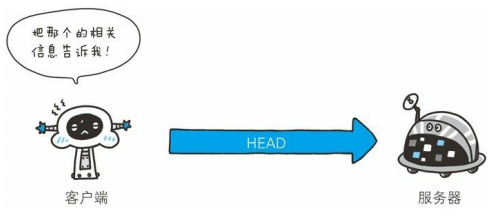

② HEAD 方法的请求·响应如下

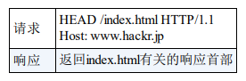

### (3) CONNECT

① CONNECT 方法主要用于与代理服务器通信时建立隧道，实现用隧道协议进行 TCP 通信，主要使用 SSL、TLS 协议将通信内容加密后经网络隧道传输

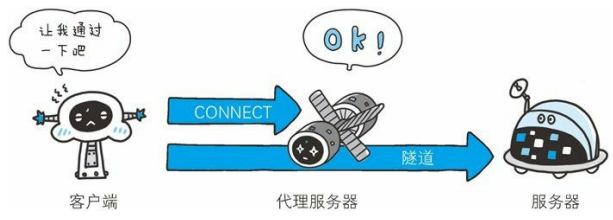

② CONNECT 方法的格式如下

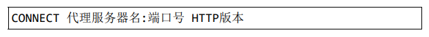

③ CONNECT 方法的请求·响应如下

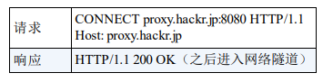

### (4) OPTIONS (不建议使用)

① OPTIONS 方法主要用来查询针对请求 URI 指定资源支持的方法，一般情况下事先会知道请求支持的方法，无需特意获取

② OPTIONS 方法请求·响应如下

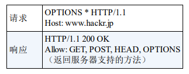

### (5) PUT (不建议使用)

① PUT 方法主要用来传输文件，请求报文主体中包含文件内容，然后将文件内容保存到请求 URI 指定的位置

② HTTP/1.1 协议的 `PUT 方法不带验证机制`，任何人都可以上传文件，存在安全性问题，因此一般的 Web 网站不使用 PUT 方法

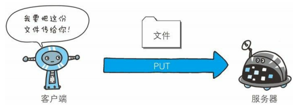

### (6) DELETE (不建议使用)

① DELETE 方法主要用来删除文件，删除请求 URI 指定的资源

② HTTP/1.1 协议的 `DELETE 方法不带验证机制`，任何人都可以删除文件，存在安全性问题，因此一般的 Web 网站不使用 DELETE 方法

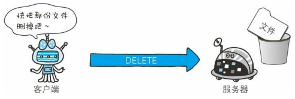

### (7) TRACE (不建议使用)

① TRACE 方法主要用来查询发出的请求是怎样被修改/篡改的，这是因此请求想要连接到目标服务器可能会通过代理中转，TRACE 方法就是用来确认连接过程中发生的一系列操作

② 发送请求时，在 `Max-Forwards` 首部字段中填入数值，每经过一个服务器数值减 1，数值为 0 时停止继续传输，最后收到请求的服务器返回状态码为 200 OK 的响应

③ TRACE 方法容易引发 `AST (Cross-Site Tracing) 攻击`，通常不会用到 TRACE 方法

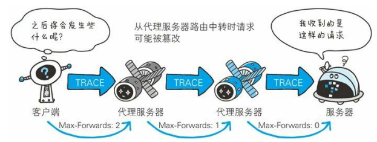

## 3. 请求 URI

① HTTP 协议使用 URI 定位互联网上的资源

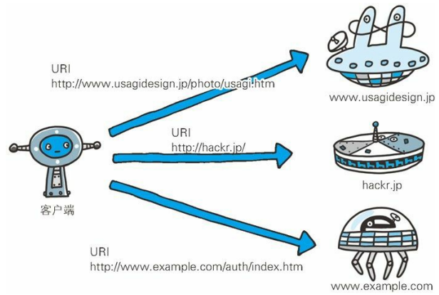

② HTTP 请求报文中指定请求 URI 的方式有 2 种

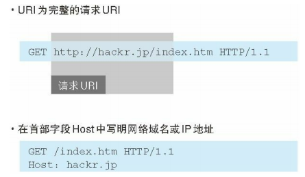
