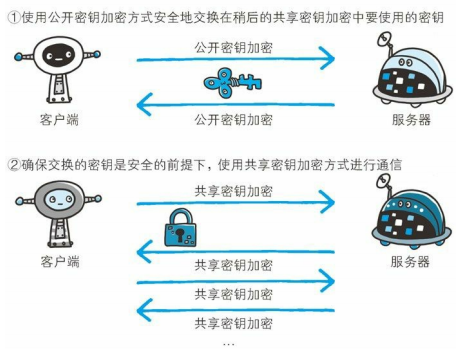
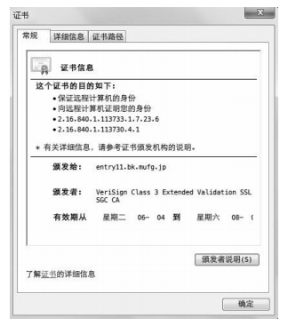

# 七、HTTPS

[[_TOC_]]

## 1. HTTPS 的诞生

### (1) HTTPS 的组成

① HTTPS (HTTP Secure) 并非一种新的应用层协议，而是 HTTP 协议的通信接口部分用 SSL 协议代替，这样 HTTP 就拥有了 SSL 的加密、证书、完整性保护等功能

② HTTPS = HTTP + 加密技术 (HTTP 通信使用明文) + 身份认证技术 (HTTP 不验证通信双方的身份) + 完整性保护 (HTTP 无法保证明文的完整性)

### (2) HTTPS 的通信

通常 HTTP 直接和 TCP 通信，而 HTTPS 则是 HTTP 先和 SSL 通信，再由 SSL 和 TCP 通信

## 2. HTTPS 的加密技术

### (1) HTTPS 的混合加密方式

HTTPS 采用`混合加密方式`，即客户端和服务器通过公开密钥加密方式发送共享密钥，然后通过共享密钥加密方式进行安全通信的方式

① 客户端生成一个共享密钥，服务器生成一对公钥私钥

② 服务器将公钥通过 Web 公开或邮件发送给客户端，客户端使用服务器的公钥将自身的共享密钥加密之后再发送，服务器收到密文后，使用自己的私钥将密文解密恢复成共享密钥

③ 客户端将要发送的数据通过自身的共享密钥加密之后再发送，服务器收到密文后，使用客户端的共享密钥将密文解密恢复成原文

### (2) HTTPS 的公钥证书

**由来**：解决加密技术中，公钥在传输过程中可能被篡改或替换的问题，公钥使用公钥证书证明自己的身份

① 数字证书认证机构是处于客户端和服务器双方都信赖的第三方机构的立场

② 首先服务器的运营人员向数字证书认证机构提出公钥申请，数字证书认证机构判明申请者的身份之后，使用自身的私钥对申请的公钥进行数字签名，然后将这个已签名的公钥放入公钥证书后绑定在一起

③ 然后服务器将这份公钥证书发送给客户端，收到证书的客户端，使用数字证书认证机构的公钥 (浏览器开发商发布版本时，事先内部植入常用认证机构的公钥) 对证书上的数字签名进行验证，一旦验证通过，就可以证明这个公钥是可以信赖的

## 3. HTTPS 的身份认证技术

### (1) SSL 服务器认证

#### ① EV SSL 证书

EV SSL 证书有两个作用

* 一是证明作为通信一方的服务器真实存在且规范
* 二是证明该服务器背后运营的企业真实存在

#### ② SSL 服务器认证

SSL 服务器认证是利用 EV SSL 证书完成认证的方式，客户端凭借 EV SSL 证书可确认访问的服务器真实存在且规范，并且服务器背后运营的企业真实存在

### (2) SSL 客户端认证

#### ① 客户端证书

* 客户端证书只能证明作为通信一方的客户端真实存在且规范
* 客户端证书无法证明用户本人的真实有效性，只要获得了安装有客户端证书的计算机的使用权限，也就意味着同时拥有了客户端证书的使用权限
* 从认证机构购买客户端证书需要支付一定费用

#### ② SSL 客户端认证

SSL 客户端认证是利用客户端证书完成认证的方式，服务器凭借客户端证书可确认访问自己的客户端

* 客户端发送 HTTP 请求，请求需要认证的资源
* 服务器返回 Certificate Request 报文，要求客户端提供客户端证书
* 用户选择将要发送的客户端证书后，客户端将选择好的证书信息以 Client Certificate 报文方式发送给服务器
* 服务器验证客户端证书通过后，领取证书内的`客户端的公钥`，然后开始 HTTPS 加密通信

### (3) 双因素认证

① HTTPS 的 SSL 客户端认证：认证客户端计算机

② 基于表单认证：认证用户本人

双因素认证就是将 HTTPS 的 SSL 客户端认证和 HTTP 的基于表单认证结合起来的一种认证方式，通过双因素认证，就可以确认是用户本人正在使用匹配正确的计算机访问服务器

## 4. HTTPS 的完整性保护

HTTPS 使用加密技术和身份认证技术，基本能够保证报文传输的安全性，不会被窃听、劫持、篡改

## 5. HTTPS 的通信

### (1) HTTPS 的通信过程

① 客户端发送 Client Hello 报文开始 SSL 通信，报文中包含客户端支持的 SSL 版本、加密组件列表

② 服务器可进行 SSL 通信时，返回 Server Hello 报文，报文中包含服务器支持的 SSL 版本、加密组件列表 (客户端的加密组件列表中筛选出来的)

③ 服务器发送 Certificate 报文，包含服务器的公钥证书

④ 服务器发送 Server Hello Done 报文，通知客户端 SSL 第一次握手协商阶段结束

⑤ 客户端发送 Client Key Exchange 报文，报文中包含客户端的共享密钥，报文已经使用服务器的公钥加密

⑥ 客户端发送 Change Cipher Spec 报文，通知服务器此报文之后的通信都会采用之前发送的共享密钥加密

⑦ 客户端发送 Finished 报文，报文包含此次连接至今的全部报文的整体校验值，该报文使用之前的共享密钥加密，这次握手协商能否成功，要以服务器能否正确解密该报文作为判定标准

⑧ 服务器发送 Change Cipher Spec 报文

⑨ 服务器发送 Finished 报文，客户端和服务器的 Finished 报文交换完毕，SSL 连接就算建立完成，从此处开始进行 HTTP 协议的通信

⑩ 客户端发送 HTTP 请求，服务器返回 HTTP 响应，通信完成后断开连接

### (2) HTTPS 通信慢

使用 SSL 协议时，HTTPS 比 HTTP 慢 2 到 100 倍

#### ① 通信慢

HTTPS 比 HTTP 多了进行 `SSL 通信`的过程，整体上处理通信量会不可避免的增加，导致网络负载加大，通信变慢

#### ② 处理速度慢

SSL 必须进行加密处理，客户端和服务器都需要进行`加密和解密的运算处理`，因此 HTTPS 比 HTTP 会更多地消耗客户端和服务器的 CPU 和内存等硬件资源，导致硬件负载加强，处理速度变慢

