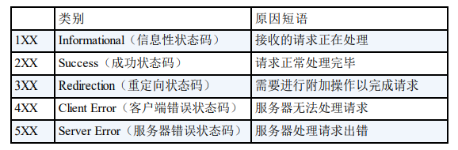
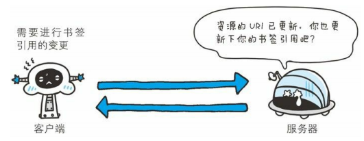
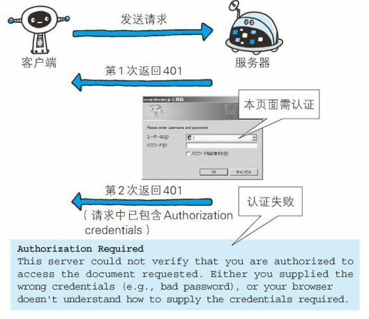
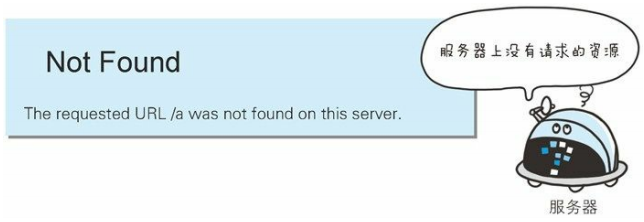

# 五、HTTP 响应报文状态码

[[_TOC_]]

## 1. HTTP 响应报文

## 2. 状态码

状态码由 `3 位数字和原因短语`组成，状态码用于描述 HTTP 请求的处理结果

### (1) 状态码类别

① 状态码第一位数字指定了响应类别，后两位数字无分类

② 只要遵循了状态码的类别，即使改变 RFC2616 中定义的状态码，或服务端自行创建状态码，都没有问题

### (2) 常用状态码

仅仅记录在 RFC2616 中的状态码就有 `40 种`，若再加上 WebDAV 和附加 HTTP 状态码 RFC6585 等扩展，状态码大概有 `60 多种`，但是常用状态码大概只有 `14 种`

#### ① 200 OK

* 表示请求被服务端正常处理了，返回正确的响应报文

#### ② 204 No Content

* 表示请求被服务端正常处理了，但返回的响应报文中不包含实体

* 常用于只往服务端发送信息，而无需向客户端返回信息的情况，即客户端无需更新

#### ③ 206 Partial Content

* 表示服务端成功执行了客户端发来的范围请求，返回的响应报文中包含指定范围的实体内容

#### ④ 301 Moved Permanently

* 表示`永久性重定向` (URI 不会再次改变)，请求的资源已经被永久分配了新的 URI，希望客户端按照响应报文的 `Location` 字段提示的 URI 重新请求

#### ⑤ 302 Found

* 表示`临时性重定向` (URI 将来还有可能改变)，请求的资源已经被临时被分配了新的 URI，希望客户端按照响应报文的 `Location` 字段提示的 URI 重新请求

#### ⑥ 303 See Other

* 表示`临时性重定向` (URI 将来还有可能改变)，请求的资源已经被临时被分配了新的 URI，希望客户端按照响应报文的 `Location` 字段提示的 URI 重新请求，并且必须采用 `GET` 方法

* 当 301、302、303 的状态码返回时，几乎所有的浏览器都会删除请求报文的主体，将 POST 改成 GET，自动再次发送请求

#### ⑦ 307 Temporary Redirect

* 表示`临时性重定向` (URI 将来还有可能改变)，请求的资源已经被临时被分配了新的 URI，希望客户端按照响应报文的 `Location` 字段提示的 URI 重新请求

* 当 307 的状态码返回时，浏览器不会像 303 一样将 POST 改成 GET，而是按照之前的请求方法，自动再次发送请求

#### ⑧ 304 Not Modified

* 表示客户端发送`附带条件`的请求时，服务端允许访问资源但未满足条件的情况，因此返回的响应报文不包含实体

* 附带条件的请求是指采用 `GET` 方法的请求报文中包含 If-Match、If-ModifiedSince、If-None-Match、If-Range、If-Unmodified-Since 中任一首部字段

#### ⑨ 400 Bad Request

* 表示请求报文中存在语法错误，需要修改请求报文后再次发送

#### ⑩ 401 Unauthorized

* 表示请求报文需要包含通过 `HTTP 认证`的认证信息，若之前已经进行过一次请求，则表示用户认证失败

* 状态码为 401 的响应报文必须包含 `Authenticate` 首部字段用以质询用户信息，浏览器初次接收 401 响应，会弹出认证用的对话窗口

#### ⑪ 403 Forbidden

* 表示服务端拒绝访问资源的请求，访问权限出现某些问题、未获得访问授权等都有可能导致这种情况

#### ⑫ 404 Not Found

* 表示服务端无法找到访问的资源

#### ⑬ 500 Internal Server Error

* 表示服务端在执行请求时发生了错误，可能是 Web 应用存在 bug 或者是某些临时故障

#### ⑭ 503 Service Unavailable

* 表示服务端暂时处于超负荷状态，或者服务端正在停机维护，现在无法处理请求

* 如果事先得知解决以上情况需要的时间，可以写入响应报文的 `RetryAfter` 字段后返回给客户端

