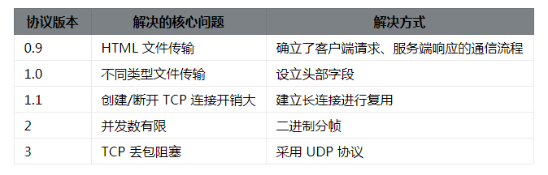

# 十、HTTP3

[[_TOC_]]

## 1. HTTP3

### (1) HTTP3 的诞生

当然 HTTP/2 也并非完美，考虑一种情况，如果客户端或服务端在通信时出现数据包丢失，或者任何一方的网络出现中断，那么整个 TCP 连接就会暂停。

HTTP/2 由于采用二进制分帧进行多路复用，通常只使用一个 TCP 连接进行传输，在丢包或网络中断的情况下后面的所有数据都被阻塞。但对于 HTTP/1.1 来说，可以开启多个 TCP 连接，任何一个 TCP 出现问题都不会影响其他 TCP 连接，剩余的 TCP 连接还可以正常传输数据。这种情况下 HTTP/2 的表现就不如 HTTP/1 了。

2018 年 HTTP/3 将底层依赖的 TCP 改成 UDP，从而彻底解决了这个问题。UDP 相对于 TCP 而言最大的特点是传输数据时不需要建立连接，可以同时发送多个数据包，所以传输效率很高，缺点就是没有确认机制来保证对方一定能收到数据

### (2) HTTP3 的特点

①②③④⑤⑥⑦⑧⑨⑩
