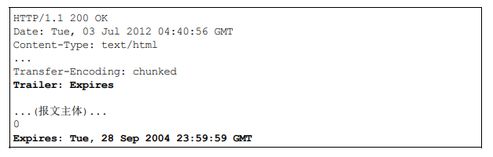

# 四、HTTP 报文首部字段

[[_TOC_]]

## 1. HTTP 报文

**HTTP 请求报文**

**HTTP 响应报文**

## 2. 请求首部字段

请求报文特有的首部字段，用于补充请求的附加信息、客户端信息、对响应内容相关的优先级等内容

### (1) User-Agent

客户端的 User-Agent 字段用于告知服务器，客户端浏览器的用户代理字符串，表示浏览器厂商和版本信息

### (2) Accept

客户端的 Accept 字段用于通知服务器，客户端用户代理支持的媒体类型及优先级，媒体类型可以后跟 `q = 0 到 1 的精确到小数点后三位的数值`来额外表示权重值，媒体类型用分号 `;` 进行分割，服务器会优先返回权重值最高的媒体类型

### (3) Accept-Charset

客户端的 Accept-Charset 字段用于通知服务器，客户端用户代理支持的字符集及优先级，写法与 Accept 字段相同

### (4) Accept-Encoding

客户端的 Accept-Encoding 字段用于通知服务器，客户端用户代理支持的内容编码及优先级，写法与 Accept 字段相同，也可使用星号 `*` 指定任意的编码格式

### (5) Accept-Language

客户端的 Accept-Language 字段用于通知服务器，客户端用户代理支持的自然语言集及优先级，写法与 Accept 字段相同

### (6) TE

客户端的 TE 字段用于通知服务器，客户端支持的分块传输编码方式及优先级，写法与 Accept 字段相同，TE 字段属于端到端首部字段，在`整个传输过程`中有效

### (7) Referer

客户端的 Referer 字段用于通知服务器，客户端请求的原始资源的 URI

### (8) Host

客户端的 Host 字段用于通知服务器，客户端请求是访问服务器上的哪个域名，详见 Web 章节 - Web 服务器 - 虚拟主机

### (9) From

客户端的 From 字段用于通知服务器，使用用户代理的用户的电子邮件地址

### (10) Authorization

客户端的 Authorization 字段用于客户端与服务器之间的认证，客户端收到服务器发来的认证质询时，通过 Authorization 字段告知服务器认证信息

### (11) Proxy-Authorization

客户端的 Proxy-Authorization 字段用于客户端与代理服务器之间的认证，客户端收到代理服务器发来的认证质询时，通过 Proxy-Authorization 字段告知代理服务器认证信息

### (12) Max-Forwards

客户端的 Max-Forwards 字段指明 HTTP 请求报文可经过的服务器的最大数量

### (13) Expect

客户端的 Expect 字段用于通知服务器，期望出现的某种特定行为，服务器无法理解客户端的期望而发生错误时，返回状态码 `417 Expectation Failed`

### (14) Range

客户端的 Range 字段用于通知服务器，实体的字节范围请求

### (15) If-Range、If-Match、If-None-Match、If-Modified-Since、If-Unmodified-Since

#### 条件请求

带 If 的请求首部字段，都称为条件请求，服务器收到条件请求后，只有判断条件为真，才会执行请求  

#### ① If-Range
  
客户端的 If-Range 字段用于通知服务器，对比 If-Range 字段值和资源 ETag 值或时间，两者一致时，请求作为范围请求处理，否则返回全体资源

#### ② If-Match

客户端的 If-Match 字段用于通知服务器，对比 If-Match 字段值和资源的 ETag 值，只有当两者一致时，才会执行请求

#### ③ If-None-Match
  
客户端的 If-None-Match 字段用于通知服务器，对比 If-Match 字段值和资源的 ETag 值，只有当两者不一致时，才会执行请求，与 If-Match 字段功能相反

#### ④ If-Modified-Since
  
客户端的 If-Modified-Since 字段用于通知服务器，对比 If-Modified-Since 字段值和资源的更新时间，只有指定值早于更新时间，才会执行请求

#### ⑤ If-Unmodified-Since

客户端的 If-Unmodified-Since 字段用于通知服务器，对比 If-Unmodified-Since 字段值和资源的更新时间，只有指定值晚于更新时间，才会执行请求

## 2. 响应首部字段

响应报文特有的首部字段，用于补充响应的附加信息、服务器信息、对客户端的附加要求等内容

### (1) Accept-Ranges

服务器的 Accept-Ranges 字段用于告知客户端，服务器是否能够处理范围请求，bytes 代表可以处理范围请求，none 代表不能处理范围请求

### (2) Server

服务器的 Server 字段用于告知客户端，当前服务器上安装的 HTTP 服务器应用程序的信息，包括软件应用名称、版本号、安装时的启动项等等

### (3) Vary

① 服务器的 Vary 字段用于告知`代理服务器`，根据响应报文的 Vary 字段的值缓存资源

② 客户端向源服务器发送一个包含字段 Accept-Language: en-us 的请求，代理服务器收到这个请求后，没有对应的缓存，就将请求转发给源服务器，源服务器根据请求返回响应，并在响应中添加字段 Vary: Accept-Language，用于告知代理服务器缓存资源，并且将当前缓存映射到 Accept-Language: en-us，当下次客户端再次发送相同请求时，代理服务器收到请求并且缓存未过期，就直接将缓存返回给客户端而无需转发请求给源服务器

### (4) ETag

服务器的 ETag 字段用于告知客户端，服务器给每个实体资源分配的`唯一字符串标识`，当资源更新时，ETag 字段值也会更新

**强 ETag 值**：不论实体发生多么细微的变化都会改变其值

**弱 ETag 值**：只用于提示资源是否相同，只有资源发生了根本改变，产生差异时才会改变其值

### (5) Age

服务器的 Age 字段用于告知客户端，源服务器在`多少秒前`创建了响应，如果是缓存代理服务器创建了响应，则表示缓存资源从再次发起认证到认证完成的时间

### (6) Location

服务器的 Location 字段用于告知客户端，请求资源的重定向 URI，几乎所有的浏览器在收到包含首部字段 Location 的响应后，都会`强制访问`重定向资源

### (7) Retry-After

服务器的 Retry-After 字段用于告知客户端，应该在多久之后再次发送请求，字段值可以是创建响应后的秒数，也可以是具体的日期时间

### (8) WWW-Authenticate

服务器的 WWW-Authenticate 字段用于客户端与服务器之间的认证，将服务器要求的认证信息发送给客户端

### (9) Proxy-Authenticate

服务器的 Proxy-Authenticate 字段用于客户端与代理服务器之间的认证，将代理服务器要求的认证信息发送给客户端

## 3. 通用首部字段

请求报文和响应报文共有的首部字段

### (1) Transfer-Encoding

Transfer-Encoding 规定报文主体时采用的`分块传输编码`方式，Transfer-Encoding 字段属于逐跳首部字段，只在`两个节点间`有效

### (2) Trailer

Trailer 字段事先说明在报文主体后记录了哪些首部字段

### (3) Via

Via 字段用于标记请求报文和响应报文转发过程中经过的所有代理服务器，避免请求回环的产生

### (4) Cache-Control 和 Warning

**① Cache-Control**：用于控制缓存的行为

**② Warning**：用于告知用户与缓存相关的警告

③ 具体功能见 Web 章节 - Web 服务器 - 缓存 - 缓存行为控制

### (5) Connection

**① 控制逐跳首部字段**：在客户端发送的请求和服务器返回的响应内，使用 Connection 首部字段指明无需转发给代理的逐跳首部字段

**① 管理持久连接**：HTTP/1.1 协议都是持久连接，客户端会在持久连接上连续发送请求，当服务器明确想断开连接时，会指定响应报文的 Connection 首部字段值为 close

### (6) Upgrade

Upgrade 字段用于检测 HTTP 协议是否可升级为指定的其他协议

## 4. 实体首部字段

针对请求报文和响应报文的实体使用的首部字段，用于补充实体的更新时间等与实体相关的信息

### (1) Allow

服务器的 Allow 字段用于告知客户端，对于请求的资源，服务器支持的 HTTP 请求方法

### (2) Content-Type

服务器的 Content-Type 字段用于告知客户端，实体主体的媒体类型

### (3) Content-Encoding

服务器的 Content-Encoding 字段用于告知客户端，实体主体采用的内容编码

### (4) Content-Language

服务器的 Content-Language 字段用于告知客户端，实体主体采用的自然语言

### (5) Content-Length

服务器的 Content-Length 字段用于告知客户端，实体主体部分的字节大小

### (6) Content-Range

服务器的 Content-Range 字段用于告知客户端，作为响应返回的实体的哪个部分符合范围请求的要求字段值以字节为单位，表示当前发送部分以及整体实体大小

### (7) Content-Location

服务器的 Content-Location 字段用于告知客户端，实体主体返回资源对应的 URI

### (8) Content-MD5

服务器的 Content-MD5 字段用于告知客户端，服务器对响应报文主体执行 MD5 算法后再通过 Base64 编码后生成的值，客户端在收到响应报文后，对响应报文主体执行相同的 MD5 算法后再通过 Base64 编码，得到的值与响应报文的 Content-MD5 字段值对比，用于确认响应报文主体在传输过程中是否保持完整，以及确认传输到达

### (9) Expires

服务器的 Expires 字段用于告知客户端，资源过期的日期时间

### (10) Last-Modified

服务器的 Last-Modified 字段用于告知客户端，资源最后修改的日期时间

## 5. Cookie 相关的其他首部字段

详见 HTTP 协议章节 - 无状态协议 - Cookie

## 6. HTTP 首部字段转发次数

HTTP 报文首部字段因`缓存代理`而是否可以被转发，分为逐跳首部字段 (Hop-by-hop Header) 和端到端首部字段 (End-to-end Header) 两类

### (1) 逐跳首部字段

逐跳首部字段只对`单次转发`有效，不会通过代理再次转发

* **TE (请求)**：客户端支持的分块传输编码方式及优先级
* **Transfer-Encoding (通用)**：指定报文主体的分块传输编码方式
* **Trailer (通用)**：报文末端的首部一览
* **Upgrade (通用)**：检测 HTTP 协议是否可升级为指定的其他协议
* **Connection (通用)**：控制逐跳首部字段、管理持久连接
* **Proxy-Authorization (请求)**：客户端告知代理服务器其要求的认证信息
* **Proxy-Authenticate (响应)**：代理服务器对客户端的认证信息

### (2) 端到端首部字段

端到端首部字段会转发给请求或响应的`最终接收目标`，除上述 8 个逐跳首部字段以外，其他首部字段都属于端到端首部字段
