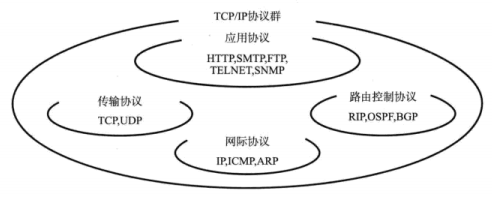
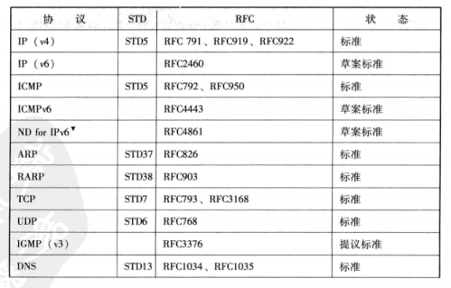
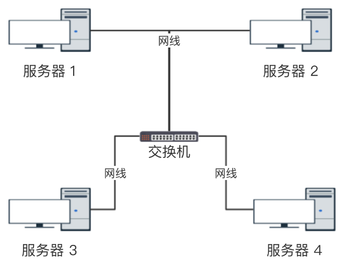
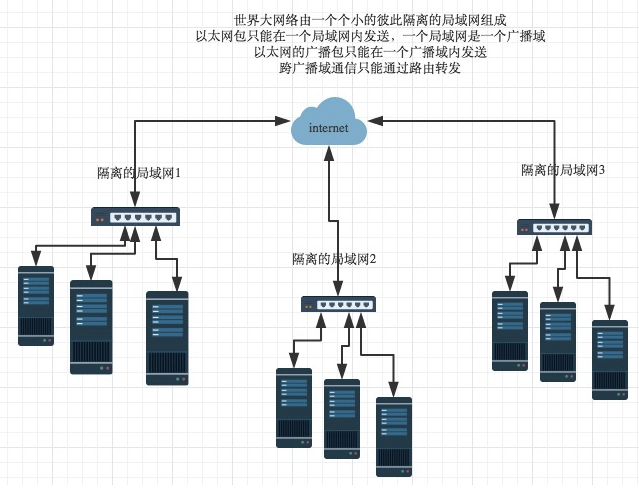
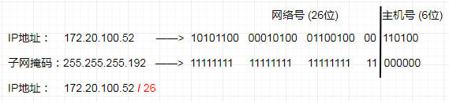
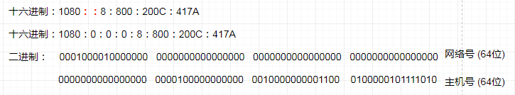
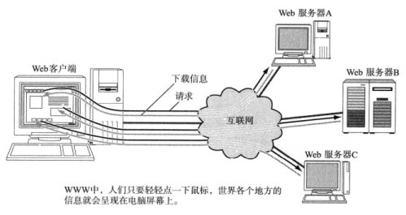
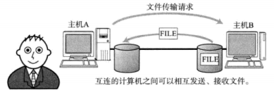
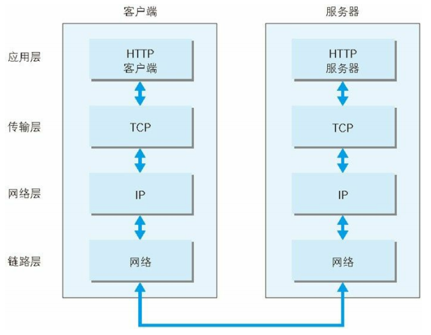

# 一、TCP/IP协议群

[[_TOC_]]

## 1. TCP/IP协议群

TCP/IP 协议群就是为了使用互联网而开发制定的，因此互联网的协议就是 TCP/IP 协议群

TCP/IP 协议群是利用 IP 进行通信时必须用到的协议群的统称

① 应用协议 (应用层)：HTTP、SMTP、FTP、TELNET、SSH、SNMP

② 传输协议 (传输层)：TCP、UDP

③ 网际协议 (网络层)：IP、ICMP、ARP

④ 路由控制协议 (网络层)：RIP、OSPF、BGP



## 2. TCP/IP协议群的标准化

### (1) 开放性

开放性是由于 TCP/IP 协议群是由国际互联网工程任务组 IETF 讨论制定的，而 IETF 是一个允许任何人加入讨论的组织，在 IETF 人们通常采用电子邮件组的形式进行日常讨论，而邮件组可以由任何人订阅

### (2) 实用性

TCP/IP 协议群在制定某个协议规范的过程中会考虑这个协议实现的可行性，只要这个协议的大致规范确定下来，人们就会在多个已实现这个协议的设备间进行通信实验，一旦发现有什么问题，就可以继续在 IETF 中讨论修改，经过多次讨论、实验、修改，这个协议的最终详细规范才会诞生，因此 TCP/IP 协议群具有很强的实用性

### (3) TCP/IP规范

#### ① RFC 文档

* TCP/IP 协议群中那些需要标准化的协议，会被列入 RFC 文档并在互联网上公布，RFC 文档记录了协议规范内容、协议的实现和应用相关信息、实验方面的信息，
* RFC 文档通过编号组织每个协议的标准化请求，RFC 文档的编码是既定的，如要扩展某个已有的协议规范，就必须有一个全新编号的 RFC 文档对其记录，同时，老的那份 RFC 文档作废，新的 RFC 文档必须记录扩展自哪个 RFC 文档以及要作废哪个 RFC 文档

#### ② STD 编号

由于每次修改 RFC 时都要产生新的 RFC 编号太麻烦，人们采用 STD 方式管理 RFC 编号，STD 编号记录制定哪个协议，同一个协议的规范内容变化只会改变 RFC 编号，不会改变 STD 编号

下图是部分 STD 编号：



## 3. 物理层

**由来**：计算机以二进制 0、1 来表示信息，但实际上传输介质处理的是电压的高低、光的闪灭、电波的强弱等信号，物理层负责将这些信号与二进制 0、1 进行转换

**作用**：物理层主要负责将 0、1 的二进制信息，传输给物理的传输介质

### (1) 传输介质

① 计算机之间通过`电缆`相互连接，电缆又分为双绞线电缆、光纤电缆、同轴电缆、串行电缆等

② 物理层使用的传输介质不同，网络的带宽、可靠性、安全性、延迟等都会有所不同

### (2) 带宽

带宽就是数据传输过程中，两个设备之间数据流动的物理速度，单位 bps (比特每秒)，带宽是指单位时间内传输的数据量有多少

## 4. 数据链路层

**由来**：数据链路层规定了电信号的分组方式，单纯的 0、1 电信号没有任何意义，必须规定电信号多少位为一组，每组什么意思

**作用**：数据链路层主要负责将一组电信号，传输给物理的连接在同一传输介质上的设备 (计算机、交换机、路由器)



### (1) 交换机

交换机主要用于组建局域网，交换机一般至少有 8 个交换端口，可以将多台计算机连接起来，与交换机相连的计算机组建成了一个局域网

### (2) MAC 地址

#### ① 网卡

* 以太网协议规定，接入 Internet 的设备都必须具有网卡，数据帧中报头 head 的发送方地址和接收方地址指的就是网卡的地址，也就是 MAC 地址

* 网卡 NIC 用于计算机连接局域网功能，计算机必须具备能够接入无线网的网卡才能保证连接到局域网

* 网卡可以被集成到计算机的主板，也可以单独插入计算机的扩展槽

#### ② MAC 地址

制造厂商针对每块网卡分别指定的全世界唯一的地址

* 具备唯一性：MAC 地址可以通过制造商识别号、制造商内部产品编号、产品通用编号确保 MAC 地址的唯一性

* 不具备层次性：无法确定哪家厂商的哪块网卡被用到了哪个地方，因此 MAC 地址不具备层次性

### (3) 以太网协议

早期各个公司都有自己的电信号分组方式，现在都统一使用以太网协议 ethernet

#### 以太网数据帧

以太网协议规定一组电信号构成一个数据帧，每个数据帧分成报头 head 和数据 data 两部分

* 报头 head：发送方 MAC 地址、接收方 MAC 地址、上层协议类型

* 数据 data：数据帧的具体内容

## 5. 网络层

**由来**：有了以太网协议、MAC 地址，基本上局域网内的计算机都可以互相通信了，但是世界范围的互联网是由一个个彼此隔离的局域网组成，局域网之间的通信就需要通过网络层实现

**规定**：网络层规定一个局域网是一个广播域/子网，以太网的广播传输方式只能在一个广播域内发送，跨广播通信只能通过路由器转发，网络层引入网络地址来区分不同的子网

**作用**：网络层主要负责路由寻址



### (1) 路由器

① 路由器主要用于连接两个组建好的局域网/子网，并在不同的子网间转发 IP 报文，并通过宽带上网功能接入互联网

② 路由器同样具有交换机的连接不同计算机组建局域网的功能，但是路由器价格昂贵，并且速度没有交换机快

③ 路由器一般有 5 个端口，1 个为 WAN 端口与宽带线相连，实现宽带上网功能，其他 4 个端口相当于交换机的交换端口，可以与计算机相连，所以 1 个路由器最多可支持 4 台计算机上网，但是这 4 个端口可以与交换机相连，将每个交换机组建好的局域网连接起来，那么就可以支持更多的计算机上网

### (2) IP 协议

IP 协议就是规定网络地址的协议，其定义的网络地址也称为 IP 地址

#### ① 面向无连接

IP 协议采用面向无连接的传输方式，在发送 IP 报文之前，无需建立与目标主机间的连接，上层如果遇到需要发送的数据，该数据会被立刻压缩成 IP 报文发送出去，无论目标主机是否存在

#### ② ipv4 地址

* IPv4 地址长度为 4 个 8 位字节，即 32 比特，

* IPv4 地址以 8 个比特为一组，每组以 . 隔开，再转成十进制表示



#### ③ ipv6 地址

* IPv6 地址长度为 8 个 16 位字节，即 128 比特

* IPv6 地址以 16 位比特为一组，每组以 : 隔开，出现连续的 0 时，可以将这些 0 省略，以 :: 隔开，一个 IPv6 地址中最多允许 2 个 :: 号，再转成十六进制表示



#### ④ 主机

**主机**：配有 IP 地址但是不进行路由控制的设备

**路由器**：配有 IP 地址并且具有路由控制的设备

### (3) 主机名&域名

#### ① 单一主机名

单一主机名是为每台计算机赋予的唯一主机名 (实际上并不唯一)，用来替换不便于用户记忆的 IP 地址

#### ② 域名

* 域名是用于识别组织机构名称的一种具有分层的名称

* 域名是分层管理的：`.` 三级域名 `.` 二级域名 `.` 一级域名

```javascript
document.domain //返回/设置当前文档域名
```

#### ③ 带域名的主机名

带域名的主机名是互联网上某一台计算机或某一组计算机的名称，用于识别单一主机名和具有分层结构的组织机构名称，带域名的主机名互联网`唯一`

```javascript
URL对象：
url.origin   //协议、主机、端口
url.protocol //协议
url.host     //主机、端口
url.hostname //主机
url.port     //端口
```

```javascript
//新浪博客：http://blog.sina.com.cn

单一主机名：blog
域名：.sina.com.cn (.sina代表新浪 .com代表商业机构 .cn代表中国)
带域名的主机名：blog.sina.com.cn
```

```javascript
//百度网：https://www.baidu.com
console.log(url.hostname);    //"www.baidu.com"
console.log(document.domain); //"www.baidu.com"

//新浪网：https://www.sina.com.cn
console.log(url.hostname);    //"www.sina.com.cn"
console.log(document.domain); //"sina.com.cn"

//新浪博客：http://blog.sina.com.cn
console.log(url.hostname);    //"blog.sina.com.cn"
console.log(document.domain); //"sina.com.cn"
```

### (4) ARP 协议

**由来**：计算机网络通信中，网络层的 IPv4 报文，最后都要在数据链路层封装成以太网数据帧，然后通过以太网协议发送，因此需要获取下一跳路由器的 MAC 地址或接收方主机的 MAC 地址

### (5) ICMP 协议

#### ① ICMPv4 协议

**由来**：IP 协议采用面向无连接的传输方式，IP 协议做不到最终收到与否的验证，IP 报文在发送途中可能出现丢包、错位、数量翻倍等问题，因此提高通信的可靠性很重要

#### ② ICMPv6 协议

**由来**：ARP 协议仅适用于 IPv4 地址，ICMPv6 协议不仅仅具有 ICMPv4 协议的异常通知功能，还包含 ARP 协议的探索下一跳路由器或者目标主机的 MAC 地址的功能

### (6) DHCP 协议

**由来**：逐一为每台主机设置 IP 地址非常繁琐，特别是移动使用笔记本的时候，每移动到一个新地方都需要重新设置 IP 地址，DHCP 协议实现了计算机连网后自动获取 IP 地址的功能

## 6. 传输层

**由来**：网络层的 IP 地址用来区分子网，数据链路层的 MAC 地址用来寻找计算机，但是大家在计算机上使用的都是应用程序，一台计算机可能同时打开 QQ、爱奇艺等多个应用程序，我们通过端口来标识一台主机上的不同应用程序

**作用**：传输层主要负责建立端口到端口的通信

### (1) 端口

**由来**：端口号用来标识一台主机上进行通信的不同应用程序，端口号即应用程序与网卡关联的编号，因此也被称为程序地址

**范围**：端口号的范围是 `0 ~ 65535`

**① 知名端口号**：HTTP、FTP 等广为使用的应用协议使用的端口号，知名端口号是固定的，一般由 `0 ~ 1023` 的数字分配而成

**② 注册端口号**：一些被正式注册的端口号，一般由 `1024 ~ 49151` 的数字分配而成，注册端口号可用于任何通信用途

**③ 操作系统分配端口号**：客户端应用程序无需自己设置端口号，操作系统为每个应用程序分配互不冲突的端口号，这样操作系统就可以动态管理端口号，一般由 `49152 ~ 65535` 的数字分配而成

### (2) TCP 协议

TCP 协议是一种面向有连接的传输层协议

### (3) UDP 协议

UDP 协议是一种面向无连接的传输层协议

## 7. 应用层

**由来**：用户使用的都是计算机上的应用程序，应用程序多种多样，数据也多种多样，就必须规范好数据的组织形式，避免传输后发生数据乱码的情况

**作用**：应用层规定计算机上各种应用程序的标准数据格式，将某个应用程序特有的数据格式，转换成网络标准数据格式

### (1) 客户端/服务端模型

TCP/IP 协议群应用的架构绝大多数属于客户端/服务端模型

**① 客户端**：请求访问文本或图像等资源的程序

**② 服务端**：提供资源响应的程序，服务端会被预先部署到计算机上，等待任何时候客户端可能发送的请求


### (2) Web 浏览器 (HTTP)

① Web 浏览器：用户在一种叫做 Web 浏览器的软件上借助鼠标和键盘就可以轻松上网，浏览器中既可以显示文字、图片、动画等信息，还能播放声音以及运行程序

② 浏览器与服务端通信使用的协议是 HTTP 协议，HTTP 协议传输数据的主要格式是 HTML 格式



### (3) 电子邮件 (SMTP)

网络上发送电子邮件使用的协议是 SMTP 协议，最初只能发送文本格式的电子邮件，现在电子邮件的格式由 MIME 协议扩展后，可以发送声音、图像等各式各样的信息，还可以修改邮件文字的大小、颜色，

**多用途互联网邮件扩展 MIME**

① MIME 是一种描述消息内容类型的因特网标准，最早应用于邮件系统，后来也应用到浏览器，用来表示文档、文件、字节流的性质和格式

② 常见的 MIME 类型如下：

* text/plain
* text/html
* image/jpeg
* image/pngaudio/mpeg
* audio/ogg
* audio/*
* video/mp4
* application/*
* application/json
* application/javascrip
* tapplication/ecmascript
* application/octet-stream
* ...


### (4) 文件传输 (FTP)

文件传输是指将保存在其他计算机硬盘的文件下载到本地硬盘，或者将本地硬盘上的文件上传到其他计算机硬盘，文件传输使用的协议是 FTP 协议，传输过程可以选择用二进制方式还是文本方式



### (5) 远程登录 (TELNET SSH)

远程登录是指登录到远程的计算机上，使那台计算机上的程序得以运行的一种功能，TCP/IP 网络中远程登录常用 TELNET、SSH 两种协议


### (6) 网络管理 (SNMP)

① 在 TCP/IP 中进行网络管理时，采用 SNMP (Simple Network Management Protocol) 协议，使用 SNMP 协议管理的计算机、路由器等称为 SNMP 代理，进行管理的称为管理器，SNMP 协议的代理端保存网络接口的信息、通信数据量、异常数据量、设备温度等信息，这些信息可以通过 MIB (Management Infomation Base) 访问

② 一个网络范围越大，结构越复杂，就越需要对其进行有效的管理，而 SNMP 协议可以及时让管理员查看网络堵塞情况，及早发现故障，也可以为以后扩大网络收集必要的信息

## 8. TCP/IP 网络通信


