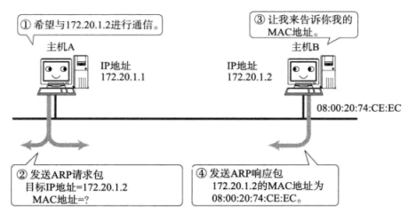
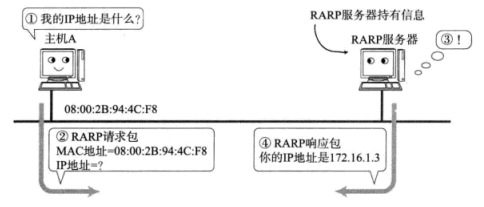
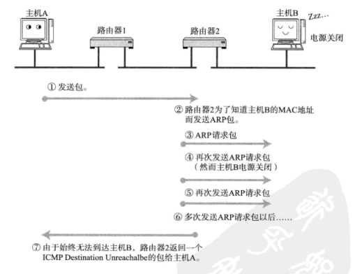
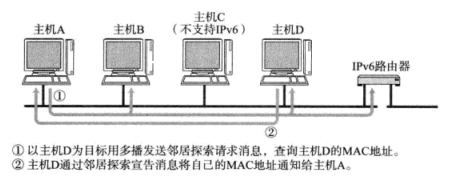
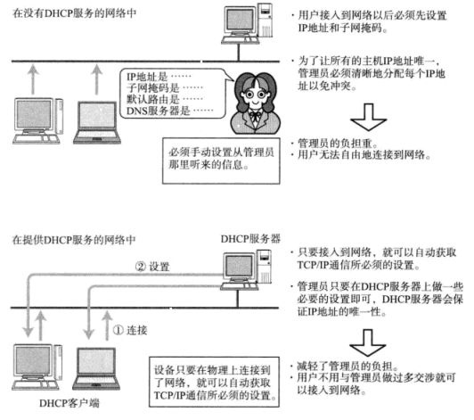
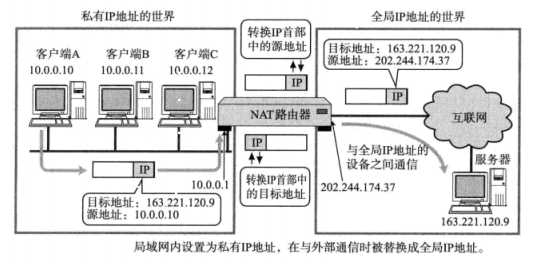
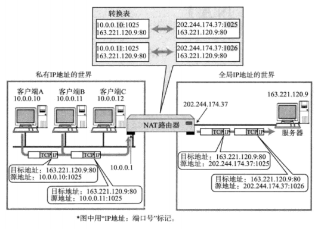
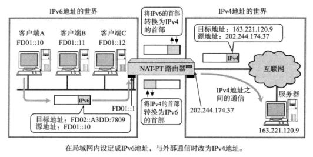
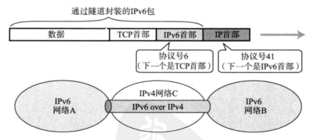
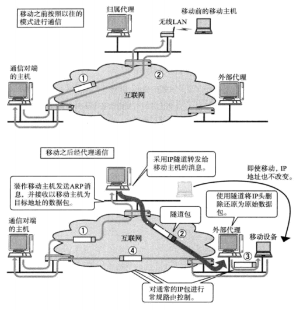

# 五、IP 协议相关技术

[[_TOC_]]

## 1. DNS

**由来**：在浏览器访问网页时，用户通常输入应用层提供的地址，但是主机在网络层是根据 IP 地址通信，所以需要一种将应用层地址映射为 IP 地址的功能

### (1) 主机名&域名

单一主机名：为每台计算机赋予唯一的主机名，用来替换不便于用户记忆的IP 地址

域名：为了识别主机名和组织机构名称的一种具有分层的名称

带域名的主机名：

```javascript
//新浪网：https://www.sina.com.cn
console.log(url.hostname);    //"www.sina.com.cn" (服务器名：www)
console.log(document.domain); //"sina.com.cn" 三级域名

//新浪博客：http://blog.sina.com.cn
console.log(url.hostname);    //"blog.sina.com.cn" (服务器名：blog)
console.log(document.domain); //"sina.com.cn" 三级域名
```

### (2) DNS

域名服务器 DNS (Domain Name Server)，

各个域的分层上都设有各自的 DNS

从根 DNS 开始，各层 DNS 呈树状结构相互连接，每个 DNS 都了解该层下一层所有 DNS 的 IP 地址，所以若从根 DNS 开始追踪，可以访问世界上所有 DNS

①②③④⑤⑥⑦⑧⑨⑩

## 2. ARP 协议

### (1) ARP 协议

**由来**：计算机网络通信中，网络层的 IP 报文，最后都要在数据链路层封装成以太网数据帧，然后通过以太网协议发送，因此需要获取下一跳路由器或者接收方主机的 MAC 地址

**限制**：ARP (Address Resolution Protocol) 协议只适用于 IPv4 地址

① ARP 协议借助 ARP 请求和 ARP 响应两种类型的包，通过`广播`传输方式，确定下一跳路由器或者接收方主机的 MAC 地址，实现子网内的 IP 通信

② 同一局域网/广播域/子网内的主机 A 需要向主机 B 发送 IP 报文，通过路由控制表主机 A 可以知道主机 B 的 IP 地址，主机 A 在子网内`广播`发送一个 ARP 请求包，请求包中包含主机 B 的 IP 地址，同一子网内的所有主机和路由器都会收到这个广播请求包，然后和自己的 IP 地址对比，如果一致则将自己的 MAC 地址塞入 ARP 响应包返回给主机 A



### (2) RARP 协议

**由来**：平时我们可以通过个人电脑设置 IP 地址，还可以通过 DHCP 服务器自动分配获取 IP 地址，但是对于嵌入式设备来说，没有任何输入接口并且无法通过 DHCP 服务器动态获取 IP 地址，这种情况下，就需要 RARP 协议

①  RARP (Reverse Address Resolution Protocol) 协议和 ARP 协议相反，是从 MAC 地址定位 IP 地址的一种协议

② 先架设一台 RARP 服务器，在服务器上注册嵌入式设备的 MAC 地址和 IP 地址，再将嵌入式设备接入到网络，插电启动设备时，设备会向 RARP 服务器发送一条请求信息请求自身的 MAC 地址和 IP 地址，然后设备根据 RARP 服务器的返回结果设置自己的 IP 地址



### (3) 代理 ARP

**由来**：普通 ARP 请求响应包会被路由器隔离，但是采用代理 ARP 的路由器会将 ARP 请求响应包转发给相邻的子网

## 3. ICMP 协议

### (1) ICMPv4 协议

**由来**：IP 协议采用面向无连接的传输方式，IP 协议做不到最终收到与否的验证，IP 报文在发送途中可能出现丢包、错位、数量翻倍等问题，因此提高通信的可靠性很重要

① ICMPv4 协议的主要功能包括确认 IP 报文是否成功到达目标主机，通知在发送过程中 IP 报文被丢弃的具体原因，改善网络设置等，从而便于进行网络上的问题诊断

② 主机 A 向主机 B 发送 IP 报文，由于某种原因，途中的路由器 2 未能发现主机 B 的存在，那么路由器 2 就会向主机 A 发送一个 ICMPv4 包，说明发往主机 B 的 IP 报文未能成功，主机 A 分解 ICMPv4 包的首部和数据域得知发生问题的具体原因



### (2) ICMPv6 协议

**由来**：ARP 协议仅适用于 IPv4 地址，ICMPv6 协议不仅仅具有 ICMPv4 协议的异常通知功能，还包含 ARP 协议的探索下一跳路由器或目标主机的 MAC 地址的功能

① ICMPv6 协议通过`多播`传输方式，确定下一跳路由器或者接收方主机的 MAC 地址，实现子网内的 IP 通信

② 同一局域网/广播域/子网内的主机 A 需要向主机 D 发送 IP 报文，通过路由控制表主机 A 可以知道主机 D 的 IP 地址，主机 A 在子网内`多播`发送一个邻居请求消息，只有`支持 IPv6` 的路由器和主机才会收到这个多播消息，主机 D 通过邻居宣告消息告知主机 A 自己的 MAC 地址



## 4. DHCP 协议

**由来**：逐一为每台主机设置 IP 地址非常繁琐，特别是移动使用笔记本的时候，每移动到一个新地方都需要重新设置 IP 地址，DHCP 协议实现了计算机连网后自动获取 IP 地址的功能

### (1) DHCP 工作原理

① DHCP (Dynamic Host Configuration Protocol) 协议实现了自动设置 IP 地址，统一管理 IP 地址分配的功能，有了 DHCP 协议，计算机只要连接到网络，就可以自动获取 IP 地址，进行 TCP/IP 通信

② 首先架设一台 DHCP 服务器，然后将 DHCP 所要分配的 IP 地址设置到服务器上，还需要设置相应的子网掩码、路由控制信息、DNS 服务器的地址等等

③ 为了避免 DHCP 服务器遇到故障，导致子网内所有主机都无法进行 TCP/IP 通信，通常会架设两台及以上的 DHCP 服务器，不过启动多个 DHCP 服务器，可能会导致分配的 IP 地址相互冲突



### (2) DHCP 中继器

#### ① 小型网络

家庭网络这种小型网络一般只需要一台 DHCP 服务器就可以满足 IP 地址分配的需求，这种情况下一般都由宽带路由器充当这个 DHCP 服务器的角色

#### ② 大型网络

企业或学校等大规模组织机构的大型网络中，一般会有多个子网，这种情况下，将 DHCP 服务器的功能分设到各个路由器上，对管理和运维都不是一件有益的事，因此在这类网络环境中，往往需要一个 DHCP 服务器统一管理，即由每个子网的宽带路由器充当 DHCP 中继代理的角色，在 DHCP 服务器上为每个子网注册 IP 地址的分配范围

## 5. NAT 技术

### (1) NAT

**由来**：没有连接互联网的私有网络中的主机配有私有 IP，而当私有网络中的主机想要访问互联网时，转而使用全局 IP 的技术就是 NAT

① NAT 路由器的内部，有一张自动生成的用来转换私有 IP 和全局 IP 的表，当私有 IP 第一次连接互联网发送第一个 IP 报文时，NAT 路由器生成这张表，并按照表中的映射关系进行处理

② 配置私有 IP：10.0.0.10 的主机与配置全局 IP：163.221.120.9 的主机通信时，途中的 NAT 路由器先将私有 IP：10.0.0.10 转换成全局 IP：202.244.174.37 再发送 IP 请求报文，目标主机返回响应报文时，NAT 路由器又将全局 IP：202.244.174.37 转换为私有 IP：10.0.0.10 再发送 IP 响应报文

③ 私有 IP 结合 NAT 技术已经成为解决 IPv4 地址分配问题的主流方案，现在很多学校、公司内部正在采用每个主机配置私有 IP，路由器配置全局 IP 的方式



### (2) NAPT

**由来**：当私有网络中的多台主机都要连接互联网时，仅仅转换 IP 地址会担心全局 IP 是否够用的问题，因此产生了包含端口号一起转换的技术 NAPT，这样可以将私有网络中的私有 IP 都转换为同一个全局 IP，但是端口号不同



## 6. IPv4 和 IPv6 通信

### (3) NAT-PT

**由来**：IPv4 报文首部和 IPv6 报文首部不同，那么 IPv4 地址的主机和 IPv6 地址的主机之间就无法相互通信，NAT-PT 正是将 IPv6 报文首部转换成 IPv4 报文首部的一种技术



### (4) IP 隧道

**由来**：IPv4 报文首部和 IPv6 报文首部不同，那么支持 IPv4 的子网和支持 IPv6 的子网之间就无法相互通信，IP 隧道正是将支持 IPv6 的子网发来的 IP 报文统合成一个数据，再追加一个 IPv4 报文首部之后转发给支持 IPv4 的子网的技术



## 7. Mobile IP

**由来**：移动设备每移动一个位置，就会连接到不同的子网，由 DHCP 分配不同的 IP 地址，而 IP 地址的变更会引起通信的中断，若传输层使用 TCP 协议，TCP 协议采用面向有连接的传输方式，自始至终都要求通信双方的 IP 地址不发生变化，若传输层使用 UDP 协议，UDP 协议采用面向无连接的传输方式，需要在应用层处理 IP 地址变更的问题，而改造所有应用让其适应 IP 地址变更非常困难，正因如此，移动位置后主机 IP 保持不变的 Mobile IP 技术诞生

① 归属网络：移动设备未移动时连接的网络

② 归属地址：移动设备不变的主机 IP

③ 归属代理：处于归属网络下，可监控移动设备的位置，并转发数据给移动设备

④ 外部代理：所有需要接入网络的移动设备都需要它

⑤ 从应用层看，移动设备永远使用归属地址进行通信，实际上是使用代理转发数据


