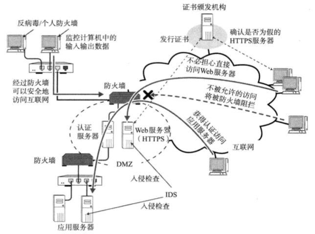
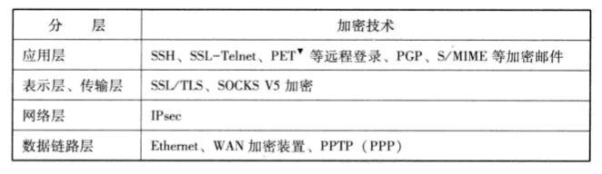
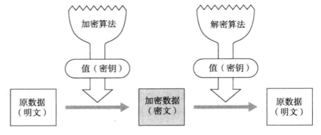
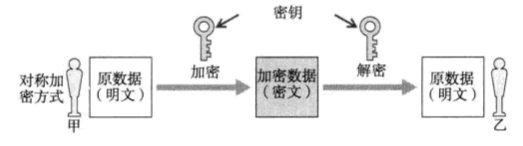
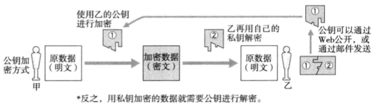
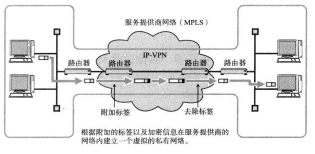
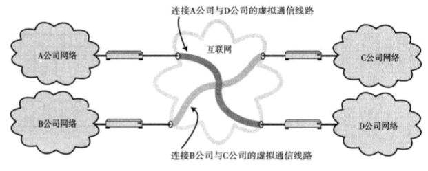
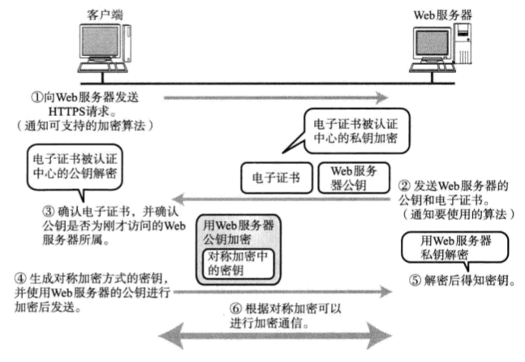

# 一、网络安全构成要素

[[_TOC_]]

## 1. 网络安全构成要素

网络安全最基本的要领是要有预备方案，不是在遇到问题的时候再去处理，而是通过对可能发生的问题进行预测，在可行的最大范围内为系统制定安保对策，进行日常运维，才是重中之重

### (1) 防火墙

**由来**：组织机构内部的私有网络与互联网相连时，为了避免受到非法访问的威胁，往往会设置防火墙

**原理**：外部访问的数据包符合安全策略，防火墙才让其通过

### (2) 入侵检测系统 IDS

**由来**：数据包只要与安全策略相符，防火墙就会让其通过，但是防火墙无法判断当前访问是否为非法访问，IDS 由此诞生

**原理**：IDS 一般在防火墙上进行设置，IDS 拥有定期采集日志、长期监控、通知异常等功能，可以监控网络上流动的所有数据包，检查已经侵入内部网络进行非法访问的情况，及时通知给管理员，IDS 可以与防火墙相辅相成，实现更为安全的网络环境

### (3) 反病毒/个人防火墙

**由来**：网络上的攻击形式日趋复杂，有些黑客发送带有病毒的邮件感染系统，还有些可能直接攻击操作系统本身的弱点，严重影响人们的正常工作生活

**原理**：反病毒/个人防火墙正是防范上述威胁、保护客户端 PC 的一种方法，反病毒/个人防火墙其实就是在用户计算机或者服务器上运行的软件，既可以监控计算机中进出的所有包、数据、文件，也可以防止对计算机的异常操作和病毒入侵

## 2. 加密技术

**由来**：一般情况下，网页访问、电子邮件等互联网上流动的数据不会被加密，因此通常无法避免这些信息会被泄露给第三方，为了防止这些信息的泄露、实现机密数据的传输，出现了各种各样的加密技术

### (1) 对称密码体制与公钥密码体制

#### ① 加密

利用某个值 (密钥) 将明文数据通过一定的算法变成加密数据的过程，其逆反过程为解密

#### ② 对称加密方式

加密和解密使用相同密钥的方式

#### ③ 公钥加密方式

加密使用公钥，解密使用私钥的方式

### (2) 身份认证技术

在实施安全策略时，有必要验证使用者的正确性和真实性，如果不是正当的使用者要拒绝其访问

#### ① 根据所知道的信息进行认证

利用密码认证的方式

#### ② 根据所拥有的信息进行认证

利用身份证、手机号码等信息认证的方式

#### ③ 根据独一无二的体态特征进行认证

利用指纹、视网膜等个人特有的生物特征认证的方式

## 3. 安全协议

**由来**：以前为了防止信息泄露，对机密数据的传输一般使用由专线连接的私有网络，在物理上杜绝窃听和篡改数据的可能，但是专线的造价太高，因此诞生了虚拟专用网 VPN

### (1) VPN

#### ① IP-VPN

* 多协议标签交换 MPLS (Multiprotocol Label Switching)：在 IP 报文首部附加一个标签信息进行传输控制的技术

* IP-VPN 由服务提供商 ISP 提供，IP-VPN 是在 IP 网络上使用 MPLS 技术构建 VPN 的服务，每个用户的标签信息不同，因此在通过 MPLS 网时，可以轻松判断出目标地址，将多个不同用户通过 MPLS 网加以区分，形成封闭的私有网络

#### ② IPsec-VPN

IPsec-VPN 是企业可以自己在互联网上建立的服务，IPsec-VPN 是对 IP 报文进行验证和加密，在互联网上构造一个封闭的私有网络，但是有时会收到网络堵塞的影响

### (2) HTTPS

**由来**：网上购物的支付过程使用的账号密码都属于机密信息，因此在网上传输这些信息时有必要进行加密处理

① HTTPS 通信就是使用 TLS/SSH 的 HTTP 通信，HTTPS 采用对称加密方式，发送其公钥时采用公钥加密方式

①②③④⑤⑥⑦⑧⑨⑩
