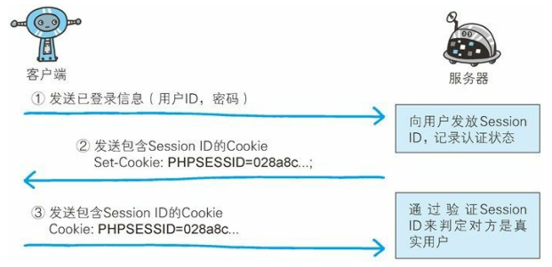

# 三、身份认证技术

[[_TOC_]]

## 1. 身份认证技术

**由来**：除了使用加密技术确保通信传输的机密信息不会被泄露以外，还需要身份认证技术确认通信双方的身份，因为无论是客户端还是服务器都有可能被伪造

## 2. HTTP 的身份认证技术

### (1) BASIC 认证

① 客户端发送 HTTP 请求，请求需要认证的资源

② 服务器返回状态码 `401 Authorization Required`，响应首部字段 `WWW-Authenticate` 包含认证方式 (Basic)、realm 字符串

③ 客户端收到服务器发来的 Basic 认证质询时，将`用户 ID 和密码`以冒号 `:` 连接然后经过 Base64 编码处理，再通过 `Authorization` 字段告知服务器

④ 服务器收到认证信息后，如验证通过，则返回状态码 200 OK

### (2) DIGEST 认证

① 客户端发送 HTTP 请求，请求需要认证的资源

② 服务器返回状态码 `401 Authorization Required`，响应首部字段 `WWW-Authenticate` 包含认证方式 (Digest)、realm 字符串、质询码 nonce (生成的随机数)

③ 客户端收到服务器发来的 Digest 认证质询时，由质询码 nonce 通过 MD5 算法计算出响应码 response，再将包含 realm、nonce、response、uri (请求 URI)、username (realm 限定范围内可进行认证的用户名) 这 5 个字段的 `Authorization` 字段告知服务器

④ 服务器收到认证信息后，如验证通过，则返回状态码 200 OK

## 3. HTTPS 的身份认证技术

### (1) SSL 客户端认证

#### ① 客户端证书

* 客户端证书只能证明作为通信一方的客户端真实存在且规范
* 客户端证书无法证明用户本人的真实有效性，只要获得了安装有客户端证书的计算机的使用权限，也就意味着同时拥有了客户端证书的使用权限
* 从认证机构购买客户端证书需要支付一定费用

#### ② SSL 客户端认证

SSL 客户端认证是利用客户端证书完成认证的方式，服务器凭借客户端证书可确认访问自己的客户端

* 客户端发送 HTTP 请求，请求需要认证的资源
* 服务器返回 Certificate Request 报文，要求客户端提供客户端证书
* 用户选择将要发送的客户端证书后，客户端将选择好的证书信息以 Client Certificate 报文方式发送给服务器
* 服务器验证客户端证书通过后，领取证书内的`客户端的公钥`，然后开始 HTTPS 加密通信

### (2) SSL 服务器认证

#### ① EV SSL 证书

EV SSL 证书有两个作用

* 一是证明作为通信一方的服务器真实存在且规范
* 二是证明该服务器背后运营的企业真实存在

#### ② SSL 服务器认证

SSL 服务器认证是利用 EV SSL 证书完成认证的方式，客户端凭借 EV SSL 证书可确认访问的服务器真实存在且规范，并且服务器背后运营的企业真实存在

## 4. 基于表单认证

### (1) 基于表单认证

#### ① 基于表单认证

客户端向服务器上的 Web 应用程序发送登陆信息，按登陆信息的验证结果认证

#### ② 基于表单认证的优势

可以解决客户端证书无法证明用户本人的真实有效性的问题，通常和 SSL 客户端认证结合使用

### (3) Cookie 状态管理

**由来**：HTTP 协议是无状态协议，用户登陆 Web 页面后不会记录已登陆状态，那么每次跳转新页面都需要再次登陆，或者在每次的 HTTP 请求报文中附加参数来管理登陆状态，针对这种情况，引入了 Cookie 技术，Cookie 技术通过在 HTTP 请求报文中附加 Cookie 信息来控制客户端状态

① 用户登陆 Web 页面时，客户端将用户 ID 和密码放入报文主体，然后将请求发送给服务器

② 服务器验证客户端发送的登陆信息进行身份认证，验证通过后发放用以识别用户的 `Session ID`，然后将用户的认证状态和 Session ID 绑定后记录在服务器，服务器返回响应时，添加其他首部字段 Set-Cookie 记录 Session ID 值

③ 客户端收到服务器返回的 Session ID 后，将其作为 Cookie 保存在本地，下次向服务器发送请求时，浏览器会自动发送 Cookie，服务器就可以通过验证 Session ID 识别用户及其认证状态

