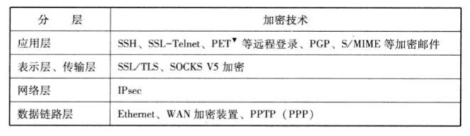
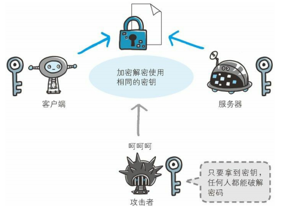
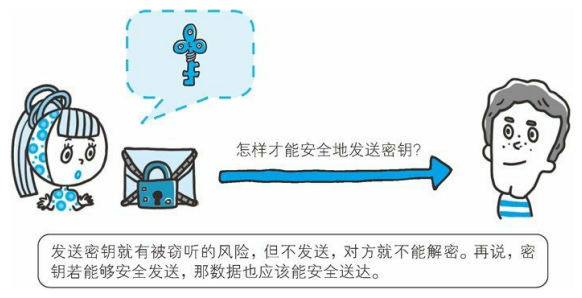
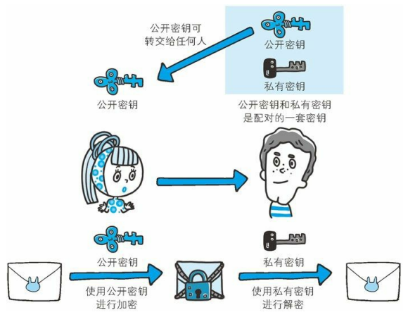
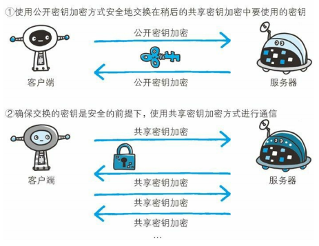
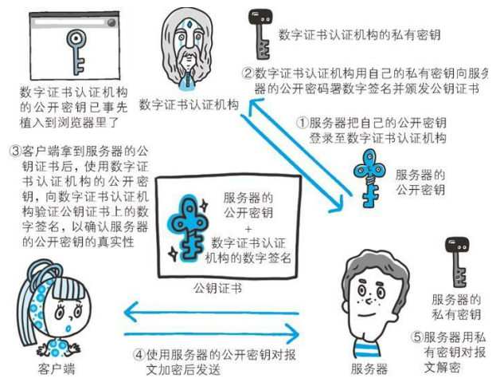

# 二、加密技术

[[_TOC_]]

## 1. 加密技术

### (1) 由来

一般情况下，网页访问、电子邮件等互联网上流动的数据不会被加密，因此通常无法避免这些信息会被泄露给第三方，为了防止这些信息的泄露、实现机密数据的传输，出现了各种各样的加密技术

### (2) 原理

利用某个值 (密钥) 将明文数据通过一定的算法变成加密数据的过程，其逆反过程为解密

## 2. 共享密钥加密

### (1) 原理

加密和解密使用同一个密钥的方式

① 客户端生成一个共享密钥

② 客户端将共享密钥发送给服务器

③ 客户端将要发送的数据通过自身的共享密钥加密之后再发送，服务器收到密文后，使用客户端的共享密钥将密文解密恢复成原文

### (2) 优势

共享密钥加密方式处理简单，速度快，效率高

### (3) 缺陷

共享密钥加密方式，客户端需要将共享密钥发送给服务器，但是共享密钥可能在发送途中被篡改

## 3. 公开密钥加密

### (1) 原理

加密使用公钥，解密使用私钥的方式

① 服务器生成一对私钥和公钥

② 服务器将公钥通过 Web 公开或邮件发送给客户端，客户端使用服务器的公钥将明文加密之后再发送，服务器收到密文后，使用自己的私钥将密文解密恢复成原文

### (2) 优势

使用公钥将密文恢复到原文十分困难，因此公开密钥加密方式十分安全，就目前的技术来说，破解不太现实

### (3) 缺陷

① 公开密钥加密方式，服务器需要将公钥发送给客户端，但是公钥可能在发送过程中被篡改

② 公开密钥加密方式处理相对复杂，因此速度更慢、效率更低

## 4. 混合加密方式

### (1) 原理

客户端和服务器通过公开密钥加密方式发送共享密钥，然后通过共享密钥加密方式进行安全通信的方式

① 客户端生成一个共享密钥，服务器生成一对公钥私钥

② 服务器将公钥通过 Web 公开或邮件发送给客户端，客户端使用服务器的公钥将自身的共享密钥加密之后再发送，服务器收到密文后，使用自己的私钥将密文解密恢复成共享密钥

③ 客户端将要发送的数据通过自身的共享密钥加密之后再发送，服务器收到密文后，使用客户端的共享密钥将密文解密恢复成原文

### (2) 优势

混合加密方式结合了共享密钥加密和公开密钥加密两者的优势，比共享密钥加密方式更加安全，又比公开密钥加密方式速度快、效率高

### (3) 缺陷

混合加密方式，服务器需要将公钥发送给客户端，但是公钥可能在发送过程中被篡改

## 5. 公钥证书

**由来**：解决加密技术中，公钥在传输过程中可能被篡改或替换的问题，公钥使用公钥证书证明自己的身份

① 数字证书认证机构是处于客户端和服务器双方都信赖的第三方机构的立场

② 首先服务器的运营人员向数字证书认证机构提出公钥申请，数字证书认证机构判明申请者的身份之后，使用自身的私钥对申请的公钥进行数字签名，然后将这个已签名的公钥放入公钥证书后绑定在一起

③ 然后服务器将这份公钥证书发送给客户端，收到证书的客户端，使用数字证书认证机构的公钥 (浏览器开发商发布版本时，事先内部植入常用认证机构的公钥) 对证书上的数字签名进行验证，一旦验证通过，就可以证明这个公钥是可以信赖的

