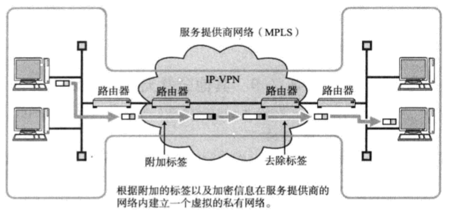
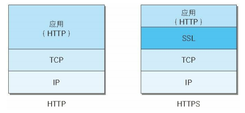

# 四、安全协议

[[_TOC_]]

## 1. 安全协议

**由来**：以前为了防止信息泄露，对机密数据的传输一般使用由专线连接的私有网络，在物理上杜绝窃听和篡改数据的可能，但是专线的造价太高，因此诞生了虚拟专用网 VPN

## 2. VPN

### (1) IP-VPN

① 多协议标签交换 MPLS (Multiprotocol Label Switching)：在 IP 报文首部附加一个标签信息进行传输控制的技术

② IP-VPN 由服务提供商 ISP 提供，IP-VPN 是在 IP 网络上使用 MPLS 技术构建 VPN 的服务，每个用户的标签信息不同，因此在通过 MPLS 网时，可以轻松判断出目标地址，将多个不同用户通过 MPLS 网加以区分，形成封闭的私有网络

### (2) IPsec-VPN

IPsec-VPN 是企业可以自己在互联网上建立的服务，IPsec-VPN 是对 IP 报文进行验证和加密，在互联网上构造一个封闭的私有网络，但是有时会收到网络堵塞的影响

## 3. HTTPS

**由来**：网上购物的支付过程使用的账号密码都属于机密信息，因此在网上传输这些信息时有必要进行加密处理

① HTTPS (HTTP Secure) 并非一种新的应用层协议，而是 HTTP 协议的通信接口部分用 SSL 协议代替，这样 HTTP 就拥有了 SSL 的加密、证书、完整性保护等功能

② HTTPS = HTTP + 加密技术 (HTTP 通信使用明文) + 证书 (HTTP 不验证通信双方的身份) + 完整性保护 (HTTP 无法保证明文的完整性)

③ 通常 HTTP 直接和 TCP 通信，而 HTTPS 则是 HTTP 先和 SSL 通信，再由 SSL 和 TCP 通信

①②③④⑤⑥⑦⑧⑨⑩⑪⑫⑬⑭⑮⑯
